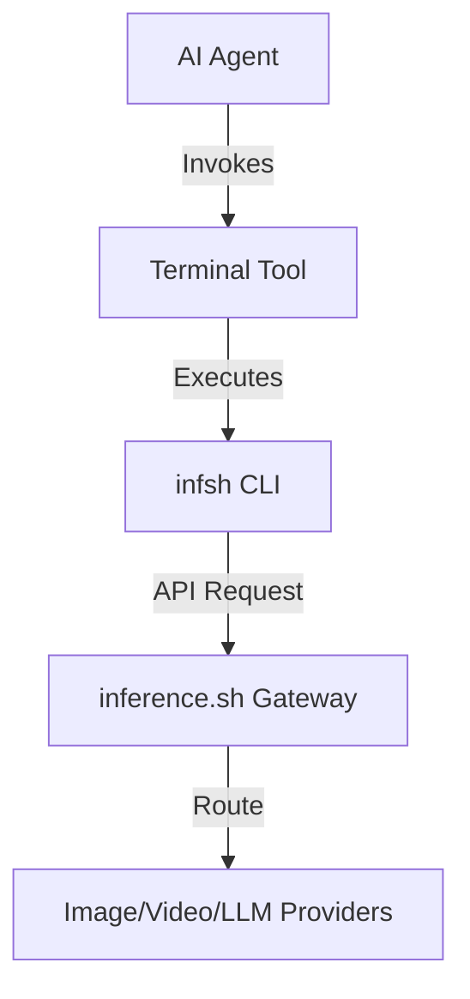

# skills — inference-sh

# inference-sh

The `inference-sh` module provides a unified interface to the [inference.sh](https://inference.sh) platform, allowing the system to access over 150 AI applications through a single API key. This module abstracts the complexity of managing multiple provider credentials (e.g., OpenAI, Anthropic, Google, Black Forest Labs) by routing requests through the inference.sh gateway.

## Overview

The primary goal of this module is to provide the agent with a versatile toolkit for multi-modal AI tasks. Instead of implementing individual integrations for every new model, the module leverages the `infsh` command-line interface to perform tasks ranging from image generation to social media automation.

## The `cli` Skill

The core functionality of this module is exposed through the `cli` skill. This skill enables the agent to interact with the platform via the terminal using the `infsh` binary.

### Execution Pattern
When the agent needs to perform a task supported by inference.sh, it invokes the terminal tool to run `infsh` commands. This allows for:
- **Dynamic Model Selection**: Switching between models (e.g., FLUX for images, Claude for text) without changing code.
- **Stateful Operations**: Using the CLI's internal session management for complex workflows.
- **Unified Authentication**: Relying on the environment's configured `infsh` credentials.

## Supported Service Domains

The module provides access to several specialized AI domains:

| Domain | Key Models/Services |
| :--- | :--- |
| **Image Generation** | FLUX, Reve, Seedream, Grok Imagine, Gemini |
| **Video Generation** | Veo, Wan, Seedance, OmniHuman, HunyuanVideo |
| **LLMs** | Claude, Gemini, Kimi, GLM-4 (via OpenRouter) |
| **Search & Web** | Tavily, Exa |
| **3D Modeling** | Rodin |
| **Social Media** | Twitter/X automation |
| **Audio** | TTS, voice cloning |

## Integration Architecture

The `inference-sh` module acts as a bridge between the agent's tool-calling capabilities and the external `infsh` ecosystem.

## Developer Implementation Notes

### Prerequisites
To use this module effectively, the environment must have:
1. The `infsh` CLI installed and available in the system PATH.
2. A valid `inference.sh` API key configured via `infsh login` or environment variables.

### Usage in Workflows
Developers should guide the agent to use the `cli` skill when high-fidelity multi-modal output is required that exceeds the capabilities of the primary LLM. For example, if the agent is tasked with "creating a promotional video with a specific script," it should:
1. Use an LLM to generate the script.
2. Use the `cli` skill to run `infsh` commands for video generation (e.g., using `Wan` or `Veo`).
3. Use the `cli` skill to generate accompanying images or social media posts.