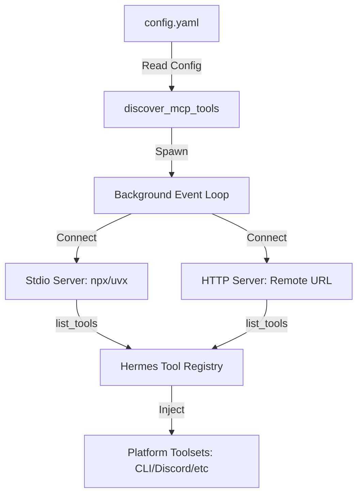

# skills — mcp

# Native MCP Client

The `skills/mcp` module provides a built-in Model Context Protocol (MCP) client for Hermes Agent. It allows the agent to connect to external MCP servers, discover their capabilities, and register their tools as first-class functions within the Hermes ecosystem.

Unlike the `mcporter` skill which is designed for ad-hoc terminal usage, the native MCP client is a persistent integration that initializes at startup based on the agent's configuration.

## Architecture

The MCP client operates as a background service within the Hermes Agent process. It manages the lifecycle of connections to multiple servers simultaneously.



### Key Components
- **Discovery Engine**: Triggered during agent initialization via `discover_mcp_tools()`. It reads the `mcp_servers` configuration and establishes connections.
- **Background Event Loop**: Each server connection runs in a dedicated asyncio Task within a daemon thread to ensure non-blocking tool execution.
- **Tool Registry Bridge**: Automatically maps remote MCP tools to the Hermes tool format, handling name sanitization and prefixing.

## Configuration

MCP servers are configured in `~/.hermes/config.yaml` under the `mcp_servers` key.

### Stdio Transport
Used for local servers executed via command line (e.g., Node.js or Python-based servers).

```yaml
mcp_servers:
  filesystem:
    command: "npx"
    args: ["-y", "@modelcontextprotocol/server-filesystem", "/path/to/data"]
    env:
      CUSTOM_VAR: "value"
    timeout: 60
```

### HTTP Transport
Used for remote servers or shared infrastructure.

```yaml
mcp_servers:
  remote_service:
    url: "https://mcp.example.com/v1"
    headers:
      Authorization: "Bearer <token>"
    connect_timeout: 30
```

## Tool Discovery and Naming

When a server connects, the client calls `list_tools()` and registers every discovered tool using a specific naming convention to prevent collisions:

**Pattern**: `mcp_{server_name}_{tool_name}`

- **Sanitization**: Hyphens (`-`) and dots (`.`) are replaced with underscores (`_`) to ensure compatibility with LLM tool-calling schemas.
- **Example**: A tool named `fetch-data` on a server configured as `api_provider` becomes `mcp_api_provider_fetch_data`.

## Security and Isolation

### Environment Filtering
For **stdio** servers, the client does not pass the full host environment. It provides a "clean room" environment containing only essential variables (`PATH`, `HOME`, `USER`, `LANG`, `TERM`, `SHELL`, `TMPDIR`, and `XDG_*`). 

Any sensitive credentials (API keys, tokens) must be explicitly defined in the `env` section of the server configuration.

### Credential Redaction
The module includes an automatic redaction layer. If an MCP tool returns an error message, the client scans the text for common credential patterns (GitHub PATs, OpenAI keys, Bearer tokens, etc.) and masks them before the error is passed to the LLM.

## Sampling (Server-Initiated LLM Calls)

The client supports the `sampling/createMessage` capability. This allows an MCP server to "call back" to the agent and request an LLM completion.

- **Agent-in-the-loop**: Servers can use the agent's brain to process data or make decisions during tool execution.
- **Tool Augmentation**: Servers can include a list of tools in their sampling request, allowing for multi-turn reasoning within a single MCP tool call.
- **Safety Limits**: The `max_tool_rounds` setting prevents infinite loops between the server and the agent.

### Sampling Configuration
```yaml
sampling:
  enabled: true
  model: "gemini-1.5-pro"  # Optional model override
  max_tool_rounds: 5       # Limit recursive tool calls
  max_rpm: 10              # Rate limit for the server
```

## Connection Lifecycle

1. **Initialization**: `discover_mcp_tools()` is called. It is idempotent; it will not re-connect to already active servers.
2. **Persistence**: Connections are maintained for the duration of the Hermes process.
3. **Reconnection**: If a connection is lost, the client implements exponential backoff (1s to 60s) for up to 5 attempts.
4. **Shutdown**: All active sessions and subprocesses are gracefully terminated when the agent exits.

## Requirements

- **Python Package**: `mcp` (install via `pip install mcp`).
- **Runtimes**: `node` (for `npx` servers) or `uv` (for `uvx` servers).
- **HTTP Support**: Requires `mcp.client.streamable_http` (available in recent versions of the MCP SDK).