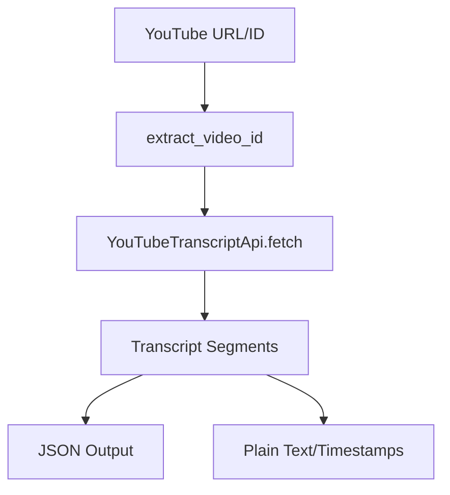

# skills — media

# Media Skills

The `media` module provides a suite of skills for interacting with, generating, and analyzing various media formats, including music, video transcripts, GIFs, and audio visualizations.

## Spotify Integration

The Spotify skill manages playback, library, and playlists through a set of 7 specialized tools. It is designed to minimize latency by avoiding unnecessary state checks before executing commands.

### Toolset Overview
- `spotify_playback`: Core controls (play, pause, next, volume, state).
- `spotify_devices`: Device enumeration and playback transfer.
- `spotify_queue`: Management of the play queue.
- `spotify_search`: Catalog search (tracks, albums, artists).
- `spotify_playlists`: CRUD operations on user and public playlists.
- `spotify_albums` & `spotify_library`: Metadata retrieval and library management.

### Implementation Patterns
- **Direct Execution**: Do not call `get_state` before `play` or `pause`. The API handles these requests idempotently.
- **Error Handling**: 
    - `403 Forbidden (No active device)`: Requires the user to manually open a Spotify client.
    - `403 Forbidden (Premium required)`: Indicates a mutation attempt on a Free account.
- **ID Normalization**: Tools accept Spotify URIs (`spotify:track:...`), URLs, or bare IDs. URIs are preferred for internal consistency.

---

## YouTube Content Transformation

This skill extracts transcripts from YouTube videos and reformats them into structured content like summaries, blog posts, or timestamped chapters.

### Transcript Extraction
The core logic resides in `scripts/fetch_transcript.py`, which utilizes the `youtube-transcript-api`.



**Key Functions:**
- `extract_video_id(url_or_id)`: Uses regex to parse IDs from standard URLs, shorts, embeds, and live links.
- `fetch_transcript(video_id, languages)`: Retrieves segments and normalizes them into a standard dictionary format (`text`, `start`, `duration`).

### Content Workflows
1. **Fetch**: Execute `fetch_transcript.py` with `--text-only --timestamps`.
2. **Chunking**: If the transcript exceeds 50k characters, it must be processed in overlapping chunks (~40k chars with 2k overlap).
3. **Formatting**: Transform the raw text into specific formats (e.g., Twitter threads, Markdown blog posts, or chapter lists).

---

## HeartMuLa (AI Music Generation)

HeartMuLa is an open-source music foundation model for generating full songs from lyrics and style tags.

### Architecture
- **HeartMuLa (3B/7B)**: The LLM responsible for generating music tokens from text.
- **HeartCodec**: A 12.5Hz codec for high-fidelity audio reconstruction.
- **HeartCLAP**: Used for audio-text alignment.

### Critical Patches
Due to dependency shifts in `transformers` and `torchtune`, the following patches are required in the `heartlib` environment:

1.  **RoPE Cache Fix**: In `modeling_heartmula.py`, RoPE caches must be manually re-initialized after moving the model from the meta device to the GPU:
    ```python
    for module in self.modules():
        if isinstance(module, Llama3ScaledRoPE) and not module.is_cache_built:
            module.rope_init()
            module.to(device)
    ```
2.  **Codec Loading**: In `pipelines/music_generation.py`, `HeartCodec.from_pretrained` requires `ignore_mismatched_sizes=True` to handle scalar vs. 0-d tensor discrepancies in the VQ codebook.

### Resource Management
- **VRAM**: Use `--lazy_load true` to run on 8GB VRAM. This loads the generator and codec sequentially.
- **Precision**: Always use `fp32` for `HeartCodec` to prevent audio artifacts; `bfloat16` is recommended for the `HeartMuLa` generator.

---

## Audio Visualization (songsee)

The `songsee` skill provides CLI-based audio analysis using a Go-based backend. It generates multi-panel images representing different audio features.

### Visualization Types
| Type | Analysis |
| :--- | :--- |
| `mel` | Mel-scaled spectrogram for frequency analysis |
| `chroma` | Harmonic content and pitch class distribution |
| `hpss` | Separation of harmonic (tonal) and percussive (transient) elements |
| `mfcc` | Mel-frequency cepstral coefficients for timbre description |

### Usage
Visualizations are generated by calling the `songsee` binary. Multiple features can be combined into a single grid using the `--viz` flag:
```bash
songsee input.mp3 --viz spectrogram,mel,chroma,loudness -o analysis.png
```

---

## GIF Search (Tenor)

A lightweight integration for searching and downloading GIFs using the Tenor V2 API.

- **Prerequisites**: `curl`, `jq`, and a `TENOR_API_KEY`.
- **Media Formats**: Supports `gif`, `tinygif` (optimized for chat), `mp4`, and `webm`.
- **Implementation**: Uses direct `curl` calls to `https://tenor.googleapis.com/v2/search`. Results are parsed via `jq` to extract specific media format URLs.