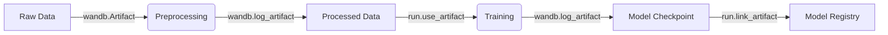

# skills — mlops

# Skills — MLOps

The **skills — mlops** module provides a standardized toolkit for Machine Learning Operations, focusing on the lifecycle of Large Language Models (LLMs). It encompasses tools for model evaluation, experiment tracking, hyperparameter optimization, and repository management.

## Module Overview

The module is structured into three primary functional areas:
1.  **Evaluation**: Standardized benchmarking using `lm-evaluation-harness`.
2.  **Experiment Tracking**: Real-time logging and artifact management via `Weights & Biases`.
3.  **Hub Interaction**: Repository management using the `hf` CLI.

## LLM Evaluation (`lm-evaluation-harness`)

The evaluation sub-module leverages the EleutherAI `lm-eval` framework to benchmark models across 60+ academic tasks (MMLU, GSM8K, HumanEval, etc.).

### Core Execution Patterns
Evaluation is typically performed via the CLI, supporting multiple backends:

*   **HuggingFace (`hf`)**: Standard transformer-based evaluation.
*   **vLLM (`vllm`)**: Optimized for 5-10x faster inference using tensor parallelism.
*   **API (`openai-chat-completions`, `anthropic-chat`)**: Benchmarking closed-source models.

```bash
# Example: Evaluating a local model on reasoning tasks
lm_eval --model hf \
  --model_args pretrained=meta-llama/Llama-2-7b-hf \
  --tasks mmlu,gsm8k \
  --device cuda:0 \
  --batch_size auto
```

### Distributed Evaluation
For large models (e.g., 70B+), the module supports:
*   **Data Parallelism**: Using `accelerate launch` to split samples across GPUs.
*   **Tensor Parallelism**: Sharding model weights via `parallelize=True` (HF) or `tensor_parallel_size` (vLLM).

## Experiment Tracking & Optimization (`wandb`)

The module integrates `Weights & Biases` for logging metrics, managing model lineage, and performing Hyperparameter Optimization (HPO).

### Key Components
*   **Runs**: Initialized via `wandb.init()`, tracking configurations and metrics.
*   **Artifacts**: Versioned storage for datasets and model checkpoints.
*   **Sweeps**: Automated HPO using Bayesian, Grid, or Random search strategies.

### Artifact Lineage Workflow
The module follows a strict lineage pattern to ensure reproducibility:



## Model & Dataset Management (`hf` CLI)

The module utilizes the modern `hf` CLI (replacing `huggingface-cli`) for Hub interactions.

*   **Download/Upload**: `hf download REPO_ID` and `hf upload REPO_ID`.
*   **Authentication**: Managed via `HF_TOKEN` environment variables.

## Fine-Tuning Patterns (TRL/GRPO)

Based on internal templates (e.g., `basic_grpo_training.py`), the module implements Group Relative Policy Optimization (GRPO) patterns using the `trl` library.

### Reward Function Logic
A critical component of the MLOps pipeline is the automated evaluation of model outputs during training. The module implements XML-based answer extraction for reinforcement learning:

1.  **`extract_xml_tag(text, tag)`**: Parses model output for specific structured tags.
2.  **`extract_answer(text)`**: High-level wrapper to retrieve the final response.
3.  **`correctness_reward_func(prompts, completions, answer, ...)`**: A reward function that utilizes `extract_answer` to compare model completions against ground truth, returning a binary or scalar reward for the GRPO trainer.

### Training Setup
The `main` execution flow for fine-tuning typically follows:
1.  `get_dataset()`: Loading and formatting training data.
2.  `setup_model_and_tokenizer()`: Initializing the base model with PEFT/LoRA configurations.
3.  `get_peft_config()`: Defining adapter parameters for parameter-efficient fine-tuning.

## Hardware & Performance Guidelines

| Task | Model Size | Hardware | Optimization |
| :--- | :--- | :--- | :--- |
| **Evaluation** | 7B | 1x A100 (40GB) | `vllm` backend |
| **Evaluation** | 70B | 4x A100 (80GB) | `tensor_parallel_size=4` |
| **Fine-Tuning** | 7B | 8x A100 (80GB) | DeepSpeed ZeRO-3 + LoRA |

## Best Practices
*   **Deterministic Eval**: Always set `temperature=0` and `num_fewshot` (typically 5) for academic benchmarks.
*   **Cost Control**: Use `--limit N` when testing API-based evaluations to prevent unexpected billing.
*   **Registry Promotion**: Use `wandb` aliases (`staging`, `production`) to manage model deployment stages rather than manual file renaming.