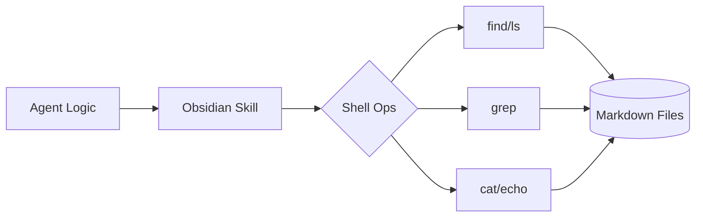

# skills — note-taking

# Note-Taking Skill: Obsidian

The `note-taking` module provides a set of capabilities for persistent information storage, research assistance, and multi-session planning. It specifically implements an interface for **Obsidian**, allowing the system to interact with a local Markdown-based knowledge base.

## Overview

This skill treats an Obsidian vault as a structured filesystem database. It leverages standard Unix utilities (`find`, `grep`, `cat`) to perform CRUD operations and searches on Markdown files. This approach ensures that the data remains human-readable and compatible with the Obsidian desktop and mobile applications.

## Configuration

The module relies on the `OBSIDIAN_VAULT_PATH` environment variable to locate the vault.

| Variable | Description | Default Value |
| :--- | :--- | :--- |
| `OBSIDIAN_VAULT_PATH` | Absolute path to the Obsidian vault directory. | `~/Documents/Obsidian Vault` |

**Note:** Because vault paths often contain spaces, all internal operations quote the path variable to prevent word-splitting errors.

## Core Operations

### Note Discovery and Listing
The module uses `find` and `ls` to navigate the vault hierarchy.

*   **Global List:** Recursively finds all `.md` files within the vault.
*   **Scoped List:** Lists files within a specific subfolder.
*   **Filename Search:** Uses `find -iname` to perform case-insensitive searches for specific note titles.

### Content Retrieval
Reading a note is performed via `cat`. The system expects the full path relative to the vault root, including the `.md` extension.

### Search Functionality
The module implements full-text search across the entire vault using `grep`:
```bash
grep -rli "keyword" "$VAULT" --include="*.md"
```
*   `-r`: Recursive search.
*   `-l`: Only output the filenames of matches.
*   `-i`: Case-insensitive.

### Writing and Modification
*   **Creation:** Uses a `cat` heredoc to create new files with initial content and headers.
*   **Appending:** Uses the `>>` operator to add new information to the end of existing notes, typically used for logging or adding thoughts to a research thread.

## Integration Patterns

### Wikilinks
When creating or updating notes, the module follows Obsidian's internal linking syntax: `[[Note Name]]`. This allows the system to build a graph of related concepts that the Obsidian UI can visualize.

### Execution Flow
The skill acts as a bridge between the agent's logic and the local filesystem.



## Developer Guidelines

1.  **Path Sanitization:** Always wrap the vault path and file names in double quotes to handle spaces.
2.  **Extension Handling:** Ensure `.md` is appended to filenames when creating or reading, as Obsidian identifies notes by this extension.
3.  **Concurrency:** Since operations are standard filesystem writes, be mindful of potential race conditions if multiple processes attempt to append to the same note simultaneously.
4.  **Formatting:** When creating notes, prefer including a `# Title` header at the top of the file to maintain consistency with Obsidian's rendering engine.