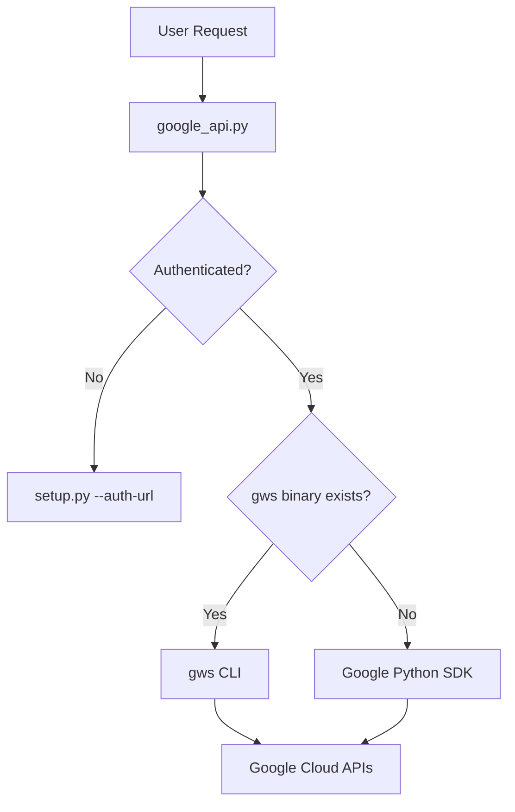

# skills — productivity

# Skills — Productivity

The **Productivity** module provides a suite of tools for managing documents, spreadsheets, project management workflows, and location-based services. These skills are designed to be executed primarily through the `terminal` tool, utilizing direct API calls via `curl` or specialized Python CLI wrappers.

## Module Overview

The module is divided into four primary service integrations:
1.  **Airtable**: Database and record management via REST.
2.  **Google Workspace**: Comprehensive access to Gmail, Calendar, Drive, and Sheets.
3.  **Linear**: Issue tracking and project management via GraphQL.
4.  **Maps**: Geocoding, routing, and POI discovery using OpenStreetMap data.

---

## Airtable Integration

The Airtable skill interacts directly with the Airtable REST API. It avoids heavy SDKs in favor of `curl` commands, making it lightweight and transparent.

### Authentication & Setup
- **Mechanism**: Personal Access Tokens (PAT).
- **Environment Variable**: `AIRTABLE_API_KEY`.
- **Scope**: Tokens must be scoped to specific bases. A `403 Forbidden` usually indicates the base has not been added to the PAT's access list.

### Key Patterns
- **Schema Inspection**: Always run `GET /v0/meta/bases/$BASE_ID/tables` before mutations to verify field names and select options.
- **Typecasting**: Use `"typecast": true` in POST/PATCH bodies to allow Airtable to automatically create new select options or coerce string-to-number types.
- **Filtering**: Use `filterByFormula`. Formulas must be URL-encoded. The module recommends using a Python one-liner for encoding:
  ```bash
  python3 -c 'import sys, urllib.parse; print(urllib.parse.quote(sys.argv[1], safe=""))' "{Status}='Todo'"
  ```
- **Rate Limits**: Hard limit of 5 requests per second per base.

---

## Google Workspace

This skill provides a unified interface for Gmail, Calendar, Drive, Sheets, and Docs. It uses a managed OAuth2 flow and prefers the `gws` CLI binary if available, falling back to standard Python client libraries.

### Architecture
The integration relies on two core scripts:
- `setup.py`: Handles the non-interactive OAuth2 flow, credential storage (`google_token.json`), and dependency management.
- `google_api.py`: The primary execution CLI. It routes commands to specific Google services and ensures output is returned as structured JSON.



### Core Commands
- **Gmail**: `search`, `get`, `send`, `reply`, `modify`.
- **Calendar**: `list`, `create`, `delete`.
- **Sheets**: `get`, `update`, `append`.
- **Drive/Docs**: `search`, `get`.

### Setup Workflow
1.  `setup.py --client-secret <path>`: Stores the OAuth client credentials.
2.  `setup.py --auth-url`: Generates the consent URL.
3.  `setup.py --auth-code <code>`: Exchanges the browser redirect code for a persistent token.
4.  `setup.py --check`: Verifies the token and required scopes.

---

## Linear

The Linear skill manages issues and projects via Linear's GraphQL API.

### Workflow States
Linear issues are governed by `WorkflowState` types. Before updating an issue's status, you must query the team's specific state UUIDs:
- `triage`, `backlog`, `unstarted`, `started`, `completed`, `canceled`.

### GraphQL Execution
All interactions are POST requests to `https://api.linear.app/graphql`.
- **Issue Resolution**: Supports both UUIDs and human-readable identifiers (e.g., `PROD-123`).
- **Mutations**: Uses `issueCreate`, `issueUpdate`, and `commentCreate`.
- **Pagination**: Implements Relay-style cursor pagination using `pageInfo { hasNextPage endCursor }`.

---

## Maps

The Maps skill provides location intelligence without requiring API keys, utilizing OpenStreetMap (Nominatim), Overpass API, and OSRM.

### Core Functions in `maps_client.py`
- **`search`**: Forward geocoding (Name -> Coordinates).
- **`reverse`**: Reverse geocoding (Coordinates -> Address).
- **`nearby`**: POI discovery. Supports 46 categories (e.g., `pharmacy`, `hospital`, `cafe`).
- **`distance` / `directions`**: Routing for `driving`, `walking`, or `cycling`.

### POI Discovery Logic
The `nearby` command can resolve locations in two ways:
1.  **Coordinates**: Direct `lat` and `lon` input.
2.  **Address**: Using the `--near` flag, which triggers an internal call to `geocode_single` before querying the Overpass API.

### Execution Flow: `nearby`
1.  **Input**: Category and Location (Lat/Lon or Address).
2.  **Geocoding**: If address provided, `nominatim_search` resolves to coordinates.
3.  **Overpass Query**: `overpass_query` sends a QL script to a pool of mirrors (e.g., `overpass-api.de`, `overpass.kumi.systems`).
4.  **Parsing**: `parse_overpass_elements` converts OSM nodes/ways into a clean JSON list, calculating `distance_m` and generating Google Maps URLs for user convenience.

---

## Common Implementation Patterns

### JSON Formatting
All productivity scripts are designed to output clean, parseable JSON. When using these skills in a terminal, pipe output through `python3 -m json.tool` for readability:
```bash
python3 google_api.py gmail search "is:unread" | python3 -m json.tool
```

### Error Handling
- **Airtable/Linear**: Check the `errors` array in the JSON response even if the HTTP status is 200.
- **Maps**: Uses `error_exit` to return a structured JSON error object: `{"error": "message", "status": "error"}`.
- **Google Workspace**: `_ensure_authenticated` checks for the existence of `google_token.json` before attempting API calls.

### Environment Management
The module uses `_hermes_home.py` to consistently resolve the configuration directory (defaulting to `~/.hermes`). This ensures that tokens, client secrets, and environment variables are shared across different execution contexts (system Python, virtualenvs, etc.).