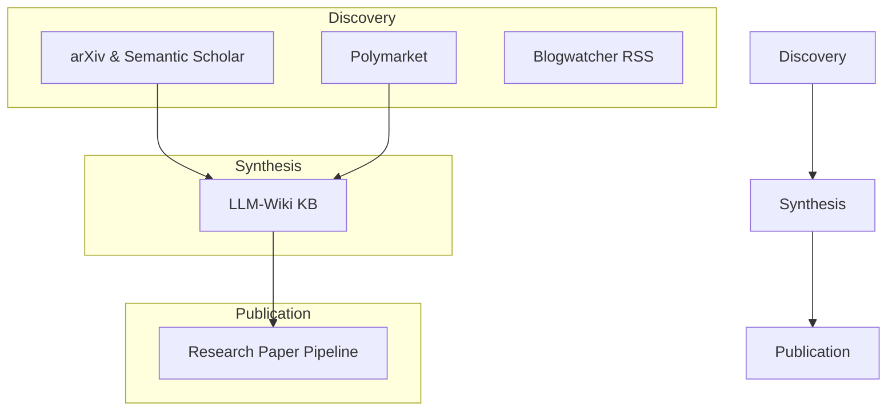

# skills — research

# Research Skills Module

The **research** module provides a suite of tools for academic discovery, market intelligence, knowledge management, and scientific publication. It is designed to support the full research lifecycle—from initial domain reconnaissance to the submission of publication-ready machine learning papers.

## Module Architecture

The module is organized into specialized sub-skills that can be used independently or composed into complex workflows.



---

## 1. Academic Discovery (`arxiv`)

This component interfaces with the arXiv REST API and Semantic Scholar to retrieve paper metadata, abstracts, and citation graphs.

### Key Tools
*   **`scripts/search_arxiv.py`**: A zero-dependency Python script for searching papers by keyword, author, category, or ID.
*   **Semantic Scholar Integration**: Used for impact assessment (citation counts) and finding related work (references/recommendations).

### Common Patterns
```bash
# Search for latest AI papers
python scripts/search_arxiv.py "reinforcement learning" --max 5 --sort date

# Get citation data via Semantic Scholar
curl -s "https://api.semanticscholar.org/graph/v1/paper/arXiv:2402.03300?fields=citationCount,influentialCitationCount"
```

---

## 2. Market Intelligence (`polymarket`)

Provides real-time access to prediction market data, allowing researchers to track event probabilities and market sentiment.

### API Structure
*   **Gamma API**: Discovery and search (`gamma-api.polymarket.com`).
*   **CLOB API**: Orderbooks and price history (`clob.polymarket.com`).
*   **Data API**: Recent trades and open interest (`data-api.polymarket.com`).

### Helper Script: `polymarket.py`
The helper script handles double-encoded JSON fields and provides human-readable formatting for probabilities and volume.
```bash
python3 polymarket.py search "fed interest rates"
python3 polymarket.py history <condition_id> --interval 1d
```

---

## 3. Knowledge Management (`llm-wiki`)

Based on the "Karpathy LLM Wiki" pattern, this sub-module maintains a persistent, compounding knowledge base as interlinked markdown files.

### Three-Layer Structure
1.  **`raw/`**: Immutable source material (PDFs, web extracts).
2.  **`entities/` & `concepts/`**: Agent-maintained synthesis pages with `[[wikilinks]]`.
3.  **`SCHEMA.md`**: Defines the domain, tag taxonomy, and consistency rules.

### Operational Workflow
*   **Orientation**: Every session must begin by reading `SCHEMA.md`, `index.md`, and the recent `log.md`.
*   **Ingestion**: Sources are processed into `raw/`, then used to update or create entity/concept pages.
*   **Linting**: A programmatic check for orphan pages, broken links, and stale content.

---

## 4. Content Monitoring (`blogwatcher`)

A wrapper for `blogwatcher-cli` to track RSS/Atom feeds and monitor domain-specific blogs.

*   **Discovery**: Automatically finds feeds from homepages.
*   **Persistence**: Uses a SQLite database (`blogwatcher-cli.db`) to track read/unread states.
*   **Scraping Fallback**: Supports CSS selectors for sites without native feeds.

---

## 5. Research Paper Writing Pipeline

A comprehensive framework for producing ML papers targeting venues like NeurIPS, ICML, and ICLR. It emphasizes a "Narrative Principle"—the idea that a paper is a single technical story supported by evidence.

### Pipeline Phases
*   **Phase 0-1 (Setup & Lit Review)**: Workspace organization and verified citation gathering.
*   **Phase 2-4 (Experimentation)**: Mapping claims to experiments, running parallel sweeps, and statistical analysis (McNemar’s test, Cohen’s h).
*   **Phase 5-6 (Drafting & Refinement)**: LaTeX production using the **Autoreason** strategy.

### The Autoreason Strategy
For complex drafting and code tasks, the module employs an iterative refinement loop:
1.  **Critic**: Identifies weaknesses in the current draft.
2.  **Author**: Generates a revised version addressing the critique.
3.  **Synthesizer**: Merges the best elements of both versions.
4.  **Judge Panel**: A blind Borda count ranking by 3+ agents to select the winner.
5.  **Convergence**: Loop terminates when the incumbent wins $k=2$ consecutive rounds.

### Technical Standards
*   **Citations**: Mandatory 5-step verification (Search → Verify → Retrieve → Validate → Add).
*   **LaTeX**: Uses `microtype` for typography, `booktabs` for tables, and `cleveref` for smart referencing.
*   **Figures**: Requires vector graphics (PDF) generated via `matplotlib` or `TikZ`.

### Directory Convention
```text
paper/               # LaTeX source and figures
experiments/         # Runner scripts
results/             # Raw JSON/CSV outputs
experiment_log.md    # The "bridge" document connecting results to prose
```

## Integration with External Tools
*   **Obsidian**: The `llm-wiki` is fully compatible with Obsidian vaults.
*   **Firecrawl**: Used via `web_extract` to convert PDFs and web pages into clean markdown for the wiki or paper pipeline.
*   **Exa MCP**: Recommended for real-time academic search integration.