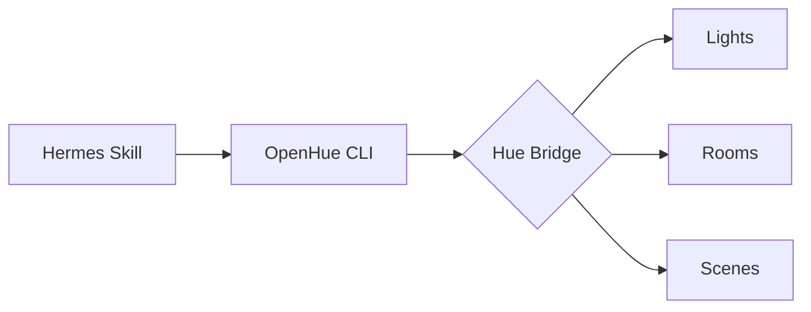

# skills — smart-home

# Smart Home Skills

The `smart-home` module provides integrations for controlling IoT devices, lighting systems, and home automation hubs. Currently, the module focuses on Philips Hue ecosystem support via the **OpenHue** skill.

## OpenHue Skill

The OpenHue skill enables control over Philips Hue bridges using the `openhue` CLI. It allows for granular control of individual lights, logical rooms, and predefined scenes.

### Architecture

The skill operates as a wrapper around the `openhue` binary. It translates high-level automation intents into shell commands that communicate with the Hue Bridge over the local network.



### Prerequisites

The skill requires the `openhue` CLI to be installed and accessible in the system's `PATH`.

*   **Linux:** Binary installed to `~/.local/bin/openhue`.
*   **macOS:** Installed via Homebrew (`brew install openhue/cli/openhue-cli`).
*   **Authentication:** The first execution requires physical access to the Hue Bridge to press the link button for API authorization.

### Resource Management

The skill interacts with three primary resource types:

1.  **Lights:** Individual bulbs or fixtures.
2.  **Rooms/Zones:** Logical groupings of lights defined in the Hue app.
3.  **Scenes:** Predefined states (color, brightness) for a specific room.

#### Discovery
To audit available resources, the skill utilizes the `get` command:
- `openhue get light`
- `openhue get room`
- `openhue get scene`

### Command Patterns

The skill executes state changes using the `openhue set` command. All control commands are case-sensitive based on the names assigned in the Hue Bridge configuration.

#### Power and Dimming
Basic state changes are handled via the `--on`, `--off`, and `--brightness` flags. Brightness values range from `0` to `100`.

```bash
# Example: Room-level control
openhue set room "Living Room" --on --brightness 50
```

#### Color and Temperature
For color-capable bulbs, the skill supports two methods of color definition:
- **Named Colors:** Standard CSS-like names (e.g., `red`, `blue`).
- **Hex/RGB:** Specific hex codes (e.g., `#FF5500`).
- **Color Temperature:** Measured in mireks, ranging from `153` (cool/blue) to `500` (warm/yellow).

```bash
# Example: Setting temperature
openhue set light "Desk Lamp" --on --temperature 250
```

#### Scene Activation
Scenes are activated by referencing the scene name and its associated room.

```bash
openhue set scene "Relax" --room "Bedroom"
```

### Implementation Details

- **Network Dependency:** The machine running the skill must be on the same local network as the Hue Bridge.
- **Hardware Limitations:** Color and temperature commands will fail silently or be ignored if the target hardware (e.g., a White-only bulb) does not support the feature.
- **Concurrency:** Commands are executed synchronously. For large-scale "All Off" operations, it is more efficient to target the "Room" or "Zone" level rather than individual lights to reduce bridge congestion.