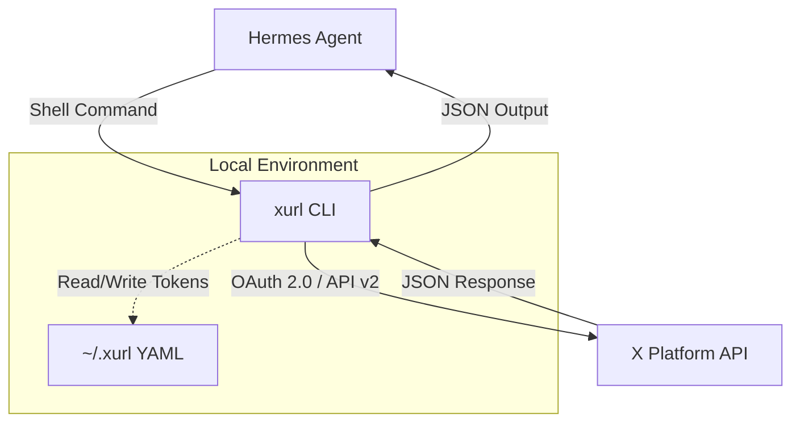

# skills — social-media

# Social Media Skills

The `social-media` module provides capabilities for interacting with social platforms, specifically focusing on X (formerly Twitter) via the official `xurl` CLI. This module enables agents to perform complex social workflows including posting, monitoring timelines, managing engagement, and handling media uploads.

## Core Component: xurl

The primary engine for this module is `xurl`, the official X developer platform CLI. It provides a high-level interface for common actions and a low-level interface for raw X API v2 requests.

### Architecture Overview

The module operates as a wrapper around the `xurl` binary. The agent executes shell commands, and `xurl` handles OAuth 2.0 PKCE token management, request signing, and JSON serialization.



## Security & Secret Safety

This module enforces strict security boundaries to prevent credential leakage. **These rules are mandatory for any agent implementation:**

1.  **Credential Isolation:** Agents must never read, print, or transmit the contents of `~/.xurl`.
2.  **No Inline Secrets:** Never use flags that accept secrets in the command line (e.g., `--bearer-token`, `--client-secret`).
3.  **User-Only Setup:** App registration and initial OAuth flows must be performed by the user manually outside the agent session.
4.  **Verification:** Use `xurl auth status` to verify connectivity without exposing sensitive data.
5.  **No Verbose Logging:** The `--verbose` (`-v`) flag is forbidden as it may leak authorization headers in the output.

## Functional Areas

### 1. Content Creation & Interaction
The module supports standard social interactions. `xurl` automatically extracts IDs from full X URLs, allowing agents to process links provided by users directly.

| Action | Command Pattern |
| :--- | :--- |
| **Post** | `xurl post "message"` |
| **Reply** | `xurl reply <POST_ID_OR_URL> "message"` |
| **Quote** | `xurl quote <POST_ID_OR_URL> "message"` |
| **Delete** | `xurl delete <POST_ID>` |

### 2. Discovery & Reading
Agents can query the platform for real-time data. All responses are returned as structured JSON matching the X API v2 schema.

*   **Search:** `xurl search "query" -n <limit>`
*   **Timeline:** `xurl timeline -n <limit>`
*   **Mentions:** `xurl mentions -n <limit>`
*   **User Lookup:** `xurl user @handle`

### 3. Engagement & Social Graph
Commands for managing relationships and algorithmic signals.

*   **Engagement:** `like`, `unlike`, `repost`, `unrepost`, `bookmark`.
*   **Graph:** `follow`, `unfollow`, `block`, `mute`.
*   **Direct Messages:** `xurl dm @handle "message"`.

### 4. Media Management
Media uploads are a multi-step process. For videos, agents should use the `--wait` flag to handle asynchronous processing.

```bash
# Upload and post workflow
MEDIA_ID=$(xurl media upload path/to/image.jpg | jq -r '.media_id_string')
xurl post "Check this out" --media-id $MEDIA_ID
```

## Raw API Access
For endpoints not covered by shortcut commands, the module supports a `curl`-like syntax for any X API v2 endpoint:

```bash
# GET request
xurl /2/users/me

# POST request with JSON payload
xurl -X POST /2/tweets -d '{"text":"Manual post"}'
```

## Agent Implementation Guide

### Workflow for Developers
When building features using this module, follow this execution flow:

1.  **Environment Check:** Run `xurl auth status` to ensure a default app is configured and tokens are valid.
2.  **Context Gathering:** Use `xurl whoami` to identify the acting account and `xurl mentions` to find relevant interactions.
3.  **Intent Confirmation:** Before performing "Write" actions (posting, deleting, following), the agent should summarize the intended action for the user.
4.  **Response Parsing:** Always parse the JSON output. Even successful commands return a `data` object, while failures return an `errors` array.

### Handling Common Errors

| Error Scenario | Resolution Strategy |
| :--- | :--- |
| **401 Unauthorized** | Direct the user to run `xurl auth oauth2 --app <app-name>` manually. |
| **403 Forbidden** | Usually a scope issue or a "Read-only" app permission. Check X Developer Portal settings. |
| **429 Rate Limit** | Implement exponential backoff or notify the user of the cooldown period. |
| **Empty Auth Status** | The user has not set a default app. Instruct them to use `xurl auth default <app-name>`. |

## Configuration Storage
Configuration is stored in `~/.xurl` in YAML format. This file contains:
*   Registered App Client IDs/Secrets.
*   OAuth 2.0 Refresh and Access tokens.
*   Default app and user settings.

**Note:** OAuth 2.0 tokens are automatically refreshed by the `xurl` binary during request execution; no manual refresh logic is required in the agent code.