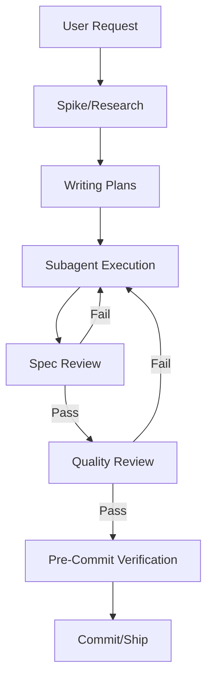

# skills — software-development

# Software Development Skills Module

The **software-development** module is a collection of standardized methodologies, technical procedures, and workflow definitions that govern how the Hermes Agent performs engineering tasks. It provides the agent with the "mental models" required for systematic debugging, test-driven development, and complex task orchestration.

## Module Overview

This module does not contain executable code in the traditional sense; rather, it contains **Skills** (defined in `SKILL.md` files) that the agent loads into its context to execute specific software engineering workflows. These skills bridge the gap between high-level user requests and low-level tool executions (like `terminal`, `file`, or `delegate_task`).

### Core Methodologies

The module enforces three primary engineering disciplines:

1.  **Systematic Debugging**: A 4-phase root cause investigation process (Investigation → Pattern Analysis → Hypothesis → Implementation). It prohibits "guess-and-check" fixes and mandates finding the root cause before touching code.
2.  **Test-Driven Development (TDD)**: Enforces the **Red-Green-Refactor** cycle. The agent is instructed to write a failing test, verify the failure, implement the minimal code to pass, and then refactor.
3.  **Subagent-Driven Development**: A framework for executing complex plans by dispatching fresh subagents for individual tasks using `delegate_task`. This includes a mandatory two-stage review process: **Spec Compliance** followed by **Code Quality**.

## The Implementation Pipeline

The module defines a linear workflow for feature development and bug fixing:

### 1. Planning (`writing-plans`, `plan`, `spike`)
Before execution, the agent creates a markdown plan.
*   **Spikes**: Used for throwaway prototypes to validate feasibility.
*   **Plans**: Stored in `.hermes/plans/`. They must contain "bite-sized" tasks (2-5 minutes of work) with exact file paths and TDD steps.

### 2. Execution (`subagent-driven-development`)
The orchestrator agent parses the plan and dispatches subagents.
*   **Isolation**: Each task is handled by a fresh subagent to prevent context pollution.
*   **Context Budgeting**: Uses a four-tier degradation model (PEAK to POOR) to monitor context window usage and checkpoint progress before performance drops.

### 3. Verification (`requesting-code-review`)
A pre-commit pipeline that includes:
*   **Static Security Scans**: Grepping for hardcoded secrets, shell injections, and unsafe deserialization.
*   **Baseline-Aware Testing**: Running the test suite and comparing results against a stashed baseline to ensure no regressions.
*   **Independent Review**: Using `delegate_task` to spawn a reviewer agent with no context other than the diff.

## Technical Debugging Suite

The module provides specific procedures for debugging the Hermes ecosystem itself and general applications.

### Python Debugging (`python-debugpy`)
Focuses on `pdb` and `debugpy`.
*   **Local**: Using `breakpoint()`.
*   **Remote**: Using `remote-pdb` or `debugpy` to attach to long-lived processes like the `tui_gateway` or `_SlashWorker`.
*   **Pytest Integration**: Using `--pdb` and `-p no:xdist` to debug failing tests.

### Node.js & TUI Debugging (`node-inspect-debugger`, `debugging-hermes-tui-commands`)
Covers the TypeScript/Ink frontend and the JSON-RPC bridge.
*   **Inspector**: Using `node --inspect-brk` with `tsx` to debug the TUI entry point.
*   **Command Registry**: Procedures for syncing the Python `COMMAND_REGISTRY` (in `hermes_cli/commands.py`) with the TUI frontend handlers (in `ui-tui/src/app/slash/`).

## Skill Authoring and Validation

The module includes the `hermes-agent-skill-authoring` skill, which defines the standards for extending the agent's capabilities.

*   **Location**: In-repo skills reside in `skills/<category>/<name>/SKILL.md`.
*   **Validation**: Frontmatter is validated by `tools/skill_manager_tool.py::_validate_frontmatter`.
*   **Constraints**:
    *   `name`: Lowercase, hyphens, max 64 chars.
    *   `description`: Max 1024 chars.
    *   `content`: Max 100,000 chars.
*   **Structure**: Requires specific sections: `Overview`, `When to Use`, `Common Pitfalls`, and `Verification Checklist`.

## Key Components Reference

| Component | Purpose |
| :--- | :--- |
| `SKILL.md` | The primary definition of the skill's logic and triggers. |
| `references/` | Deep-dive documents (e.g., `context-budget-discipline.md`) for complex orchestration. |
| `COMMAND_REGISTRY` | The source of truth in `hermes_cli/commands.py` for all slash commands. |
| `delegate_task` | The core tool used by orchestration skills to spawn sub-processes. |
| `skill_manager_tool.py` | The backend logic that validates and manages these skill files. |