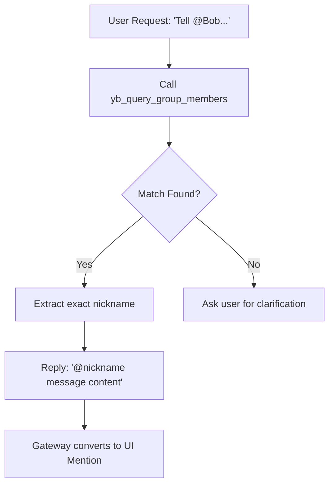

# skills — yuanbao

# Yuanbao Group Interaction Module

The `yuanbao` skill module provides integration with the Yuanbao platform (often referred to as "派" or "Pai" in-app). It enables bots to interact within groups, manage member information, and send direct messages (DMs).

## Core Messaging Architecture

Unlike many chat integrations that require a specific "send" tool for every interaction, the Yuanbao module uses a **Response-as-Message** pattern for group replies.

1.  **Implicit Delivery**: Any text returned by the LLM is automatically captured by the gateway and delivered as a message to the active group.
2.  **Native Mentions**: The gateway parses `@nickname` strings within the response text. If the nickname matches a group member, it is converted into a functional UI mention (notifying the user).
3.  **Direct Messaging**: While group replies are implicit, private messages (DMs) require the explicit use of the `yb_send_dm` tool.

## Tool Reference

### `yb_query_group_info`
Retrieves metadata for a specific group.
*   **Input**: `group_code` (string)
*   **Returns**: Group name, owner details, and total member count.

### `yb_query_group_members`
Searches or lists members within a group. This is the primary tool for resolving nicknames before an @mention.
*   **Actions**:
    *   `find`: Search for a specific user by name (partial match).
    *   `list_bots`: Filter for bots and Yuanbao AI assistants.
    *   `list_all`: Retrieve the full member list.
*   **Parameters**: `group_code`, `action`, `name` (for find), `mention` (boolean).

### `yb_send_dm`
Sends a private message to a specific user.
*   **Parameters**: 
    *   `group_code`: The context group.
    *   `name` or `user_id`: Target identifier.
    *   `message`: The text content.
    *   `media_files`: Optional array of file objects (supports `.jpg`, `.png`, `.gif`, `.webp`, `.bmp` as images; others as documents).

---

## Implementation Workflows

### 1. The @Mention Workflow
To ensure an @mention successfully triggers a notification, the bot must resolve the user's exact nickname within the Yuanbao system.



**Example Tool Call:**
```json
{
  "group_code": "328306697",
  "action": "find",
  "name": "Bob",
  "mention": true
}
```

**Example Response:**
`@Bob_Official The report is ready.`

### 2. Sending Private Messages (DM)
DMs are used when a user requests a "私信" or when sensitive information should not be posted in the group.

**Example Tool Call (with Media):**
```json
{
  "group_code": "535168412",
  "name": "User123",
  "message": "Here is the requested document",
  "media_files": [{"path": "/tmp/invoice.pdf"}]
}
```

---

## Data Handling & Constraints

### Group Identification
The `group_code` is derived from the standard `chat_id` provided in the message context.
*   **Context ID**: `group:535168412`
*   **Extracted Code**: `535168412`

### Member Roles
The module distinguishes between three entity types:
1.  `user`: Standard human participants.
2.  `yuanbao_ai`: Official platform AI entities.
3.  `bot`: Third-party integrations.

### Best Practices
*   **Nickname Resolution**: Never guess a nickname for an @mention. Always use `yb_query_group_members` with `action="find"` first.
*   **Formatting**: When mentioning, ensure there is a space before the `@` symbol (e.g., `Hello @User`) to ensure the gateway parser identifies the token correctly.
*   **Conciseness**: Do not explain the mention process to the user. If the tool returns the nickname, simply use it in the text response.