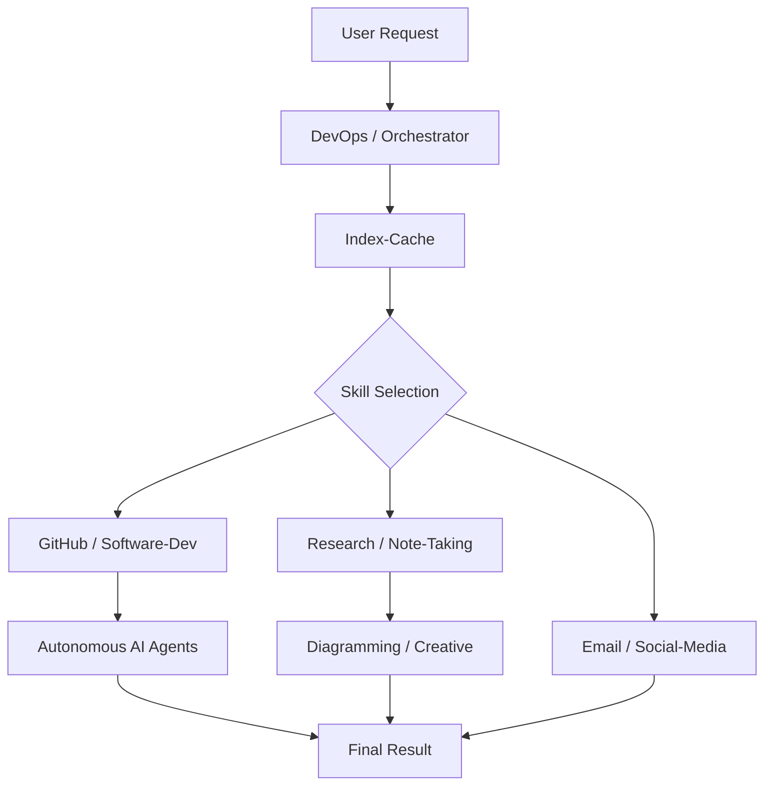

# skills

# Skills Module

The `skills` module serves as the functional engine of the Hermes ecosystem. It provides the agent with a library of standardized methodologies, API integrations, and CLI wrappers required to execute complex tasks across diverse environments.

## Architecture & Orchestration

The module is designed around a "Route, then Execute" philosophy. High-level orchestration logic determines which specialized skills are required to fulfill a user request.

*   **[DevOps](devops.md):** Provides the Kanban-style orchestration and task decomposition logic (DAG) that routes work to specific profiles.
*   **[Autonomous AI Agents](autonomous-ai-agents.md):** Enables the primary agent to spawn and manage sub-agents (like Claude Code or Codex) for specialized coding tasks.
*   **[Index-Cache](index-cache.md):** Acts as the central registry for all available capabilities, allowing the system to discover and activate tools dynamically.
*   **[MCP](mcp.md):** A native client for the Model Context Protocol, allowing the agent to ingest external tools from third-party servers as first-class functions.

## Functional Domains

Skills are categorized by their operational domain, allowing the agent to switch "mental models" based on the task at hand.

### Engineering & Data Science
These modules provide the technical foundation for software lifecycles and model management.
*   **[Software Development](software-development.md) & [GitHub](github.md):** Standardized workflows for TDD, debugging, and repository management using the `gh` CLI and REST APIs.
*   **[Data Science](data-science.md):** Stateful Python execution via `jupyter-live-kernel` for iterative data exploration.
*   **[MLOps](mlops.md):** Tools for LLM evaluation (`lm-evaluation-harness`) and experiment tracking via Weights & Biases.

### Research & Knowledge Management
These modules focus on information retrieval, synthesis, and persistent storage.
*   **[Research](research.md):** Academic and market intelligence gathering via arXiv, Semantic Scholar, and Polymarket.
*   **[Note-Taking](note-taking.md):** Persistent storage and knowledge graph management using **Obsidian**.
*   **[Diagramming](diagramming.md) & [Creative](creative.md):** Visual communication through Excalidraw schemas, architecture SVGs, and ASCII rendering.

### Productivity & Communication
Tools for managing personal workflows and interacting with external platforms.
*   **[Productivity](productivity.md):** Integrations for Google Workspace, Airtable, Linear, and Maps.
*   **[Email](email.md) & [Social Media](social-media.md):** Communication via the Himalaya CLI (Email) and `xurl` (X/Twitter).
*   **[Apple](apple.md):** Native macOS integration for Notes, Reminders, and iMessage.
*   **[Yuanbao](yuanbao.md):** Specialized group interaction and messaging for the Yuanbao platform.

### Specialized Automation
*   **[Media](media.md) & [GIFs](gifs.md):** Spotify playback, YouTube transcript processing, and animated media discovery.
*   **[Smart Home](smart-home.md):** IoT control via the OpenHue CLI.
*   **[Red-Teaming](red-teaming.md):** Safety filter bypass testing and model racing (GODMODE).
*   **[Inference-sh](inference-sh.md):** A unified gateway to 150+ AI models and multi-modal applications.

## Skill Interaction Flow

The following diagram illustrates how the core orchestration modules interact with functional skills to complete a request.

## Cross-Module Workflows

Many complex tasks require the coordination of multiple sub-modules:
*   **QA Pipeline:** The **[Dogfood](dogfood.md)** module uses browser automation to find bugs, then leverages **[GitHub](github.md)** to log issues and **[Software Development](software-development.md)** methodologies to propose fixes.
*   **Content Creation:** The **[Media](media.md)** module extracts a YouTube transcript, which is summarized by **[Research](research.md)**, stored in **[Note-Taking](note-taking.md)**, and finally shared via **[Social Media](social-media.md)**.
*   **Infrastructure Recon:** The **[Domain](domain.md)** module performs passive reconnaissance, providing data that can be visualized by **[Diagramming](diagramming.md)** or tested via **[Red-Teaming](red-teaming.md)**.