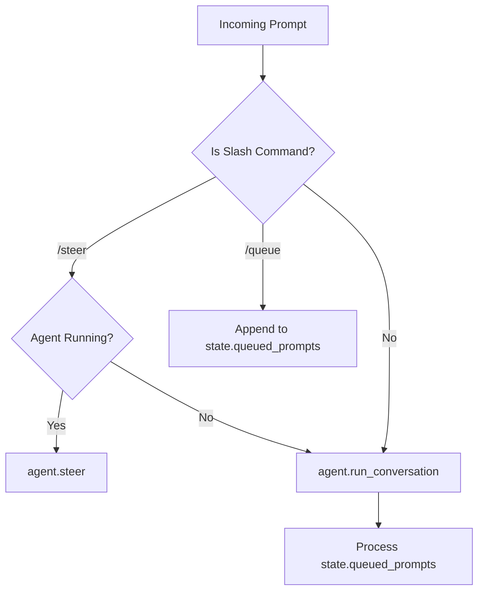

# tests — acp_adapter

# Tests — ACP Adapter

The `tests/acp_adapter` module provides functional and unit tests for the Agent Control Protocol (ACP) implementation. It ensures that the `HermesACPAgent` correctly handles slash commands, session state transitions, and multimodal content conversion.

## Test Infrastructure

The tests utilize a suite of mock objects to isolate the adapter logic from actual LLM providers or database persistence:

*   **`FakeAgent`**: Simulates the underlying agentic core. It tracks calls to `steer()` and `run_conversation()`, allowing tests to verify if guidance was injected or if a full turn was executed.
*   **`CaptureConn`**: Mocks the ACP connection interface to capture `session_update` events and simulate permission grants.
*   **`NoopDb`**: A transient implementation of the session database that performs no actual I/O.
*   **`make_agent_and_state()`**: A utility function that wires together the `HermesACPAgent`, `SessionManager`, and mocks to provide a clean test environment.

## Command Handling (`test_acp_commands.py`)

These tests verify the behavior of specialized slash commands that modify agent execution flow without necessarily starting a standard conversation turn.

### Steering Logic
The `/steer` command behaves differently depending on the session state:
1.  **Active Run**: If `state.is_running` is true, the command calls `agent.steer()` to inject guidance into the live process.
2.  **Post-Interrupt**: If a session was interrupted (e.g., by a Zed user), `/steer` triggers a new run that combines the original interrupted prompt with the new guidance.
3.  **Idle**: If no run is active or interrupted, `/steer` is treated as a standard prompt to prevent the input from being silently queued.

### Queuing Logic
The `/queue` command allows users to stage prompts for sequential execution.
*   **`test_acp_queue_slash_command_adds_next_turn_without_running_now`**: Validates that `/queue` populates `state.queued_prompts` without triggering an immediate `run_conversation`.
*   **`test_acp_prompt_drains_queued_turns_after_current_run`**: Ensures that once a primary prompt finishes, the adapter automatically "drains" the queue, executing all pending prompts in order.

## Multimodal Support (`test_acp_images.py`)

This submodule focuses on the translation between ACP-specific schemas and the internal representation used by the agent.

### Content Conversion
The internal helper `_content_blocks_to_openai_user_content` is tested for two primary paths:
*   **Multimodal**: Converts a mix of `TextContentBlock` and `ImageContentBlock` into an OpenAI-style list of dictionaries (e.g., `{"type": "image_url", ...}`).
*   **Legacy/Text-Only**: If only text blocks are present, it simplifies the output to a raw string to maintain compatibility with legacy prompt paths.

### Capability Advertisement
The `test_initialize_advertises_image_prompt_capability` test ensures that during the ACP `initialize` handshake, the `HermesACPAgent` correctly reports `image: True` in its `prompt_capabilities`. This informs the client (like the Zed editor) that it is safe to send image data.

## Key Functions Tested

| Function | Purpose |
| :--- | :--- |
| `HermesACPAgent.prompt` | The primary entry point for ACP messages; handles command parsing and execution. |
| `_content_blocks_to_openai_user_content` | Maps ACP schema blocks to OpenAI multimodal format. |
| `HermesACPAgent.initialize` | Handles the initial protocol handshake and capability negotiation. |
| `SessionManager.create_session` | Initializes the state container used to track queued prompts and run status. |