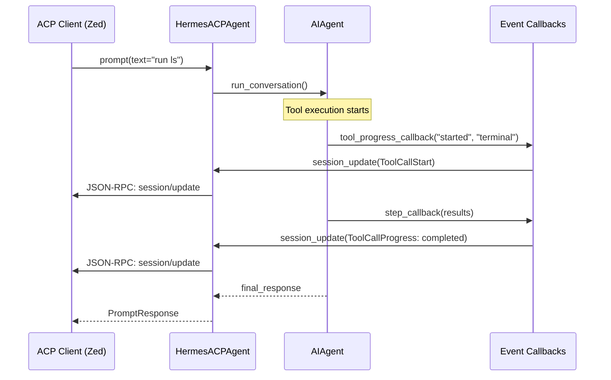

# tests — acp

# ACP Adapter Test Suite

The `tests/acp` module provides comprehensive test coverage for the **Agent Communication Protocol (ACP)** adapter. This adapter acts as a JSON-RPC bridge between the Hermes AI agent and external clients, such as the Zed editor.

The test suite ensures protocol compliance, session persistence, security isolation, and correct translation of internal agent events into ACP-compatible schemas.

## Core Test Areas

### 1. Server Implementation (`test_server.py`)
Tests the `HermesACPAgent` class, which implements the ACP server-side logic.
*   **Lifecycle Methods:** Validates `initialize`, `authenticate`, `new_session`, `load_session`, and `resume_session`.
*   **Capabilities:** Ensures the server correctly advertises support for session forking, listing, and resuming using the correct JSON wire format (e.g., `loadSession` vs `load_session`).
*   **Slash Commands:** Verifies that the adapter intercepts and handles internal commands like `/help`, `/model`, `/reset`, and `/compact` without invoking the LLM.
*   **Pagination:** Tests the cursor-based pagination logic for `list_sessions`.

### 2. Session Management & Persistence (`test_session.py`)
Tests the `SessionManager` and `SessionState` components responsible for maintaining agent state across restarts.
*   **Persistence:** Verifies that sessions are correctly serialized to and restored from `SessionDB`.
*   **WSL Integration:** Validates `_translate_acp_cwd`, which converts Windows-style paths (e.g., `E:\Project`) to WSL-compatible paths (e.g., `/mnt/e/Project`) to ensure tools function correctly in cross-platform environments.
*   **Isolation:** Ensures that `get_session` only restores sessions marked with the `acp` source, preventing collision with CLI-based sessions.
*   **FTS Search:** Confirms that ACP session history is indexed and searchable via SQLite FTS5.

### 3. Security & Thread Isolation (`test_approval_isolation.py`)
Focuses on regressions for **GHSA-96vc-wcxf-jjff** and **GHSA-qg5c-hvr5-hjgr**.
*   **Thread-Local Callbacks:** Ensures that `set_approval_callback` and `set_sudo_password_callback` use thread-local storage (TLS). This prevents concurrent ACP sessions from overwriting each other's security handlers.
*   **Interactive Enforcement:** Verifies that `_run_agent` correctly sets `HERMES_INTERACTIVE` so that dangerous commands trigger the ACP-supplied callback instead of auto-approving.
*   **Context Isolation:** Tests that even when `ThreadPoolExecutor` reuses threads, `contextvars` and `HERMES_SESSION_KEY` are used to isolate the interactive sudo password cache between distinct sessions.

### 4. Event & Tool Translation (`test_events.py`, `test_tools.py`)
Ensures internal agent activity is correctly mapped to ACP protocol messages.
*   **Callback Factories:** Tests `make_tool_progress_cb`, `make_step_cb`, and `make_thinking_cb`. These factories bridge the synchronous agent execution with the asynchronous ACP connection using `asyncio.run_coroutine_threadsafe`.
*   **Tool Mapping:** Validates `TOOL_KIND_MAP`, which categorizes Hermes tools into ACP kinds (`read`, `edit`, `execute`, `fetch`).
*   **Diff Generation:** Verifies that `build_tool_start` and `build_tool_complete` generate structured `FileEditToolCallContent` (diff blocks) for tools like `patch` and `write_file`, allowing editors to render inline previews.

### 5. MCP Integration (`test_mcp_e2e.py`)
Tests the end-to-end flow of the **Model Context Protocol (MCP)** within an ACP session.
*   **Dynamic Registration:** Verifies that `new_session` calls containing `mcpServers` correctly trigger `tools.mcp_tool.register_mcp_servers`.
*   **Sanitization:** Ensures server names with special characters (e.g., `ai.exa/exa`) are sanitized into valid tool names.
*   **Result Reporting:** Confirms that results from MCP tools are correctly paired with their `toolCallId` and reported back to the client via `ToolCallProgress` updates.

## Execution Flow: Prompt to Update

The following diagram illustrates the flow tested in `test_mcp_e2e.py` and `test_events.py`, showing how a tool execution inside the agent triggers ACP updates.

## Infrastructure & Utilities

### Ping Suppression (`test_ping_suppression.py`)
Tests the `_BenignProbeMethodFilter` logging filter. This component suppresses "Method not found" errors in the logs specifically for `ping` or `health` requests. This prevents log pollution when clients perform bare JSON-RPC probes to check if the agent process is alive.

### Permissions Bridging (`test_permissions.py`)
Tests `make_approval_callback`, which converts the agent's synchronous approval requests into asynchronous ACP `request_permission` calls. It validates the mapping of ACP outcomes (`allow_once`, `allow_always`, `cancelled`) back to internal Hermes approval states (`once`, `always`, `deny`).

### Authentication (`test_auth.py`)
Validates the logic in `acp_adapter.auth` for detecting available LLM providers (OpenRouter, Anthropic, etc.) based on the environment and configuration, which is used during the ACP `authenticate` phase.