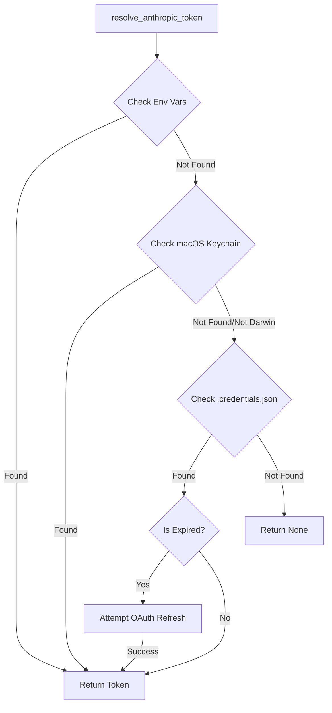

# tests — agent

# Tests — Agent Module

The `tests/agent` module provides comprehensive test coverage for the core communication and adaptation layers of the agent. It ensures that internal agent logic correctly translates to external LLM provider APIs, manages complex authentication flows, and handles model-specific constraints.

## Core Testing Areas

### 1. Anthropic Adapter (`test_anthropic_adapter.py`)
This suite validates the `agent.anthropic_adapter` module, which serves as the primary bridge to the Anthropic Messages API.

*   **Message Conversion**: Tests `convert_messages_to_anthropic` to ensure internal message formats (including system prompts, tool calls, and images) are correctly mapped.
    *   **Thinking Blocks**: Validates the strategy of stripping thinking blocks from historical turns while preserving signed thinking blocks on the latest turn.
    *   **Image Handling**: Ensures both remote URLs and base64 data URLs are converted to Anthropic's expected source format.
    *   **Role Alternation**: Verifies that consecutive messages from the same role are merged to satisfy Anthropic's strict user/assistant alternation requirements.
*   **Tool Transformation**: Tests `convert_tools_to_anthropic`, focusing on the conversion of OpenAI-style function definitions to Anthropic tool schemas, including the deduplication of tool names to prevent API rejection.
*   **Model Normalization**: Ensures model strings (e.g., `anthropic/claude-3.5-sonnet`) are correctly stripped and formatted for the SDK.
*   **Kwarg Construction**: Validates `build_anthropic_kwargs`, specifically how `max_tokens` are calculated based on model limits and how `reasoning_config` maps to either "manual" or "adaptive" thinking modes depending on the model version (e.g., Claude 4.6 vs 4.7).

### 2. Credential & Authentication Management
The test suite covers a multi-tiered credential resolution logic across `test_anthropic_adapter.py` and `test_anthropic_keychain.py`.

*   **OAuth Flow**: Validates the detection of OAuth tokens (`sk-ant-oat01-...`) and the automatic refresh logic using `_refresh_oauth_token` when tokens expire.
*   **Credential Priority**: Ensures the agent follows the correct resolution order:
    1.  Environment variables (`ANTHROPIC_TOKEN`, `ANTHROPIC_API_KEY`).
    2.  macOS Keychain (for Claude Code >= 2.1.114).
    3.  Local filesystem (`~/.claude/.credentials.json`).
*   **macOS Keychain Integration**: Specifically tests the `security` command-line interaction on Darwin platforms, ensuring JSON payloads are correctly parsed from the system keychain and that failures (like missing entries) fall back gracefully to file-based storage.

### 3. Auxiliary Client Resolution (`test_auxiliary_client.py`)
The agent uses "auxiliary" clients for secondary tasks like context compression, session search, and vision. These tests verify the `resolve_provider_client` logic.

*   **Provider Chain**: Validates the `_resolve_auto` logic which attempts to find a usable backend in a specific order: OpenRouter → Codex → Custom Runtimes → Anthropic → Nous.
*   **JWT Validation**: Tests `_read_codex_access_token` to ensure that expired JWTs are detected and skipped, preventing the agent from attempting to use stale credentials.
*   **Nous/Portal Integration**: Verifies that the agent can fetch recommended auxiliary models from the Nous Portal and correctly configures the OpenAI-compatible client for these endpoints.
*   **Error Recovery**: Tests the `call_llm` and `async_call_llm` wrappers for their ability to catch specific provider errors (like 401 Unauthorized or 400 Unsupported Parameter) and trigger appropriate retries or fallbacks.

## Key Execution Flows

The following diagram illustrates the credential resolution and client building flow tested within this module:

## Specialized Logic Tests

### Tool Guardrails
Tests in `test_tool_guardrails.py` (referenced in call graphs) ensure that the agent monitors tool execution patterns. It validates:
*   **Idempotency Checks**: Warning when the same tool is called with identical arguments repeatedly.
*   **Hard Stops**: Halting execution if a failure streak exceeds configured thresholds.

### Model Metadata & Context
Tests in `test_model_metadata_local_ctx.py` verify how the agent determines context window limits for local providers like LM Studio. It ensures that the agent queries the `/v1/models` endpoint and correctly extracts the `context_length` to prevent overflow errors during inference.

### Subagent Progress & Hooks
*   **Stop Hooks**: Ensures that when a subagent finishes, parent session IDs are correctly propagated in the payload.
*   **Progress Callbacks**: Validates that "thinking" updates from the LLM are correctly intercepted and passed to UI progress handlers.