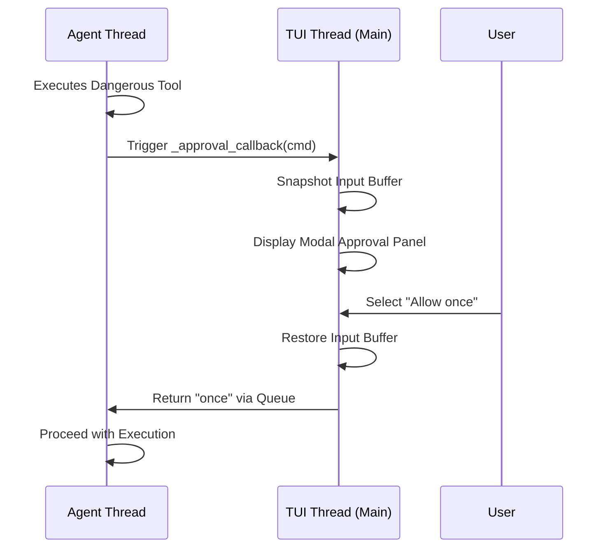

# tests — cli

# Tests — CLI Module

The `tests/cli` module provides a comprehensive test suite for the Hermes Command Line Interface. It validates the TUI (Terminal User Interface) behavior, slash command processing, session lifecycle management, and the security-critical approval workflows for dangerous operations.

## Core Testing Areas

### 1. Command Dispatch and Prefix Matching
The CLI uses a prefix-matching system for slash commands. Tests in `test_cli_prefix_matching.py` verify that:
- Unique prefixes (e.g., `/con`) correctly resolve to full commands (e.g., `/config`).
- Ambiguous prefixes trigger a suggestion or error message.
- Command arguments are preserved during expansion without causing infinite recursion.
- Exact matches bypass prefix logic for performance and stability.

### 2. Session Lifecycle and Branching
Session management is a primary focus, ensuring data integrity across different interaction states.
- **Branching (`/branch`, `/fork`):** `test_branch_command.py` verifies that branching creates a new session in the `SessionDB`, copies message history, sets the `parent_session_id`, and marks the original session as "branched". It also ensures that active agents are updated with the new session ID and log file paths.
- **Fresh Sessions (`/new`, `/reset`, `/clear`):** `test_cli_new_session.py` ensures that starting a new session correctly zeroes out all token counters (input, output, cache, reasoning) and resets the `AIAgent` state, including the `TodoStore`.
- **Resuming:** Tests verify that `/resume` without arguments lists recent sessions and that resuming correctly restores conversation history.

### 3. TUI and Interaction Logic
These tests exercise the integration with `prompt-toolkit` and `rich`.
- **Approval UI:** `test_cli_approval_ui.py` contains critical regression tests for the dangerous command approval panel. It ensures that:
    - The UI does not clip action buttons (Allow/Deny) on small terminal windows.
    - Long descriptions are truncated gracefully.
    - The "View Full Command" toggle works correctly.
    - Callbacks are correctly registered in thread-local storage to prevent deadlocks between the agent thread and the TUI thread.
- **Input Sanitization:** `test_cli_bracketed_paste_sanitizer.py` validates the stripping of terminal escape sequences (bracketed paste wrappers) that can leak into the input buffer.
- **File Drops:** `_detect_file_drop` is tested to ensure that absolute paths dragged into the terminal are recognized as file attachments (especially images) rather than slash commands.
- **Redraws:** `test_cli_force_redraw.py` verifies that the CLI can recover from terminal buffer drift (e.g., after a `tmux` tab switch) by forcing a full screen clear and invalidation.

### 4. Background Tasks (`/btw`)
The `/background` (aliased as `/btw`) command allows the agent to run tasks without blocking the main input loop.
- **TUI Refresh:** `test_cli_background_tui_refresh.py` ensures `app.invalidate()` is called before printing background task output to prevent overlapping with the spinner or status bar.
- **Callback Propagation:** Tests verify that background tasks inherit the same approval UI callbacks as foreground tasks, preventing them from falling back to `stdin` and hanging.

### 5. Configuration and MCP Integration
- **MCP Watcher:** `test_cli_mcp_config_watch.py` validates the automatic reloading of Model Context Protocol (MCP) servers when the `mcp_servers` section of `config.yaml` is modified. It includes throttling logic to prevent excessive `stat()` calls.
- **Provider Resolution:** `test_cli_init.py` ensures that root-level configuration keys (like `provider` or `base_url`) are correctly migrated to the `model` section and do not override explicit model-specific settings.
- **Busy Input Mode:** Tests the `/busy` command, which toggles how the CLI handles user input while the agent is generating (options: `interrupt`, `queue`, `steer`).

## Security and Approval Workflow

The CLI implements a strict approval flow for tools that perform side effects (e.g., `terminal_tool`). The following diagram illustrates the interaction between the Agent thread and the TUI thread during an approval request:

## Key Test Utilities and Fixtures

- **`_make_cli`:** A common factory function found across test files that initializes a `HermesCLI` instance with mocked `prompt-toolkit` components to allow testing TUI logic in headless environments.
- **`session_db`:** A fixture that provides a temporary SQLite database for testing session persistence and history.
- **`_FakeAgent`:** A stub used to verify that the CLI correctly updates agent state (like token counts and session IDs) without requiring a full LLM backend.

## Regression Highlights

- **Thread-Local Callbacks:** Tests in `test_cli_approval_ui.py` specifically guard against a bug where the agent thread could not access the TUI's approval callbacks, causing the CLI to hang while waiting for `input()`.
- **Token Counter Reset:** `test_cli_new_session.py` ensures that `/new` resets the `session_total_tokens` to 0, preventing cumulative cost/usage reporting across unrelated sessions.
- **Bracketed Paste:** `test_cli_bracketed_paste_sanitizer.py` prevents "degraded" terminal environments from injecting `[200~` and `[201~` strings into the LLM prompt.