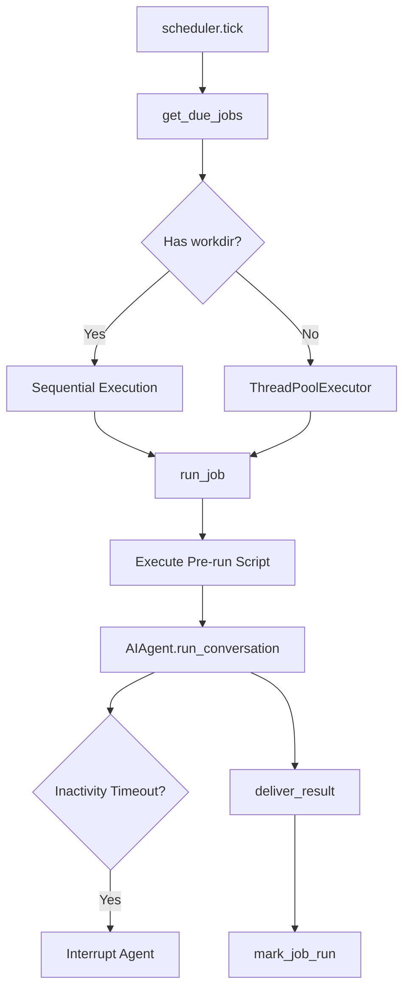

# tests — cron

# Cron Module Test Suite

The `tests/cron` module provides comprehensive test coverage for the system's background task scheduling and execution engine. It validates the lifecycle of a cron job—from creation and schedule parsing to execution via the AI agent and final result delivery.

## Core Testing Areas

### 1. Job Management and Scheduling (`test_jobs.py`)
This suite validates the `cron.jobs` logic, focusing on how schedules are interpreted and when jobs are marked as "due."

*   **Duration Parsing:** Tests `parse_duration` for various string formats (e.g., `30m`, `2h`, `7days`).
*   **Schedule Interpretation:** Validates `parse_schedule` for three distinct types:
    *   **Once:** One-shot tasks at a specific ISO timestamp or relative offset.
    *   **Interval:** Recurring tasks based on minutes (e.g., "every 2h").
    *   **Cron:** Standard cron expressions (e.g., `0 9 * * *`) using `croniter`.
*   **Next Run Calculation:** Ensures `compute_next_run` correctly anchors to `last_run_at` to prevent drift or double-firing after system restarts.
*   **State Transitions:** Tests `pause_job`, `resume_job`, and `mark_job_run`, ensuring that hitting a repeat limit correctly transitions a job to `completed` or removes it.

### 2. Scheduler Execution Flow (`test_scheduler.py`)
Tests the `cron.scheduler` module, which handles the operational logic of running a job.

*   **Origin & Delivery Resolution:** Validates `_resolve_origin` and `_resolve_delivery_target`. It ensures results are routed back to the correct platform (Telegram, Slack, etc.) or fallback "home" channels defined in environment variables.
*   **Result Delivery:** Tests `_deliver_result` and media handling (`_send_media_via_adapter`), ensuring that images, videos, and documents are correctly extracted from agent output and dispatched.
*   **Silent Mode:** Verifies that the `SILENT_MARKER` (e.g., `[silent]`) in agent responses correctly suppresses external delivery while still saving the output locally.

### 3. Inactivity Timeouts (`test_cron_inactivity_timeout.py`)
To prevent "zombie" jobs that hang indefinitely, the scheduler implements an inactivity monitor.

*   **Activity Tracking:** Tests `get_activity_summary` on the agent.
*   **Timeout Trigger:** Validates that if an agent does not perform an action (API call, tool use) within the `HERMES_CRON_TIMEOUT` (default 600s), the scheduler interrupts the task.
*   **Diagnostic Logging:** Ensures the error message includes the last known activity to assist in debugging hung agents.

### 4. Advanced Job Features

#### Context Chaining (`test_cron_context_from.py`)
Tests the `context_from` feature, which allows a job to consume the output of a previous job.
*   **Injection:** Validates that `_build_job_prompt` injects the most recent markdown output from the referenced job ID into the current job's prompt.
*   **Normalization:** Ensures multiple job IDs are handled and that missing outputs are skipped gracefully.

#### Script Injection (`test_cron_script.py`)
Jobs can execute a local script before the LLM run to provide dynamic data.
*   **Execution:** Tests `_run_job_script` for successful output capture and error handling (non-zero exits, timeouts).
*   **Security (Path Containment):** Critically validates that scripts are restricted to the `~/.hermes/scripts` directory, blocking absolute paths, tilde expansion, or symlink escapes.

#### Working Directory Isolation (`test_cron_workdir.py`)
Tests the `workdir` parameter which allows jobs to run within a specific filesystem context.
*   **Environment Mutation:** Ensures `TERMINAL_CWD` is set during the run and strictly restored afterward.
*   **Sequential Partitioning:** Validates that `tick()` runs jobs with a `workdir` sequentially on the main thread to avoid race conditions on process-global environment variables.

## Security and Hardening (`test_file_permissions.py`)
The suite enforces strict filesystem security for sensitive cron data:
*   **Directories:** `CRON_DIR` and `OUTPUT_DIR` must be `0700` (owner-only).
*   **Files:** `jobs.json` and individual job output files must be `0600`.
*   **Identity:** Ensures `load_soul_identity` is always active for cron jobs to maintain agent personality.

## Integration Paths

### Codex Recovery (`test_codex_execution_paths.py`)
Specifically tests the `openai-codex` runtime path. It mocks a `401 Unauthorized` error to verify that `AIAgent` triggers `_try_refresh_codex_client_credentials` and successfully retries the conversation without failing the cron job.

### Skill Rewriting (`test_rewrite_skill_refs.py`)
Ensures integration with the system curator. When skills are consolidated or pruned, `rewrite_skill_refs` updates existing cron jobs to point to the new "umbrella" skill names, preventing jobs from running with broken instructions.

## Execution Flow Diagram

## Developer Notes
*   **Mocking:** Most tests use `monkeypatch` to redirect `HERMES_HOME` to a `tmp_path`, preventing tests from affecting the local user's cron jobs.
*   **Dependencies:** Tests involving cron expressions will skip if `croniter` is not installed.
*   **Environment Variables:** Tests verify that `HERMES_CRON_TIMEOUT` and various `_HOME_CHANNEL` variables are correctly parsed.