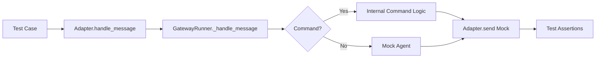

# tests — e2e

# E2E Testing Module

The `tests/e2e` module provides end-to-end validation of the message processing pipeline. These tests exercise the full asynchronous flow from the moment a platform adapter receives a raw event to the point where a response is dispatched back to the platform.

## Overview

The E2E suite is designed to test the "Gateway" layer—routing, command dispatch, session management, and authorization—without requiring real platform connections or live LLM inference.

### Core Execution Flow
The tests typically follow this execution path:
1.  **Event Injection**: A mock `MessageEvent` is passed to `adapter.handle_message(event)`.
2.  **Background Processing**: The adapter processes the message in a background task via `_process_message_background()`.
3.  **Gateway Dispatch**: The message is routed to `GatewayRunner._handle_message()`.
4.  **Command/Agent Execution**: The runner identifies slash commands or routes the text to a (mocked) agent.
5.  **Response Capture**: The adapter's `send()` method (an `AsyncMock`) captures the output for assertion.



## Test Infrastructure (`conftest.py`)

The `conftest.py` file contains the machinery required to simulate the gateway environment.

### Platform Mocking
Since E2E tests run in environments where platform-specific SDKs (like `python-telegram-bot` or `discord.py`) might not be installed, the module includes "ensure" functions (`_ensure_telegram_mock`, `_ensure_discord_mock`, `_ensure_slack_mock`). These inject `MagicMock` objects into `sys.modules` to allow the adapters to be imported and instantiated.

### Factory Functions
- **`make_runner(platform)`**: Creates a `GatewayRunner` instance. It uses `object.__new__` to bypass the standard `__init__` method, avoiding filesystem side effects and network calls. It pre-configures mocks for `session_store`, `pairing_store`, and `hooks`.
- **`make_adapter(platform, runner)`**: Instantiates a platform-specific adapter (e.g., `DiscordAdapter`, `TelegramAdapter`) and wires it to the provided runner using `set_message_handler`.
- **`send_and_capture(adapter, text, platform)`**: A high-level helper that creates an event, injects it into the adapter, waits for a short "settle" delay (`E2E_MESSAGE_SETTLE_DELAY`), and returns the `adapter.send` mock for inspection.

## Command Verification (`test_platform_commands.py`)

This suite uses parametrized fixtures to run the same set of tests across all supported platforms (Telegram, Discord, Slack). It verifies:
- **Slash Commands**: Ensures `/help`, `/status`, `/new`, `/stop`, and `/personality` return expected strings or trigger correct state changes (e.g., calling `session_store.reset_session`).
- **Authorization**: Validates that unauthorized users receive pairing codes instead of command outputs.
- **Session Lifecycle**: Confirms that sequential commands correctly share or reset session state.
- **Resilience**: Checks that the pipeline handles `send()` failures without crashing the background task.

## Discord-Specific Logic (`test_discord_adapter.py`)

Discord requires specialized E2E tests due to its unique message handling requirements:
- **Mention Stripping**: Verifies that `<@BOT_ID> /command` is correctly parsed as `/command` after the mention is stripped.
- **Auto-Threading**: Tests the interaction between `DISCORD_AUTO_THREAD` and command detection, ensuring that creating a thread doesn't lose the original command context.
- **Channel vs. DM**: Validates that mentions are required in server channels but optional in DMs.

## Matrix Cross-Signing Bootstrap (`matrix_xsign_bootstrap/`)

This is a specialized, self-contained E2E suite located in its own subdirectory. Unlike the other tests, it uses a real **Continuwuity** (Matrix) homeserver running in Docker.

### Purpose
It validates the complex cryptographic bootstrap logic in `MatrixAdapter`:
1.  **Key Generation**: Ensures cross-signing keys are published with unpadded base64 key IDs (required for compatibility with `matrix-rust-sdk`).
2.  **Idempotency**: Verifies that bootstrap is skipped on subsequent startups if keys already exist in the `PgCryptoStore`.
3.  **Recovery Path**: Confirms that providing a `MATRIX_RECOVERY_KEY` allows the adapter to verify existing keys rather than generating new ones.

### Usage
The Matrix E2E test requires Docker and the `mautrix` Python package. It is executed via:
```bash
docker compose -f tests/e2e/matrix_xsign_bootstrap/docker-compose.yml up -d
python tests/e2e/matrix_xsign_bootstrap/test_bootstrap.py
```

## Key Test Patterns

### Handling Async Settle Times
Because the gateway processes messages in background tasks, tests must allow the event loop to cycle. The `send_and_capture` helper implements a `0.3s` sleep. If a test fails intermittently, check if the background task completed within this window.

### Mocking the Agent Layer
By default, `make_runner` mocks `_handle_message_with_agent` to return a static string. This isolates the gateway logic from the LLM provider logic. To test agent-specific routing, override this mock in the specific test case:
```python
runner._handle_message_with_agent = AsyncMock(return_value="Custom Agent Response")
```