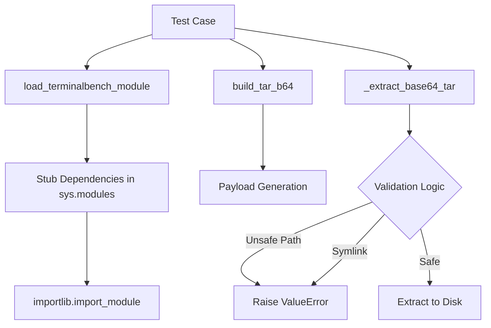

# tests — environments

# Terminal-Bench 2 Environment Security Tests

The `test_terminalbench2_env_security.py` module provides a specialized test suite focused on the security of archive extraction within the Terminal-Bench 2 environment. It specifically validates that the environment's internal extraction logic is resilient against common archive-based attacks such as path traversal and symlink exploitation.

## Overview

The primary target of these tests is the `_extract_base64_tar` function within the `environments.benchmarks.terminalbench_2.terminalbench2_env` module. Because the environment module has extensive dependencies on internal libraries (like `atroposlib`), this test suite employs a sophisticated stubbing mechanism to isolate the extraction logic for unit testing.

## Isolation and Stubbing Strategy

To test the environment in isolation, the module uses `_load_terminalbench_module` to dynamically construct a mock environment.

1.  **`_stub_module(name, **attrs)`**: A helper that creates a `types.ModuleType` object and populates it with provided attributes.
2.  **Dependency Mocking**: The suite mocks the following namespaces before importing the target module:
    *   `atroposlib` (and its sub-packages `envs.base`, `envs.server_handling`)
    *   `environments.agent_loop`
    *   `environments.hermes_base_env`
    *   `tools.terminal_tool`
3.  **Monkeypatching**: These stubs are injected into `sys.modules` using pytest's `monkeypatch`. This allows the test to call `importlib.import_module` on the Terminal-Bench 2 environment without triggering real side effects or requiring the full production stack.

## Test Utilities

### Archive Generation
The `_build_tar_b64(entries)` function is a utility that programmatically generates base64-encoded Gzip-compressed tarballs. It supports creating:
*   **Directories**: `kind: "dir"`
*   **Regular Files**: `kind: "file"` with custom string data.
*   **Symlinks**: `kind: "symlink"` with a specified target path.

This utility allows the test suite to craft malicious payloads (e.g., files with `..` in the path) to verify the environment's validation logic.

## Security Scenarios Tested

The module validates three critical behaviors of the `_extract_base64_tar` function:

### 1. Safe Extraction
**Function**: `test_extract_base64_tar_allows_safe_files`
Verifies that standard, well-formed archives containing directories and files are extracted correctly to the target destination without errors.

### 2. Path Traversal Prevention
**Function**: `test_extract_base64_tar_rejects_path_traversal`
Ensures that the environment detects and rejects archive members containing path traversal sequences (e.g., `../escape.txt`). 
*   **Expected Behavior**: The environment must raise a `ValueError` matching "Unsafe archive member path".
*   **Security Goal**: Prevent an attacker from overwriting files outside the designated temporary extraction directory.

### 3. Symlink Restriction
**Function**: `test_extract_base64_tar_rejects_symlinks`
Ensures that the environment rejects archives containing symbolic links.
*   **Expected Behavior**: The environment must raise a `ValueError` matching "Unsupported archive member type".
*   **Security Goal**: Prevent symlink attacks where an archive creates a link to a sensitive system file (like `/etc/passwd`) which might later be read or written to by the agent.

## Execution Flow

## Usage for Contributors

When modifying the extraction logic in `terminalbench2_env.py`, ensure these tests pass to maintain the security baseline. If adding support for new archive types or extraction features, add corresponding test cases to `_build_tar_b64` and create new security validation tests here.