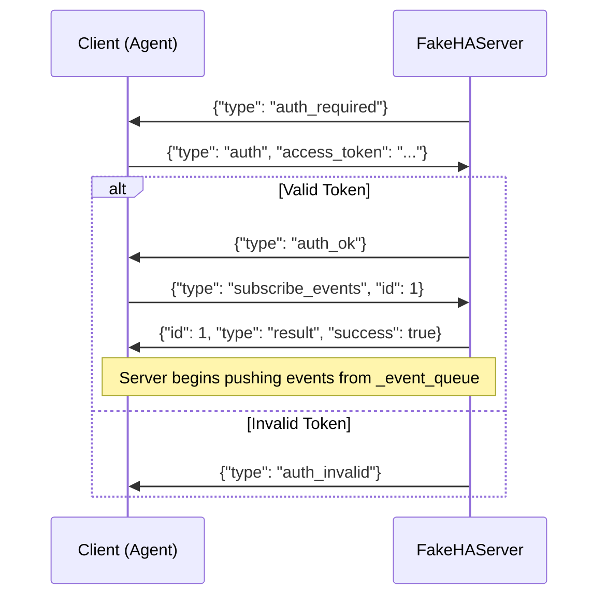

# tests — fakes

# Tests — Fakes

The `tests.fakes` module provides a mock implementation of the Home Assistant API. Its primary component, `FakeHAServer`, is an in-process HTTP and WebSocket server built on `aiohttp.web`. It allows integration tests to exercise the `hermes-agent` against a realistic API surface without requiring a live Home Assistant instance.

## FakeHAServer

The `FakeHAServer` class simulates the core Home Assistant REST and WebSocket endpoints. It maintains an internal state of entities and records incoming requests for test assertions.

### Lifecycle Management

The server is designed to be used as an asynchronous context manager, which handles the setup and teardown of the underlying `aiohttp.test_utils.TestServer`.

```python
async with FakeHAServer(token="test-token") as server:
    url = server.url  # http://127.0.0.1:<random_port>
    # Run tests against server.url
```

Alternatively, you can manually call `await server.start()` and `await server.stop()`.

### Supported Endpoints

| Protocol | Endpoint | Description |
| :--- | :--- | :--- |
| **REST** | `GET /api/states` | Returns the full list of `ENTITY_STATES`. |
| **REST** | `GET /api/states/{entity_id}` | Returns state for a specific entity or 404. |
| **REST** | `POST /api/services/{domain}/{service}` | Records a service call and updates internal state. |
| **REST** | `POST /api/services/persistent_notification/create` | Specifically handles notification creation. |
| **WS** | `/api/websocket` | Handles auth handshake and event subscriptions. |

### WebSocket Protocol Flow

The WebSocket implementation follows the standard Home Assistant handshake. Once a subscription is established, the server enters a loop, pushing any events added to the internal queue.



### State and Observability

The server provides several attributes to inspect its state and the interactions it has received:

*   **`received_service_calls`**: A list of dictionaries containing the `domain`, `service`, and `data` of every service call POSTed to the server.
*   **`received_notifications`**: A list of payloads sent to the `persistent_notification/create` endpoint.
*   **`ENTITY_STATES`**: A static list of sample entities (lights, sensors, switches, climate) used as the initial state.

### Controlling Behavior

Tests can manipulate the server's behavior dynamically:

1.  **Pushing Events**: Use `await server.push_event(event_data)` to simulate a state change in Home Assistant. This event is forwarded to all active WebSocket subscribers.
2.  **Simulating Failures**:
    *   Set `server.reject_auth = True` to force WebSocket authentication failures.
    *   Set `server.force_500 = True` to make all REST endpoints return a 500 Internal Server Error.
3.  **State Side Effects**: The `_handle_call_service` method contains logic to update `ENTITY_STATES` when specific services are called (e.g., `turn_on`, `turn_off`, `set_temperature`). For example, calling `set_temperature` on a climate entity will also update the linked `sensor.temperature` state to simulate a realistic environment response.

### Authentication

The server enforces Bearer token authentication for REST requests via the `_check_rest_auth` helper. The expected token is defined during initialization. If the `Authorization` header is missing or incorrect, the server returns a `401 Unauthorized` response.