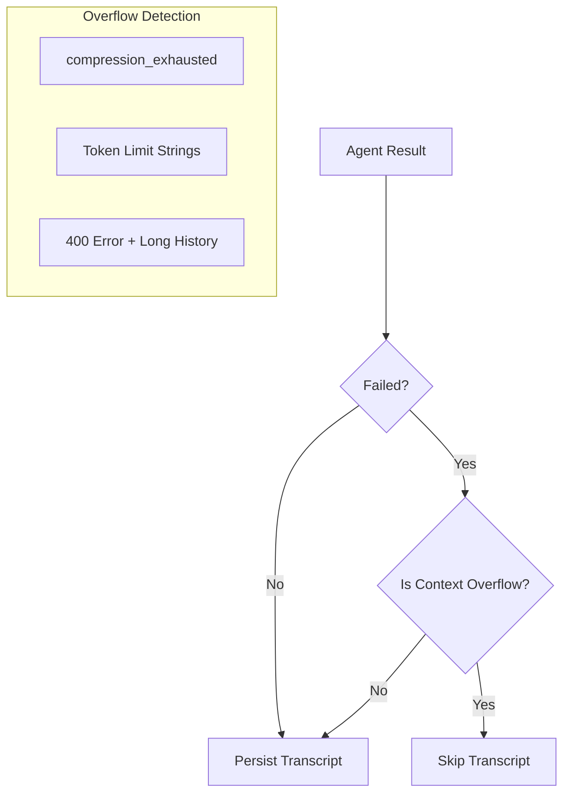

# tests — gateway

# Tests — Gateway

The `tests/gateway` module provides the testing infrastructure, mocks, and integration suites for the gateway layer. This includes the `GatewayRunner`, session management, agent caching, and various platform adapters (Telegram, Discord, Feishu, API Server, etc.).

## Core Infrastructure & Safety Guards

### Plugin Adapter Loader
Every platform plugin (located in `plugins/platforms/<name>/`) contains its own `adapter.py`. To prevent `ImportError` and `sys.modules` collisions when running tests in parallel (e.g., via `pytest-xdist`), the module provides `load_plugin_adapter`.

*   **Function**: `load_plugin_adapter(plugin_name: str)`
*   **Mechanism**: Imports the adapter from an explicit file path and registers it under a unique name (`plugin_adapter_<plugin_name>`). This avoids the "polluted `sys.path`" anti-pattern where multiple plugins compete for the top-level `adapter` module name.

### Anti-Pattern Guard
The `conftest.py` implements a mandatory AST-based scan during the `pytest_configure` phase. It rejects any test file that attempts to:
1.  Manually insert `plugins/platforms` paths into `sys.path`.
2.  Perform a bare `import adapter` or `from adapter import ...`.

If the guard detects these patterns, it raises a `pytest.UsageError` with instructions to use the `load_plugin_adapter` helper.

## Global Mocks

The gateway relies on several heavy external libraries. To ensure tests remain fast and environment-independent, `conftest.py` installs idempotent mocks into `sys.modules` before test collection.

*   **Telegram Mock**: `_ensure_telegram_mock()` provides a `MagicMock` for `telegram`, `telegram.ext`, and `telegram.constants`. It includes real exception classes (e.g., `NetworkError`, `RetryAfter`) to ensure `except` blocks in production code function correctly.
*   **Discord Mock**: `_ensure_discord_mock()` provides a comprehensive mock for `discord.py`, including fake implementations of `ui.View`, `ui.Button`, and `app_commands`. This allows testing of complex interaction flows (like model pickers) without the actual library.

## Agent Cache Testing

The `test_agent_cache.py` suite verifies the lifecycle of `AIAgent` instances within the `GatewayRunner`.

### Cache-Busting Logic
The runner generates a signature for cached agents. The tests verify that the cache is correctly invalidated (busted) when specific configuration keys change:
*   `model.context_length`
*   `compression.enabled` / `compression.threshold`
*   `tools.registry_generation` (triggered by MCP reloads)

### Safety & Eviction
The cache implements an LRU (Least Recently Used) policy and an idle-TTL sweep.
*   **Active Safety**: The `_enforce_agent_cache_cap` and `_sweep_idle_cached_agents` functions are tested to ensure they **skip** agents currently mid-turn (present in `_running_agents`). This prevents `agent.close()` from tearing down clients or sandboxes while a request is in flight.
*   **Soft vs. Hard Cleanup**: Tests distinguish between `release_clients()` (soft cleanup for cache eviction, preserving terminal/browser state) and `close()` (hard cleanup for session expiry).

## Platform-Specific Helpers

### Feishu Helpers
`feishu_helpers.py` provides factory functions for Feishu-specific testing:
*   `make_sender` / `make_message`: Generates `SimpleNamespace` objects mimicking Feishu's nested ID structures.
*   `make_adapter_skeleton`: Manually constructs a `FeishuAdapter` with specific policies (allowlists, bot permissions) for unit testing admission logic.

### Restart & Drain Helpers
`restart_test_helpers.py` facilitates testing the gateway's graceful shutdown and restart logic.
*   **`RestartTestAdapter`**: A stub adapter that tracks sent messages and simulates connection states.
*   **`make_restart_runner`**: A factory that assembles a `GatewayRunner` with mocked hooks, session stores, and a controlled environment to test the `request_restart` flow and message draining.

## API Server Integration Tests

The `test_api_server.py` suite covers the OpenAI-compatible gateway endpoint.

### Key Components Tested:
*   **Idempotency**: `_IdempotencyCache` ensures that concurrent requests with the same key and fingerprint only trigger one agent execution.
*   **SSE Streaming**: Verifies that `stream=true` correctly handles:
    *   Keepalive comments (`: keepalive`) during long tool executions.
    *   Filtering of internal `None` sentinels used for UI box management.
    *   **Tool Progress**: Verifies that tool lifecycle events are emitted as custom SSE events (`event: hermes.tool.progress`) rather than leaking into the `content` delta.
*   **Response Store**: Tests the LRU `ResponseStore` used for retrieving previous completions and chaining responses.

## Failure Classification

`test_7100_transient_failure_transcript.py` validates the logic used to decide if a failed agent turn should be persisted to the session transcript.

| Failure Type | Classification | Transcript Action |
| :--- | :--- | :--- |
| Context Window Exceeded | Context Overflow | **Skip** (Prevents infinite loops) |
| Rate Limit (429) | Transient | **Persist** (Agent remembers turn on retry) |
| Read Timeout / 500 | Transient | **Persist** |
| 400 (Short Session) | Client Error | **Persist** |

