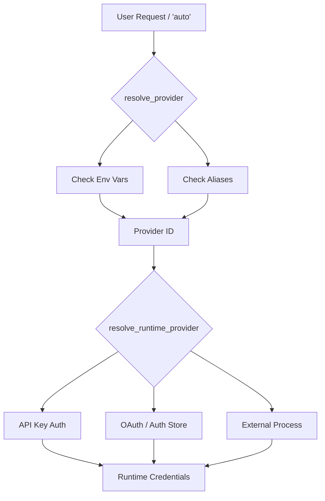

# tests — hermes_cli

# Hermes CLI Test Suite

The `tests/hermes_cli` module provides comprehensive test coverage for the Hermes command-line interface, focusing on authentication flows, provider integration, model management, and CLI-specific utilities. It ensures that the interaction between the user's environment, the `hermes_cli` logic, and external AI providers remains robust.

## Core Testing Areas

### 1. Provider Registry and Resolution
The suite extensively validates the `PROVIDER_REGISTRY` and the logic used to determine which AI provider to use based on environment variables or explicit flags.

*   **Provider Mapping:** Tests in `test_api_key_providers.py` verify that providers like `zai` (Zhipu), `kimi-coding` (Moonshot), `stepfun`, `minimax`, and `arcee` are correctly registered with their respective base URLs and environment variable keys.
*   **Alias Resolution:** Ensures that user-friendly aliases (e.g., `vercel` for `ai-gateway`, `moonshot` for `kimi-coding`) resolve to the correct internal provider ID via `resolve_provider()`.
*   **Auto-Detection:** Validates that `resolve_provider("auto")` correctly prioritizes keys (e.g., `OPENROUTER_API_KEY` taking priority over `GLM_API_KEY`).
*   **Credential Resolution:** Tests `resolve_api_key_provider_credentials()` to ensure keys and base URLs are correctly extracted from the environment, including fallback logic for local servers like LM Studio.

### 2. Authentication Flows
A significant portion of the module is dedicated to complex OAuth and API key persistence flows.

#### Anthropic OAuth & Stale Tokens
`test_anthropic_model_flow_stale_oauth.py` and `test_anthropic_oauth_flow.py` pin the behavior for Anthropic's unique authentication requirements:
*   **Stale Token Detection:** Detects when an `ANTHROPIC_TOKEN` exists but is an expired OAuth token without valid Claude Code credentials, forcing a re-authentication prompt.
*   **Credential Linking:** Verifies that successful OAuth flows correctly link Claude Code credentials and clear conflicting environment variables.

#### OpenAI Codex (ChatGPT)
`test_auth_codex_provider.py` covers the specialized OAuth flow for Codex:
*   **Token Storage:** Validates reading/writing tokens to `~/.hermes/auth.json`.
*   **Refresh Logic:** Tests `refresh_codex_oauth_pure` against specific OpenAI error shapes (e.g., `refresh_token_reused`) to ensure the CLI provides actionable re-login guidance.

#### Credential Pool
`test_auth_commands.py` tests the `hermes auth add` command, ensuring that manually entered keys or OAuth results are correctly persisted into the `credential_pool` within the Hermes auth store.

### 3. Model Management and Metadata
These tests ensure that model-specific information is accurate and provider-aware.

*   **AI Gateway Integration:** `test_ai_gateway_models.py` validates the translation of Vercel AI Gateway's pricing schema (`input`/`output`) into the internal `prompt`/`completion` format. It also tests the filtering of "recommended" and "free" models.
*   **Context Window Resolution:** `test_apply_model_switch_result_context.py` is a regression suite ensuring that the `/model` picker displays provider-specific context limits (e.g., 272K for Codex) rather than generic vendor limits (1M for GPT-4).
*   **Model Normalization:** `test_arcee_provider.py` and others verify that provider prefixes are correctly stripped or added during model selection (e.g., `arcee/trinity-mini` -> `trinity-mini`).

### 4. CLI UX and Argument Parsing
*   **Flag Propagation:** `test_argparse_flag_propagation.py` ensures that flags like `--yolo` or `--worktree` are not lost when placed before subcommands. It verifies the use of `argparse.SUPPRESS` in subparsers to prevent default values from overwriting parent parser values.
*   **Context Completions:** `test_at_context_completion_filter.py` validates that the TUI/CLI completions for `@file:` and `@folder:` correctly filter the filesystem (e.g., `@folder:` should not suggest `.env` files).

## Execution Flow: Provider Resolution

The following diagram illustrates how the test suite validates the resolution of a provider from a user request to runtime credentials.

## Utility Tests
The module also includes tests for low-level utilities used by the CLI:
*   **Atomic Writes:** `test_atomic_json_write.py` and `test_atomic_yaml_write.py` ensure that configuration and auth files are written using a temporary-file-and-rename pattern to prevent corruption during crashes or concurrent writes.

## Contributor Notes
*   **Mocks:** The suite heavily uses `unittest.mock.patch` and `monkeypatch` to simulate network responses and filesystem states.
*   **Hermes Home:** Most tests use a `tmp_path` and set the `HERMES_HOME` environment variable to isolate configuration and auth state from the developer's actual machine.
*   **Adding Providers:** When adding a new provider, add a corresponding `test_<provider>_provider.py` and update the registry tests in `test_api_key_providers.py`.