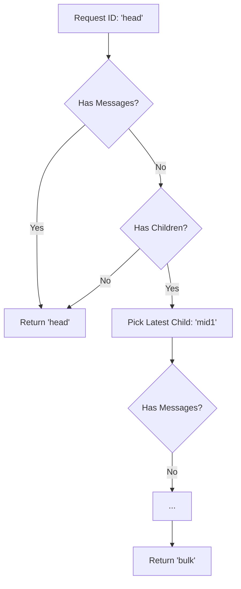

# tests — hermes_state

# Testing Session Redirection (hermes_state)

The `tests/hermes_state/test_resolve_resume_session_id.py` module provides regression testing for the session resolution logic within `SessionDB`. It specifically targets behaviors related to **Context Compression**, where a single logical conversation is split across multiple database session records.

## Context: The Compression Problem (#15000)

In Hermes, when a conversation exceeds the context window, the system performs "compression." This process:
1.  Ends the current session.
2.  Forks a new child session.
3.  Links the child to the parent via `parent_session_id`.

Because the SQLite flush cursor is reset during this fork, the parent session's `message_count` in the `sessions` table often drops to zero, while the new child session receives the subsequent messages. Previously, running `hermes --resume <parent_id>` would load the empty parent row and display a blank chat.

The `SessionDB.resolve_resume_session_id()` method was introduced to solve this by walking the descendant chain to find the actual content.

## Redirection Logic

The tests verify that the resolution logic follows these rules:
1.  **Content Priority**: If the requested session has messages, return its ID immediately.
2.  **Chain Traversal**: If the requested session is empty, look for children. Follow the chain until a session with messages is found.
3.  **Deterministic Branching**: If a session has multiple children (a fork), the resolver must pick the descendant with the most recent `started_at` timestamp.
4.  **Safety Fallbacks**: If no descendants have messages, or if the ID does not exist, return the original ID to avoid breaking standard CLI expectations.

## Test Implementation Details

### Fixtures and Helpers
*   **`db` fixture**: Initializes a transient `SessionDB` using a `tmp_path` to ensure test isolation.
*   **`_make_chain(db, ids_with_parent)`**: A utility that creates a lineage of sessions. It manually updates the `started_at` column in the SQLite database to ensure that session ordering is deterministic and not dependent on rapid-fire execution speeds.

### Key Test Scenarios

| Test Case | Purpose |
|:---|:---|
| `test_redirects_from_empty_head_to_descendant_with_messages` | Validates the primary fix for #15000: jumping from a root parent through multiple empty intermediates to the session containing the "bulk" of the messages. |
| `test_walks_from_middle_of_chain` | Ensures that if a user resumes using an ID from the middle of a compressed chain, they are still redirected forward to the active content. |
| `test_prefers_most_recent_child_when_fork_exists` | Tests the tie-breaking logic. If a session was forked into two different paths, the resolver follows the most recent temporal path. |
| `test_returns_self_when_no_descendant_has_messages` | Ensures the resolver doesn't return `None` or an error if a user resumes a genuinely empty conversation chain. |

## Database Interaction
These tests interact directly with the `sessions` table schema:
*   **`id`**: The primary session identifier.
*   **`parent_session_id`**: The foreign key used to reconstruct the conversation lineage.
*   **`started_at`**: Used to determine the "latest" path in the event of a fork.
*   **`messages` table**: The resolver checks for the existence of rows in this table linked to the session ID to determine if a session is "empty."