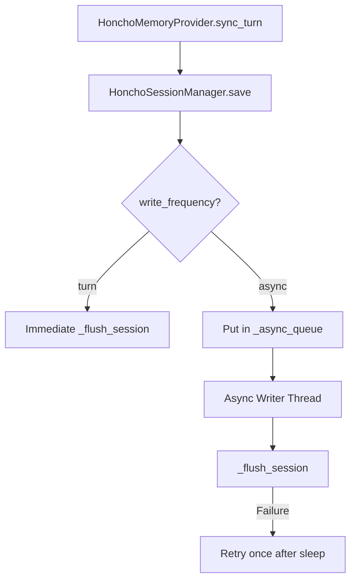

# tests — honcho_plugin

# Honcho Plugin Test Suite

The `tests/honcho_plugin` module provides comprehensive test coverage for the Honcho memory integration. It validates configuration parsing, session lifecycle management, asynchronous persistence strategies, and the tool-calling interface used by the Hermes agent.

## Core Test Areas

### 1. Configuration & Client Setup
Tests in `test_client.py` and `test_cli.py` verify how `HonchoClientConfig` assembles settings from environment variables, global configuration files, and host-specific overrides.

*   **Precedence Logic:** Validates that host-specific blocks (e.g., `hosts.hermes`) override root-level settings for fields like `workspace`, `aiPeer`, and `contextTokens`.
*   **Environment Fallbacks:** Ensures `HONCHO_API_KEY` and `HONCHO_BASE_URL` are correctly prioritized when file-based config is missing or partial.
*   **Connection Settings:** Tests the resolution of `baseUrl` and `timeout` (including aliases like `requestTimeout`), ensuring the `honcho` SDK receives the correct parameters.
*   **CLI Status:** `test_cli.py` mocks connection failures to ensure `cmd_status` accurately reports "FAILED" vs "OK" based on API reachability.

### 2. Session Management & Identity
`test_session.py` and `test_pin_peer_name.py` focus on how Hermes identifies conversations and users within the Honcho ecosystem.

*   **Session Naming:** Tests `resolve_session_name` across different strategies (`per-directory`, `per-repo`, `per-session`). It includes regression tests for the **100-character limit** on Honcho session IDs, verifying that long IDs (common in Matrix or Slack) are deterministically truncated and hashed.
*   **Peer Pinning (`pinPeerName`):** Validates the logic for unifying memory across platforms. If `pin_peer_name` is true, the system uses the configured `peer_name` instead of platform-native IDs (like Telegram UIDs), allowing a single user to share memory across different chat gateways.
*   **Sanitization:** Ensures session and peer IDs are stripped of invalid characters (colons, spaces, etc.) before being sent to the Honcho API via `_sanitize_id`.

### 3. Asynchronous Persistence
`test_async_memory.py` covers the non-blocking write system, which prevents API latency from stalling the agent's response loop.

*   **Write Frequencies:** Validates routing logic for `write_frequency` settings:
    *   `turn`: Immediate synchronous flush.
    *   `async`: Enqueue to background thread.
    *   `session`: No flush until explicit shutdown/flush.
    *   `int` (e.g., `3`): Flush every N turns.
*   **Writer Thread Lifecycle:** Tests the `_async_thread` startup, the use of `_ASYNC_SHUTDOWN` sentinels, and ensuring `flush_all()` drains the queue before exit.
*   **Retry Mechanism:** `TestAsyncWriterRetry` verifies that the background worker retries failed network calls (e.g., `ConnectionError`) exactly once before dropping the message to prevent infinite loops.

### 4. Memory Provider & Tools
`test_empty_profile_hint.py` and `test_session.py` exercise the `HonchoMemoryProvider` and its interaction with the agent's tool-calling system.

*   **Tool Dispatch:** Validates parameters and outputs for:
    *   `honcho_profile`: Returns peer cards or helpful hints if the profile is empty.
    *   `honcho_conclude`: Handles creation and deletion of memory facts, enforcing that exactly one of `conclusion` or `delete_id` is provided.
    *   `honcho_search` / `honcho_reasoning`: Verifies context retrieval and dialectic multi-pass reasoning.
*   **Context Truncation:** Tests `_truncate_to_budget`, ensuring that injected memory context stays within the `context_tokens` limit by truncating at word boundaries.
*   **Message Chunking:** Tests `_chunk_message` logic, which splits oversized messages into smaller segments with `[continued]` prefixes to satisfy Honcho API constraints.

## Execution Flow: Async Save

## Key Components Tested

| Class/Function | Responsibility Tested |
| :--- | :--- |
| `HonchoSession` | In-memory message buffer, history formatting, and timestamp tracking. |
| `HonchoSessionManager` | Peer/Session caching, ID sanitization, and routing saves to the async worker. |
| `HonchoClientConfig` | Complex JSON/Env merging and session name resolution logic. |
| `HonchoMemoryProvider` | Tool schema validation, context injection, and dialectic reasoning orchestration. |
| `_chunk_message` | Splitting large text blocks at paragraph/sentence boundaries. |
| `migrate_memory_files` | Uploading local `MEMORY.md` or `SOUL.md` files to Honcho peers. |

## Utility Helpers
The suite uses several internal helpers to simplify setup:
*   `_make_session`: Creates a `HonchoSession` with default test IDs.
*   `_make_manager`: Initializes a manager with a mocked `Honcho` client.
*   `_make_provider`: Sets up a full provider with mocked config and session state for tool testing.
*   `_settle_prewarm`: A synchronization helper that waits for background pre-warm threads to finish before assertions run.