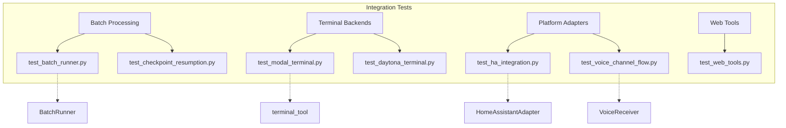

# tests — integration

# Integration Tests

The `tests/integration` module contains end-to-end tests designed to verify the interaction between the system's core logic and external services, platforms, and hardware-abstracted tools. Unlike unit tests, these modules often perform real network I/O, interact with external sandboxes, or simulate complex stateful protocols like Discord's voice encryption.

All tests in this module are marked with `@pytest.mark.integration`.

## Module Architecture

The integration suite is organized by the functional area it exercises:



---

## Batch Processing & Resumption

These tests ensure the reliability of long-running batch jobs.

### `test_batch_runner.py`
Verifies the standard execution flow of the `BatchRunner`. It creates a temporary JSONL dataset, executes a mock-configured run, and validates that:
*   `checkpoint.json` is created.
*   `statistics.json` contains accurate prompt counts and durations.
*   Output batch files are correctly partitioned.

### `test_checkpoint_resumption.py`
A specialized test for the `BatchRunner`'s fault tolerance. It simulates process interruptions to verify:
*   **Incremental Saving:** Uses a monitoring thread to check if `checkpoint.json` updates during the run rather than just at the end.
*   **Resume Logic:** Validates that when `run(resume=True)` is called, the runner skips already-completed prompts and maintains data integrity.

---

## Terminal Backends

These tests verify the `terminal_tool` across different remote execution environments. They require specific environment variables (e.g., `MODAL_TOKEN_ID`, `DAYTONA_API_KEY`).

### `test_modal_terminal.py` & `test_daytona_terminal.py`
Both scripts follow a similar validation pattern for their respective backends:
1.  **Requirements Check:** Validates API keys and local configuration (e.g., `~/.modal.toml`).
2.  **Command Execution:** Runs basic shell commands and Python scripts to verify the runtime.
3.  **Persistence:** Confirms that files written in one `terminal_tool` call persist in subsequent calls within the same `task_id`.
4.  **Isolation:** Ensures that different `task_id` values result in completely isolated environments.

---

## Platform Integrations

### `test_ha_integration.py` (Home Assistant)
This module tests the `HomeAssistantAdapter` and its associated tools using a `FakeHAServer` (a local aiohttp-based mock of the HA API).
*   **WebSocket Flow:** Tests the full handshake: `auth_required` -> `auth` -> `auth_ok` -> `subscribe_events`.
*   **Event Forwarding:** Verifies that state changes pushed by the server are correctly filtered by `watch_domains` and forwarded to the gateway.
*   **REST Tools:** Exercises `_async_call_service`, `_async_get_state`, and `_async_list_entities` against real TCP connections.

### `test_voice_channel_flow.py` (Discord Voice)
A high-fidelity simulation of the Discord voice pipeline. It does not connect to Discord but uses real `PyNaCl` encryption and `Opus` codecs to test the `VoiceReceiver` class.
*   **Packet Processing:** Generates real RTP packets with NaCl AEAD encryption to test `_on_packet` decryption.
*   **RTP Handling:** Validates RFC 3550 compliance by testing the stripping of RTP padding and header extensions.
*   **Silence Detection:** Simulates a stream of audio followed by a pause to verify that `check_silence()` correctly identifies and returns completed utterances.
*   **DAVE Passthrough:** Tests the interaction with Discord's "DAVE" end-to-end encryption protocol.

---

## Web Tools

### `test_web_tools.py`
Validates the `web_search_tool`, `web_extract_tool`, and `web_crawl_tool` using either the Firecrawl or Parallel backends.
*   **Search Validation:** Checks that search results contain required fields (`url`, `title`, `description`).
*   **Extraction:** Tests both raw Markdown extraction and LLM-augmented extraction (if an auxiliary model is configured).
*   **Crawling:** Verifies that the crawler follows instructions and returns multiple pages from a target domain.

---

## Running Integration Tests

Integration tests are skipped by default in some environments due to their reliance on external API keys. To run them:

```bash
# Run all integration tests
pytest -m integration

# Run a specific integration test with verbose output
TERMINAL_ENV=modal pytest tests/integration/test_modal_terminal.py -v
```

### Required Environment Variables
| Variable | Used By |
| :--- | :--- |
| `MODAL_TOKEN_ID` / `MODAL_TOKEN_SECRET` | `test_modal_terminal.py` |
| `DAYTONA_API_KEY` | `test_daytona_terminal.py` |
| `FIRECRAWL_API_KEY` or `PARALLEL_API_KEY` | `test_web_tools.py` |
| `OPENROUTER_API_KEY` | `test_web_tools.py` (LLM features) |