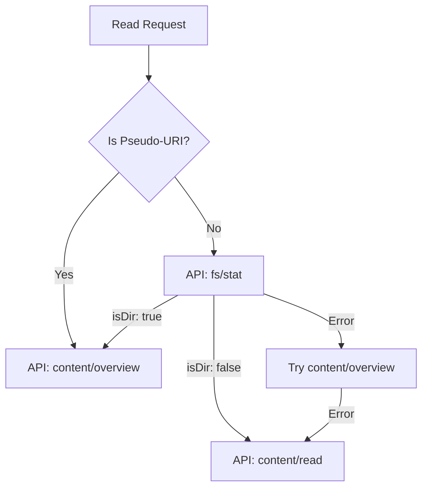

# tests — openviking_plugin

# OpenViking Plugin Tests

The `tests/openviking_plugin/test_openviking.py` module provides a comprehensive test suite for the `OpenVikingMemoryProvider`. It focuses on validating URI normalization, content retrieval logic (including fallback mechanisms), and the transformation of API responses into standardized internal formats.

## Mocking Strategy

The tests utilize a `FakeVikingClient` to simulate the OpenViking API. This mock client:
- Stores a dictionary of responses keyed by a tuple of `(path, sorted_params)`.
- Tracks all calls made to the `get` method in a `calls` list for assertion.
- Simulates network or server errors by raising exceptions stored in the response map.

## Core Test Areas

### 1. URI Normalization
The provider uses "pseudo-files" to represent directory summaries. The tests verify that `_normalize_summary_uri` correctly strips these suffixes to target the actual directory resource.

| Input URI | Normalized Output |
| :--- | :--- |
| `viking://user/hermes/.overview.md` | `viking://user/hermes` |
| `viking://resources/.abstract.md` | `viking://resources` |
| `viking://path/to/file.md` | `viking://path/to/file.md` |

### 2. Content Retrieval (`_tool_read`)
The `_tool_read` method logic is complex because it must decide between the `overview` endpoint (for directories) and the `read` endpoint (for files). The tests validate three distinct execution paths:

#### Path A: Pseudo-Summary URI
If the URI ends in a pseudo-file (like `.overview.md`), the provider skips metadata checks and calls the `/api/v1/content/overview` endpoint directly.

#### Path B: Standard URI with `fs/stat` Probe
For standard URIs, the provider calls `/api/v1/fs/stat` to determine if the target is a directory or a file:
- **If Directory:** Calls `/api/v1/content/overview`.
- **If File:** Calls `/api/v1/content/read`.

#### Path C: Fallback Mechanism
If the `fs/stat` probe fails or returns an indeterminate result, the provider attempts to call the overview endpoint. If that fails, it falls back to a full content read as a last resort.

### 3. Directory Browsing (`_tool_browse`)
The tests ensure that the `_tool_browse` method correctly normalizes inconsistent API response shapes from the `/api/v1/fs/ls` endpoint.

The provider maps various upstream fields to a consistent internal schema:
- **Path Mapping:** Converts `rel_path` to `name` if `name` is missing.
- **Type Mapping:** Converts boolean `isDir` to string `type` (`dir` or `file`).
- **Defaulting:** Ensures the `abstract` field exists, defaulting to an empty string if not provided by the API.

## Key Test Cases

| Test Name | Purpose |
| :--- | :--- |
| `test_overview_read_normalizes_uri` | Validates that reading an `.overview.md` file correctly targets the parent directory's summary. |
| `test_overview_file_uri_routes_straight_to_content_read` | Confirms that if `fs/stat` identifies a file, the "overview" request is fulfilled by a full file read. |
| `test_overview_file_uri_falls_back_via_exception` | Validates the resilience of the provider when multiple API endpoints fail sequentially. |
| `test_list_browse_unwraps_and_normalizes` | Ensures the directory listing logic can handle mixed response formats (e.g., some entries using `isDir` and others using `type`). |

## Usage for Contributors
When modifying the `OpenVikingMemoryProvider`, ensure that:
1. New API response fields are added to the normalization logic in `test_list_browse_unwraps_and_normalizes`.
2. Any changes to the routing logic (how the provider chooses between `overview` and `read`) are reflected in the `TestOpenVikingRead` class.
3. The `FakeVikingClient` is updated if the provider begins using new HTTP methods (e.g., `POST` or `PUT`).