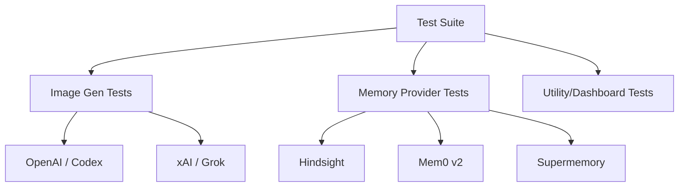

# tests — plugins

# Tests — Plugins Module

The `tests/plugins` module provides a comprehensive suite of unit and integration tests for the Hermes Agent plugin ecosystem. It ensures that external integrations—specifically image generation and long-term memory providers—adhere to the expected interfaces, handle configuration correctly, and manage resources (like threads and event loops) without leaking.

## Architecture Overview

The test suite mirrors the plugin directory structure, focusing on the two primary plugin categories: `image_gen` and `memory`.



## Image Generation Provider Tests

These tests verify that image providers correctly map user prompts and aspect ratios to provider-specific API calls.

### OpenAI & OpenAI-Codex
The suite distinguishes between the standard OpenAI REST API and the "Codex" (ChatGPT-OAuth) path.
*   **Model Tiers:** Validates the three-tier system (`low`, `medium`, `high`) and ensures they map to the correct `quality` parameters while targeting the underlying `gpt-image-2` model.
*   **Codex Stream Handling:** `test_openai_codex_provider.py` specifically tests the tool-based stream path. It mocks `response.output_item.done` and `partial_image` events to ensure images are captured even if the stream is interrupted.
*   **Aspect Ratio Mapping:** Verifies that "landscape", "portrait", and "square" correctly translate to pixel dimensions (e.g., `1536x1024`).

### xAI (Grok)
*   **Authentication:** Ensures the provider is unavailable if `XAI_API_KEY` is missing.
*   **Response Handling:** Tests both Base64 JSON responses and direct URL returns.

## Memory Provider Tests

Memory plugins are the most complex to test due to their asynchronous nature and lifecycle requirements.

### Hindsight Provider
The Hindsight tests (`test_hindsight_provider.py`) are the reference implementation for testing complex memory lifecycles:
*   **Shared Event Loop Lifecycle:** Crucial tests ensure that calling `shutdown()` on one provider instance does not stop the module-global event loop, which would orphan `aiohttp` sessions for other concurrent agents.
*   **Sync Turn Logic:** Validates that conversation turns are batched and sent to the "Bank" based on the `retain_every_n_turns` configuration.
*   **Bank ID Templates:** Tests the dynamic resolution of bank IDs using placeholders like `{profile}`, `{platform}`, and `{user}`, including sanitization logic that converts emails or special characters into safe segments.
*   **Prefetching:** Verifies that background threads correctly truncate long queries and populate the `_prefetch_result` before the LLM requests it.

### Mem0 (v2) Compatibility
Focuses on the migration from Mem0 v1 to v2:
*   **Filter Migration:** Ensures that `user_id` and `agent_id` are passed within a `filters={}` dictionary rather than as bare keyword arguments.
*   **Response Unwrapping:** Validates that the provider correctly extracts data from the v2 `{"results": [...]}` wrapper while maintaining backward compatibility for bare lists.

### Supermemory Provider
*   **Multi-Container Logic:** Tests the "whitelisting" of container tags. If `enable_custom_container_tags` is active, the test ensures the tool schema dynamically includes `container_tag` as a parameter.
*   **Text Cleaning:** Verifies that `<supermemory-context>` tags injected during prefetch are stripped before the text is re-captured into long-term memory to prevent "hallucination loops."

### OpenViking Provider
*   **Cross-Bucket Ranking:** Specifically tests the logic that merges and sorts results from `memories`, `resources`, and `skills` buckets based on raw scores.

## Utility and Dashboard Tests

### Achievements Plugin
The `test_achievements_plugin.py` focuses on integration performance:
*   **Full History Scanning:** Verifies the removal of the 200-session scan limit, ensuring the plugin can walk the entire SQLite database.
*   **Non-Blocking Initialization:** Ensures that the first-ever scan runs in a background thread so the dashboard UI remains responsive.

## Common Testing Patterns

### Mocking External Clients
Most tests use a `FakeClient` or `MagicMock` to intercept API calls. For providers using `aiohttp` or asynchronous libraries (like Hindsight), the tests utilize a shared event loop pattern to simulate real-world async execution within a synchronous `pytest` environment.

### Environment Isolation
Tests frequently use the `_tmp_hermes_home` fixture to redirect `HERMES_HOME` to a temporary directory. This prevents tests from reading the developer's actual `config.yaml` or writing to the real `cache/` directory.

### Hyphenated Module Imports
Because some plugin directories use hyphens (e.g., `openai-codex`), which are invalid in standard Python import statements, the tests use `importlib.import_module` to load the plugin code:
```python
codex_plugin = importlib.import_module("plugins.image_gen.openai-codex")
```