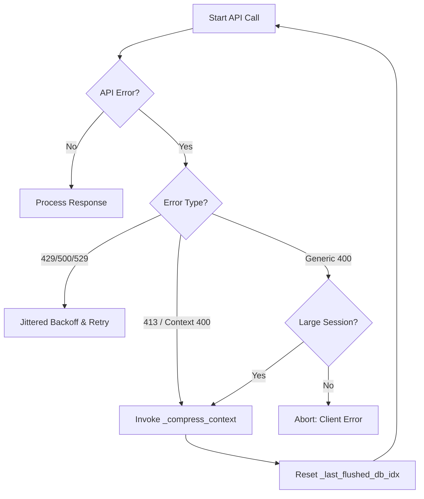

# tests — run_agent

# tests — run_agent

The `tests/run_agent/` directory contains the test suite for the core agent execution logic, primarily targeting `run_agent.py` and `environments/agent_loop.py`. These tests verify the agent's lifecycle, including multi-turn conversations, tool execution, error recovery, context window management, and session persistence.

## Test Infrastructure and Fast-Pathing

To ensure the test suite remains performant, `conftest.py` implements a global fast-path for retry logic.

*   **`_fast_retry_backoff`**: An autouse fixture that monkeypatches `run_agent.jittered_backoff` to return `0.0`. This collapses the production `while time.time() < sleep_end` loops, allowing tests to exercise retry paths without waiting for real-world backoff delays.
*   **Selective Mocking**: `time.sleep` is deliberately *not* mocked globally, as specific tests (e.g., thread coordination or interrupt propagation) rely on real timing or assert specific sleep durations.

## Core Testing Areas

### 1. Context Management and Compression
Tests in `test_413_compression.py` and `test_1630_context_overflow_loop.py` verify how the agent handles LLM context window limits.

*   **Error Heuristics**: The agent identifies context overflows not just by HTTP 413 status codes, but also by parsing HTTP 400 error messages for phrases like "maximum context length" or "too many tokens."
*   **Large Session Heuristic**: If a generic 400 error occurs and the session is large (>40% of context window or >80 messages), the agent treats it as a probable context overflow and triggers compression.
*   **Compression Flow**:
    1.  Detect 413/400 context error.
    2.  Invoke `_compress_context`.
    3.  Reset `_last_flushed_db_idx` to 0.
    4.  Retry the API call with the compressed history.
*   **Persistence Guard**: To prevent infinite loops where a failed session keeps growing, the gateway is tested to ensure it skips message persistence if the agent fails early due to context exhaustion.

### 2. Agent Guardrails
`test_agent_guardrails.py` validates static methods on `AIAgent` designed to sanitize LLM outputs before they reach the tool execution or persistence layers.

*   **`_sanitize_api_messages`**: Repairs orphaned tool pairs. It removes tool results that have no matching call and injects stub results for tool calls that the LLM failed to provide results for.
*   **`_cap_delegate_task_calls`**: Enforces concurrency limits on sub-agent creation by truncating `delegate_task` calls exceeding `MAX_CONCURRENT_CHILDREN`.
*   **`_deduplicate_tool_calls`**: Identifies and removes identical tool calls (same tool, same arguments) within a single turn to prevent redundant execution.

### 3. Session Persistence and Deduplication
`test_860_dedup.py` ensures that the SQLite session transcript remains clean across multiple flushes.

*   **Incremental Flushing**: `_flush_messages_to_session_db` uses the `_last_flushed_db_idx` pointer to ensure only new messages are written to the database, even if `_persist_session` is called multiple times in a single turn.
*   **JSONL vs. SQLite**: Tests verify that `append_to_transcript(skip_db=True)` correctly writes to the JSONL log while bypassing the SQLite database, a pattern used when the agent has already handled its own persistence.

### 4. HermesAgentLoop (Multi-turn Engine)
`test_agent_loop.py` and `test_agent_loop_tool_calling.py` test the `HermesAgentLoop` class, which manages the iterative "Think-Act-Observe" cycle.

*   **Mock Server Infrastructure**: Uses a `MockServer` to simulate `chat_completion` responses, allowing for deterministic testing of turn counts, tool call handling, and reasoning extraction.
*   **Reasoning Extraction**: Verifies that `_extract_reasoning_from_message` correctly pulls thinking blocks from various provider formats (e.g., `reasoning_content`, `reasoning_details`, or `<think>` tags).
*   **Tool Blocking**: Ensures that specific tools (like `memory` or `session_search`) are blocked or return errors when running in restricted environments (e.g., RL training loops).

### 5. Provider-Specific Error Handling
`test_anthropic_error_handling.py` covers the specific retry logic for the Anthropic API mode.

*   **Retryable Errors**: 429 (Rate Limit), 529 (Overloaded), and 500 (Server Error) trigger the backoff loop.
*   **Non-Retryable Errors**: 400 (Bad Request) fails immediately to prevent wasting tokens.
*   **Credential Refresh**: 401 (Unauthorized) triggers a call to `_try_refresh_anthropic_client_credentials` and a single retry.

## Execution Flow: Context Overflow Recovery

The following diagram illustrates the logic tested in the compression and retry modules:

## Key Components for Contributors

*   **`MockServer`**: Located in `test_agent_loop.py`, this is the preferred way to test agent logic without hitting real APIs. It allows you to queue a sequence of `MockChatCompletion` objects.
*   **`_make_agent`**: Most test files contain a helper to instantiate a minimal `AIAgent` with mocked dependencies (OpenAI client, tool definitions, etc.).
*   **Integration Tests**: `test_agent_loop_vllm.py` provides a template for testing against a local vLLM instance, which is critical for verifying token ID and logprob generation used in Reinforcement Learning (RL) workflows.