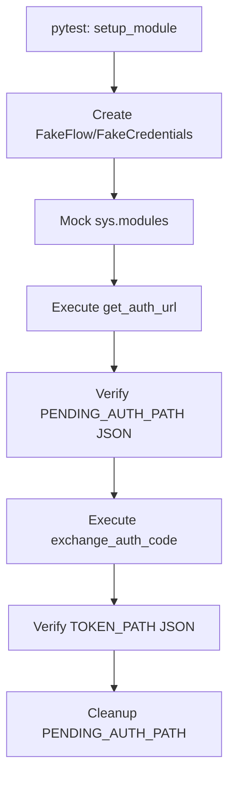

# tests — skills

# Skills Testing Module

The **tests — skills** module provides comprehensive regression and unit testing for the core productivity and utility skills within the Hermes ecosystem. These tests ensure the reliability of external integrations (Google Workspace, Twilio), data persistence (Flashcards), and system-wide migration tools.

## Core Test Suites

### 1. Google Workspace Integration
Tests for Google Workspace are split between OAuth setup and API execution.

#### OAuth Setup (`test_google_oauth_setup.py`)
This suite validates the headless/manual authorization code flow used to grant Hermes access to Gmail, Calendar, Drive, and other Workspace APIs.
- **PKCE Material Persistence**: Ensures that `code_verifier` and `state` are correctly saved to `google_oauth_pending.json` during the initial URL generation and retrieved during the code exchange.
- **Token Exchange**: Validates that the `exchange_auth_code` function correctly handles both raw codes and redirect URLs, extracts scopes, and persists the final token to `google_token.json`.
- **Scope Validation**: Tests the "v2.0 migration" logic where partial scopes are accepted with a warning rather than failing the entire exchange.

#### API Bridge (`test_google_workspace_api.py`)
Tests the `gws_bridge.py` and `google_api.py` scripts which act as a CLI wrapper for Google services.
- **Token Management**: Verifies that expired tokens trigger an automatic refresh via `urllib.request` and that the new token is persisted with the `authorized_user` type.
- **Subprocess Injection**: Confirms that `gws_bridge.py` correctly injects the `GOOGLE_WORKSPACE_CLI_TOKEN` into the environment before calling the `gws` binary.
- **Calendar Operations**: Validates that date ranges and calendar IDs are correctly transformed into JSON parameters for the CLI.

### 2. Memento Flashcards (`test_memento_cards.py`, `test_youtube_quiz.py`)
This suite covers the spaced-repetition system and its associated content generation tools.

#### Card Management
- **CRUD Operations**: Validates adding, listing, and deleting cards or entire collections.
- **Spaced Repetition Logic**: Tests the `rate` command's effect on card scheduling:
    - `hard`: Resets ease streak, adds 1 day.
    - `good`: Adds 3 days.
    - `easy`: Increments ease streak, adds 7 days.
    - **Auto-Retirement**: Confirms cards are marked as `retired` after 3 consecutive `easy` ratings or a manual `retire` command.
- **Data Integrity**: Ensures atomic writes to `cards.json` and handles recovery from corrupted JSON files.

#### YouTube Quiz Generation
- **Transcript Fetching**: Tests `youtube_quiz.py` integration with `youtube-transcript-api`, including error handling for unavailable videos or missing dependencies.
- **Text Normalization**: Validates the `_normalize_segments` function which collapses whitespace and joins transcript fragments into a clean string for LLM processing.

### 3. OpenClaw Migration (`test_openclaw_migration.py`, `test_openclaw_migration_hardening.py`)
Tests the `openclaw_to_hermes.py` script, which migrates user data, memories, and configurations from legacy OpenClaw installations.

#### Migration Logic
- **Rebranding**: Validates `rebrand_text`, which performs case-sensitive replacement of legacy terms (e.g., `OpenClaw` -> `Hermes`, `~/.openclaw` -> `~/.hermes`).
- **Memory Merging**: Tests the extraction of Markdown entries and the merging of daily notes into the long-term `MEMORY.md` file, respecting character limits.
- **Conflict Resolution**: Validates `skill_conflict_mode` settings (`rename`, `overwrite`, `skip`) when importing skills that already exist in the target directory.

#### Hardening & Security
- **Secret Redaction**: Tests `redact_migration_value`, which recursively scrubs API keys (OpenRouter, Anthropic, Slack, etc.) from migration reports using pattern matching.
- **Execution Sequencing**: Ensures that if a conflict occurs while writing `config.yaml`, subsequent configuration mutations are blocked to prevent partial or corrupt state.
- **JSON Output**: Validates the `--json` flag for structured reporting in CI/CD pipelines.

### 4. Telephony Skill (`test_telephony_skill.py`)
Covers the `telephony.py` script used for Twilio and Vapi integrations.
- **Environment Management**: Tests `_upsert_env_file` to ensure Twilio SIDs and tokens are correctly written to the `.env` file without overwriting unrelated variables.
- **Inbox Checkpointing**: Validates that `_twilio_inbox` correctly identifies new messages by comparing SIDs against the `last_inbound_message_sid` stored in `telephony_state.json`.
- **Provider Diagnostics**: Tests the `diagnose()` function, which generates a decision tree of available telephony providers based on current configuration.

## Testing Patterns & Infrastructure

### Mocking Strategy
The module relies heavily on `pytest` fixtures and `monkeypatch` to simulate external environments:
- **Filesystem Isolation**: Uses `tmp_path` to redirect all file operations (tokens, cards, configs) to temporary directories.
- **Module Mocking**: Dynamically creates `types.ModuleType` objects to simulate missing dependencies like `google_auth_oauthlib` or `hermes_constants` in CI environments.
- **Subprocess Mocking**: Patches `subprocess.run` to capture command-line arguments and environment variables without executing real binaries.

### Data Flow: Google OAuth Test Pattern

### Key Helper Functions
- `_run(capsys, argv)`: Used in Memento tests to simulate CLI execution and capture JSON output from `stdout`.
- `load_module()`: A utility used in migration and telephony tests to import scripts from relative paths outside the standard Python path.
- `_make_minimal_migrator()`: Factory function for creating `Migrator` instances with controlled dry-run settings.