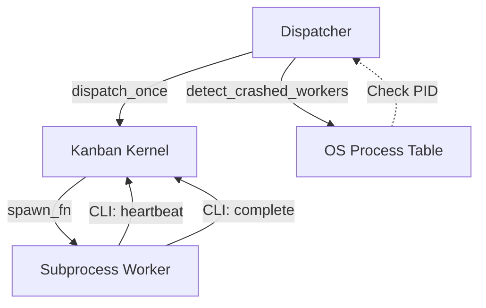

# tests — stress

# Stress and Battle-Test Suite

The `tests/stress` module contains long-running, adversarial tests designed to exercise the Kanban kernel under heavy load and edge-case conditions. Unlike the standard unit tests, these suites often spawn real subprocesses, simulate high concurrency, and perform randomized property-based fuzzing.

Due to their execution time (30s+ per file) and resource requirements, these tests are **not run by the default test script**.

## Execution

Stress tests are opted into via a `pytest` flag or by running the scripts directly as Python modules.

```bash
# Run all stress tests via pytest
./venv/bin/python -m pytest tests/stress/ --run-stress -v -s

# Run individual suites directly
./venv/bin/python tests/stress/test_concurrency.py
./venv/bin/python tests/stress/test_property_fuzzing.py
./venv/bin/python tests/stress/test_benchmarks.py
```

## Concurrency and Race Conditions

The concurrency suite validates the kernel's locking mechanisms and SQLite WAL (Write-Ahead Logging) stability.

*   **`test_concurrency.py`**: Simulates 5 workers racing to claim 100 tasks. It asserts that no task is double-claimed, every completion has a matching claim, and no SQLite locking errors escape the internal retry logic.
*   **`test_concurrency_mixed.py`**: A more complex simulation involving 10 workers and a background reclaimer. Workers randomly perform `claim`, `complete`, `block`, `unblock`, and `archive` operations.
*   **`test_concurrency_reclaim_race.py`**: Specifically targets the race between a worker's `complete_task` and the dispatcher's `release_stale_claims`. It sets a Task TTL shorter than the work duration to force the reclaimer to yank tasks mid-work, verifying that the worker's late completion is correctly refused via CAS (Compare-And-Swap) on the task status.

## Property-Based Fuzzing

`test_property_fuzzing.py` executes randomized operation sequences (create, claim, complete, block, etc.) and validates the entire database state against a set of core invariants after every step.

### System Invariants
| ID | Invariant Description |
|:---|:---|
| **I1** | If `current_run_id` is set, the run must exist and its `ended_at` must be NULL. |
| **I2** | Every open run (NULL `ended_at`) must be pointed to by a task's `current_run_id`. |
| **I3** | Task status must be one of the seven valid states (triage, todo, ready, etc.). |
| **I4** | `claim_lock` must be NULL unless the task status is `running`. |
| **I5** | For all runs, `started_at` must be less than or equal to `ended_at`. |
| **I6** | If a run has an `outcome`, it must have an `ended_at` timestamp. |
| **I8** | `task_events.run_id` must reference a valid `task_runs.id` or be NULL. |
| **I9** | If all parents of a task are `done`, the child cannot remain in `todo` status. |

## End-to-End Subprocess Lifecycle

`test_subprocess_e2e.py` validates the integration between the `kanban_db` kernel and the OS process model.

1.  **Real Spawning**: Uses a `spawn_fn` that calls `subprocess.Popen` to launch `_fake_worker.py`.
2.  **CLI Integration**: The worker process communicates back to the kernel using the actual `hermes kanban heartbeat` and `complete` CLI commands.
3.  **Crash Detection**: Validates `detect_crashed_workers` by spawning a process, killing it with `SIGKILL`, and verifying the kernel detects the dead PID and moves the task back to `ready` with a `crashed` run outcome.
4.  **Log Capture**: Verifies that worker `stdout/stderr` is correctly redirected to the `HERMES_HOME/kanban/logs/` directory.



## Atypical Scenarios

`test_atypical_scenarios.py` contains 28+ isolated scenarios testing the "dark corners" of the system:
*   **Data Extremes**: 1MB task bodies, 50-level deep metadata JSON, and Unicode/Emoji/RTL string handling.
*   **Graph Pathologies**: Detection and rejection of dependency cycles (A → B → A) and self-parenting.
*   **Environment**: `HERMES_HOME` paths containing spaces, symlinks, or non-ASCII characters.
*   **Security**: Empirical verification that SQL injection payloads in titles or assignees are neutralized by parameterized queries.
*   **Idempotency**: Races where two processes attempt to `create_task` with the same `idempotency_key` simultaneously.

## Performance Benchmarking

`test_benchmarks.py` measures kernel latency at scales of 100, 1,000, and 10,000 tasks. It records metrics for:
*   `dispatch_once` latency.
*   `recompute_ready` performance on wide fan-out graphs.
*   `build_worker_context` overhead for tasks with many parents or large comment histories.
*   `board_stats` and `list_tasks` query timings.

Results are output as a summary table and saved to `/tmp/kanban_bench_results.json` for regression tracking.