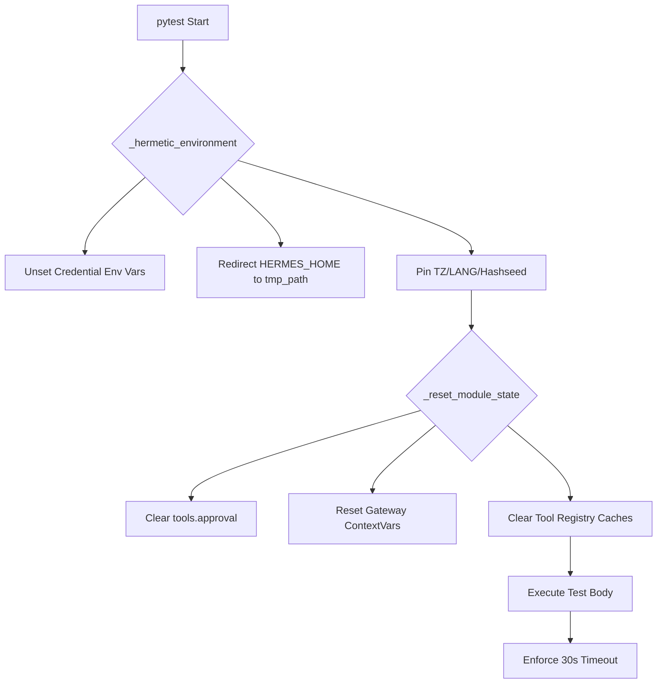

# tests — tests

# Hermes Agent Test Suite

The `tests` module provides a hermetic, deterministic environment for validating the Hermes Agent. It is designed to ensure that tests run identically in local development environments and CI by strictly isolating the agent's state, configuration, and credentials.

## Hermetic Test Invariants

The test suite enforces several invariants via `tests/conftest.py` to prevent "works on my machine" bugs and credential leakage. These are applied automatically to every test via the `_hermetic_environment` fixture.

1.  **Credential Isolation**: All environment variables matching credential patterns (e.g., `*_API_KEY`, `*_TOKEN`, `AWS_ACCESS_KEY_ID`) are unset before every test. This prevents local developer keys from leaking into tests that assert provider auto-detection.
2.  **Isolated HERMES_HOME**: `HERMES_HOME` is redirected to a per-test temporary directory. This ensures that tests cannot see or modify the user's real `~/.hermes/` configuration, sessions, or memories.
3.  **Deterministic Runtime**: The environment is pinned to `TZ=UTC`, `LANG=C.UTF-8`, and `PYTHONHASHSEED=0` to ensure date and locale-sensitive tests are stable.
4.  **Behavioral Reset**: Specific `HERMES_*` behavioral flags (like `HERMES_YOLO_MODE` or `HERMES_MANAGED`) are cleared to ensure tests start from a default state.
5.  **AWS IMDS Disabling**: AWS metadata service lookups are disabled and timed out quickly to prevent 2-second hangs during provider detection in non-EC2 environments.

## State Management and Isolation

Because `pytest-xdist` workers are long-lived, Python module singletons and `ContextVars` can leak state between tests. The `_reset_module_state` fixture explicitly clears mutable state in the following areas:

*   **`tools.approval`**: Clears session approvals, YOLO mode flags, and pending queues.
*   **`gateway.session_context`**: Resets `ContextVars` representing the active gateway session (Platform, Chat ID, User ID, etc.).
*   **`tools.terminal_tool`**: Clears cached environments and working directories to prevent path resolution pollution.
*   **`tools.file_tools`**: Resets the read history tracker used for loop detection.
*   **`tools.registry`**: Invalidates the `check_fn` cache to ensure tool availability is re-evaluated per test.

### Global Test Timeout
To prevent hanging the entire suite due to subprocess deadlocks or blocking I/O, a global 30-second timeout is enforced on every test using `SIGALRM` (on Unix systems).

## Key Test Modules

### Core Utility Tests
*   **`test_atomic_replace_symlinks.py`**: Validates that `utils.atomic_replace` preserves symlinks. This is critical for managed deployments where `config.yaml` is symlinked to a git-tracked profile.
*   **`test_base_url_hostname.py`**: Tests the logic for extracting hostnames and matching providers. It specifically guards against substring collision attacks (e.g., ensuring `evil.test/openrouter.ai` is not identified as OpenRouter).
*   **`test_hermes_constants.py`**: Validates environment detection, including Docker/Podman container detection and `HERMES_HOME` path resolution.

### Agent and Model Logic
*   **`test_ctx_halving_fix.py`**: Tests the fix for "max_tokens too large" errors. It ensures the agent uses `_ephemeral_max_output_tokens` to cap a single response rather than incorrectly halving the entire context window.
*   **`test_batch_runner_checkpoint.py`**: Validates the atomicity and resume logic of the `BatchRunner`, ensuring no duplicate prompt indices are written to checkpoints.
*   **`test_get_tool_definitions_cache_isolation.py`**: Ensures that the tool registry cache returns fresh list copies. This prevents long-lived Gateway processes from poisoning the global tool list when injecting session-specific tools (like memory).

### CLI and Integration
*   **`test_cli_file_drop.py`**: Tests the regex and logic for detecting absolute file paths pasted into the CLI, distinguishing them from slash commands.
*   **`test_cli_skin_integration.py`**: Validates that the `HermesCLI` correctly applies colors and symbols from the `skin_engine`.
*   **`test_hermes_logging.py`**: Ensures that `setup_logging` correctly initializes `agent.log`, `errors.log`, and `gateway.log` with proper rotation and filtering.

## Specialized Test Runners

### `tests/run_interrupt_test.py`
This is a standalone script rather than a standard pytest module. It performs a live integration test of the `AIAgent` interruption mechanism. It spawns a real agent thread, triggers a `delegate_tool` call, and verifies that calling `parent.interrupt()` successfully propagates the interrupt signal to child agents and halts execution within a 2-second window.

## Execution Flow: Test Setup

## Contributing Tests

When adding new tests:
1.  **Use `get_hermes_home()`**: Never use `Path.home() / ".hermes"`. The test suite redirects the former but not the latter.
2.  **Check for State Leakage**: If your module uses a global dictionary or `ContextVar`, add a reset entry to `_reset_module_state` in `conftest.py`.
3.  **Avoid Real API Calls**: The environment is stripped of keys by design. Use `unittest.mock` or `pytest-recording` if network interaction is required.
4.  **Async Tests**: Use `@pytest.mark.asyncio`. For sync tests that internally use `asyncio.get_event_loop()`, the `_ensure_current_event_loop` fixture provides a safe loop environment.