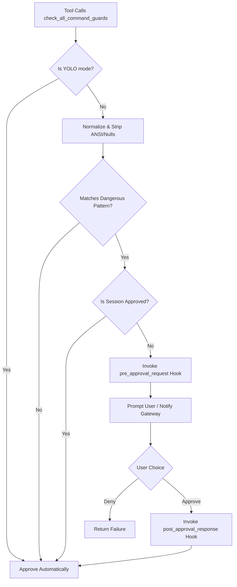

# tests — tools

# Tests — Tools Module

The `tests/tools` module provides comprehensive validation for the core utility functions, safety guardrails, and environment abstractions used by the Hermes agent. This test suite ensures that the agent's interactions with the host system—ranging from file reads and shell execution to browser automation—remain safe, performant, and accurate.

## Core Components Under Test

### 1. Safety & Command Approval System
The most critical part of the module is the validation of `tools/approval.py`. These tests ensure that dangerous operations are intercepted before execution.

*   **Pattern Detection**: `test_approval.py` validates regex-based detection for:
    *   **Destructive Filesystem Ops**: `rm -rf`, `chmod` recursion, and `find -delete`.
    *   **Shell Obfuscation**: Detects bypasses using multiline commands (`\n`), null bytes (`\x00`), and ANSI escape sequences embedded within command strings.
    *   **Remote Execution**: Intercepts `curl | sh` patterns and process substitution (e.g., `bash <(curl ...)`).
    *   **Sensitive Writes**: Monitors `tee` or redirections to system files like `/etc/passwd`, `~/.ssh/authorized_keys`, or `.env` files.
    *   **Self-Termination**: Prevents the agent from killing its own gateway or parent processes.
*   **Normalization Bypasses**: Tests verify that commands are NFKC normalized before checking, catching "fullwidth" Unicode variants (e.g., `ｒｍ` instead of `rm`).
*   **Heartbeat Mechanism**: `test_approval_heartbeat.py` ensures that while the agent is blocked waiting for user approval, it continues to fire activity heartbeats to the gateway to prevent premature session timeouts.
*   **Plugin Hooks**: Validates that `pre_approval_request` and `post_approval_response` hooks fire correctly across both CLI and Gateway surfaces, allowing external notification systems to trigger.

### 2. Environment Execution Model
`test_base_environment.py` validates the `BaseEnvironment` class, which is the foundation for all shell-based tools.

*   **Command Wrapping**: Tests the `_wrap_command` logic which injects state-tracking code into every execution. This includes:
    *   Automatic `cd` to the target directory.
    *   Environment variable snapshotting.
    *   Exit code propagation.
*   **CWD Tracking**: Validates the `_cwd_marker` contract. The environment appends a unique session-based marker to output to reliably track the Current Working Directory even if the user's command changes it.
*   **Stdin Handling**: Tests `_embed_stdin_heredoc`, ensuring that multi-line input is safely passed to commands using unique UUID delimiters to prevent collision with the payload.

### 3. Browser Automation (Camofox & CDP)
The suite covers both the high-level Camofox backend and low-level Chrome DevTools Protocol (CDP) interactions.

*   **Camofox Persistence**: `test_browser_camofox_persistence.py` ensures that when `managed_persistence` is enabled, the agent uses a stable `userId` derived from the Hermes profile. This allows persistent logins and cookies across different tasks within the same profile.
*   **CDP Tooling**: `test_browser_cdp_tool.py` uses an in-process mock WebSocket server to validate the binary protocol handling, target attachment, and session routing without requiring a live browser instance.
*   **Vision Integration**: Validates that `camofox_vision` correctly passes screenshots to the LLM with configured temperature and timeout settings.

### 4. Resource Accretion Management
Long-running sessions (CLI or Gateway) previously suffered from unbounded memory growth in internal trackers. `test_accretion_caps.py` pins the pruning logic for:

*   **File Read Tracker**: Caps `read_history`, `dedup` dictionaries, and `read_timestamps` in `file_tools`.
*   **Process Registry**: Ensures `_completion_consumed` sets are pruned when sessions expire or exceed `MAX_PROCESSES`, preventing memory leaks in high-churn environments.

### 5. ANSI Sanitization
`test_ansi_strip.py` provides exhaustive coverage for `strip_ansi`. This is vital for "cleaning" terminal output before it is sent to the LLM. It tests:
*   **SGR Sequences**: Colors, bold, and reset codes.
*   **CSI/OSC Sequences**: Cursor movement, window titles, and bracketed paste modes.
*   **Fidelity**: Ensures that legitimate code (like Python array indexing `arr[0]`) is not accidentally stripped.

## Execution Flow: Command Approval

The following diagram illustrates the logic validated by the approval tests when a tool attempts to run a command:

## Key Function References

| Function | Test File | Purpose |
| :--- | :--- | :--- |
| `detect_dangerous_command` | `test_approval.py` | Primary regex engine for security scanning. |
| `_wrap_command` | `test_base_environment.py` | Shell script generation for environment state. |
| `strip_ansi` | `test_ansi_strip.py` | ECMA-48 compliant string cleaner. |
| `_cap_read_tracker_data` | `test_accretion_caps.py` | LRU-style pruning for file metadata. |
| `get_camofox_identity` | `test_browser_camofox_state.py` | Deterministic ID generation for browser profiles. |
| `browser_cdp` | `test_browser_cdp_tool.py` | Low-level protocol dispatcher. |

## Contributing to Tests
When adding new tools or modifying existing ones:
1.  **Security**: If the tool executes shell commands, add a test case in `test_approval.py` to ensure it cannot be used for common bypasses.
2.  **Memory**: If the tool maintains state across calls, verify it is covered by an accretion cap in `test_accretion_caps.py`.
3.  **Environment**: If modifying how commands are run, ensure `test_base_environment.py` still correctly extracts the CWD and exit codes.