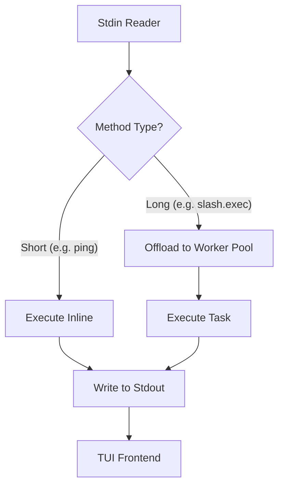

# tests — tui_gateway

# Tests — TUI Gateway

The `tests/tui_gateway` module provides a comprehensive test suite for the JSON-RPC 2.0 gateway that bridges the Hermes CLI core with its Terminal User Interface (TUI). These tests ensure that the communication protocol is robust, that agent initialization handles complex configuration states, and that background processes correctly report status to the frontend.

## Core Test Areas

### 1. JSON-RPC Protocol & Transport (`test_protocol.py`)
This sub-module validates the plumbing of the `tui_gateway.server`. It ensures that the server adheres to the JSON-RPC 2.0 specification and handles I/O failures gracefully.

*   **Envelope Integrity**: Tests `_ok` and `_err` helpers to ensure responses contain the correct `jsonrpc`, `id`, and `result`/`error` keys.
*   **I/O Robustness**: Validates `write_json` behavior under various failure modes:
    *   **Peer Gone**: Returns `False` on `BrokenPipeError` or specific `ValueError` ("I/O on closed file") to allow the dispatcher to exit cleanly.
    *   **Encoding Errors**: Re-raises `UnicodeEncodeError` to ensure configuration bugs are logged rather than swallowed.
    *   **Flush Control**: Verifies that `HERMES_TUI_GATEWAY_NO_FLUSH` correctly disables stream flushing, which is used in specific performance-sensitive environments.
*   **Request Dispatching**: Tests the routing of methods. It specifically validates the **Thread Pool Dispatcher** logic:
    *   **Short Handlers**: Executed synchronously to minimize latency.
    *   **Long Handlers**: Methods like `slash.exec` and `session.compress` are offloaded to a worker pool so they do not block the main RPC loop, allowing the TUI to remain responsive (e.g., responding to `fast.ping` while a command is running).

### 2. Agent Lifecycle & Provider Resolution (`test_make_agent_provider.py`)
These tests focus on `_make_agent`, the factory function responsible for instantiating `AIAgent` objects within the TUI context.

*   **Runtime Provider Resolution**: Ensures that bare model slugs (e.g., `claude-3-opus`) are correctly resolved into full provider configurations (API keys, base URLs, and modes) via `hermes_cli.runtime_provider.resolve_runtime_provider`. This prevents HTTP 404 errors caused by missing provider metadata.
*   **Personality Logic**: Validates that "personalities" defined in config only become active once saved to the `system_prompt`, matching the behavior of the classic CLI.
*   **Config Health Checks**: Tests `_probe_config_health` to ensure the gateway detects "null" YAML sections (e.g., an empty `agent:` key) which would otherwise cause downstream attribute errors.

### 3. Rendering Bridge (`test_render.py`)
The TUI relies on a rendering bridge to convert agent output into formatted strings. These tests verify the fallback behavior of `tui_gateway.render`.

*   **Rich Integration**: Tests `render_message` and `render_diff`.
*   **Graceful Degradation**: Ensures that if the `agent.rich_output` module is missing or if a specific formatting call raises a `TypeError` or `RuntimeError`, the system falls back to raw text or returns `None` rather than crashing the gateway.

### 4. Background Callbacks (`test_review_summary_callback.py`)
Hermes agents perform background "self-improvement" reviews. In the TUI, these cannot use standard print statements.

*   **Review Summaries**: Validates that `_init_session` correctly attaches a `background_review_callback` to the agent.
*   **Event Emission**: Ensures that when a background review completes (e.g., patching a skill), the gateway emits a `review.summary` event to the TUI frontend.

## Execution Flow: Request Dispatching

The following diagram illustrates how the gateway handles incoming JSON-RPC requests, distinguishing between synchronous and asynchronous (pool-based) execution.

## Key Components & Mocking Patterns

### Session Management
Tests frequently mock the session database (`_get_db`) and session initialization (`_init_session`). A common pattern is verifying that `session.resume` correctly hydrates message history, filtering out internal roles like `narrator` while preserving `user`, `assistant`, and `tool` messages.

### Blocking Round-trips
The `test_block_and_respond` test demonstrates how the gateway handles requests that require user input (e.g., a tool asking for confirmation). It uses `threading.Event` to simulate the gateway blocking a worker thread while waiting for a response from the TUI frontend via the `_answers` map.

### Command Interception
Tests for `command.dispatch` and `slash.exec` ensure that:
1.  **Skill Commands**: Intercepted and rejected if they should be handled by the TUI's primary command dispatcher.
2.  **Retry Logic**: Correctly truncates session history and identifies the last user message to facilitate the `/retry` command.
3.  **Plugin Support**: Correctly awaits and returns output from asynchronous plugin handlers.