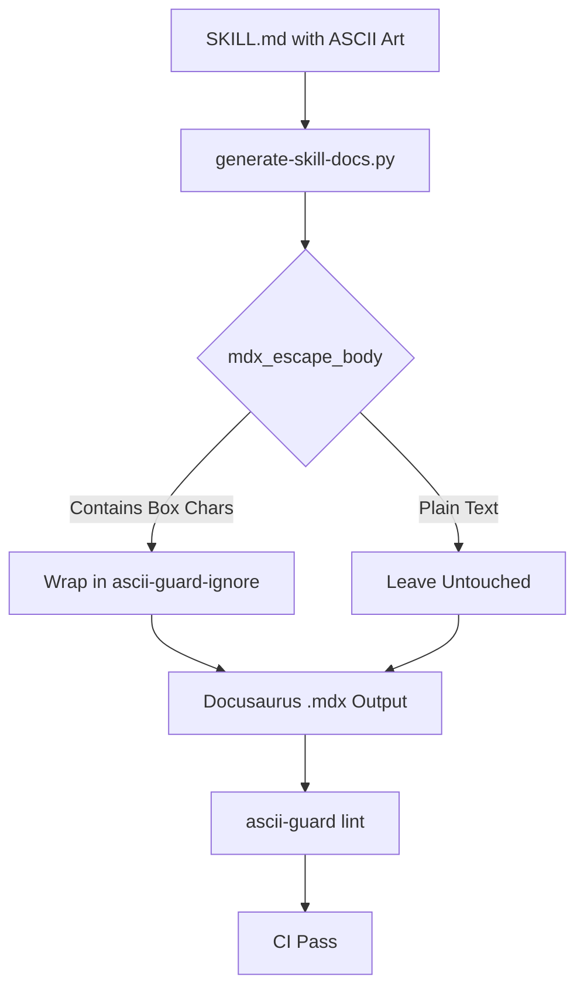

# tests — website

# Website Skill Documentation Tests

The `tests/website` module provides regression testing for the documentation generation pipeline. Its primary focus is ensuring that the `website/scripts/generate-skill-docs.py` script correctly processes skill definitions into Docusaurus-compatible Markdown without triggering CI linting failures.

## Purpose: ASCII Guard Integration

The documentation site uses `ascii-guard` to lint for unexpected non-standard characters. However, many skill definitions (`SKILL.md`) use Unicode box-drawing characters to create architectural diagrams. 

To prevent these diagrams from failing the `docs-site-checks` CI workflow, the generator must wrap code blocks containing ASCII art in `<!-- ascii-guard-ignore -->` markers. This module validates that the generator identifies these blocks accurately and applies the wrappers correctly.

## Key Component: `mdx_escape_body`

The tests primarily target the `mdx_escape_body` function within the generator script. This function is responsible for scanning the Markdown body of a skill and applying defensive wrappers where necessary.

### Test Scenarios

| Test Case | Logic Validated |
| :--- | :--- |
| `test_code_block_without_box_chars_is_not_wrapped` | Ensures standard code blocks (bash, python) remain untouched to avoid unnecessary noise in the output. |
| `test_code_block_with_box_chars_gets_wrapped` | Verifies that blocks containing characters like `┌`, `─`, or `│` are wrapped in ignore markers. |
| `test_multiple_code_blocks_only_box_ones_wrapped` | Confirms the logic is granular; in a file with both plain code and ASCII art, only the art is wrapped. |
| `test_tilde_fenced_box_is_wrapped` | Ensures support for both backtick (`` ` ``) and tilde (`~`) code fences. |
| `test_already_wrapped_source_double_wraps_harmlessly` | Validates that if a developer manually added ignore markers, the generator's automated markers do not break the document. |

## Character Coverage

The module includes a smoke test, `test_box_drawing_detection_covers_common_chars`, which verifies that the internal `_BOX_DRAWING_CHARS` set in the generator includes the full range of characters used across existing skill diagrams (e.g., `segment-anything`, `research-paper-writing`).

This includes:
- Standard box lines: `┌┐└┘─│├┤┬┴┼`
- Double lines: `═║╔╗╚╝`
- Rounded corners: `╰╮╯╰`
- Arrows/Pointers: `▶◀▲▼`

## Technical Implementation: Loading the Generator

Because `generate-skill-docs.py` is a script with a hyphenated filename located outside the standard Python package structure, it cannot be imported using a standard `import` statement. 

The test suite uses the `gen_module` fixture to load the script dynamically using `importlib.util`:

```python
def gen_module():
    spec = importlib.util.spec_from_file_location("generate_skill_docs", GENERATOR)
    module = importlib.util.module_from_spec(spec)
    spec.loader.exec_module(module)
    return module
```

## Execution Flow

The following diagram illustrates how the tested logic fits into the documentation CI pipeline:



## Running Tests

To run these tests specifically, execute pytest from the repository root:

```bash
pytest tests/website/test_generate_skill_docs.py
```