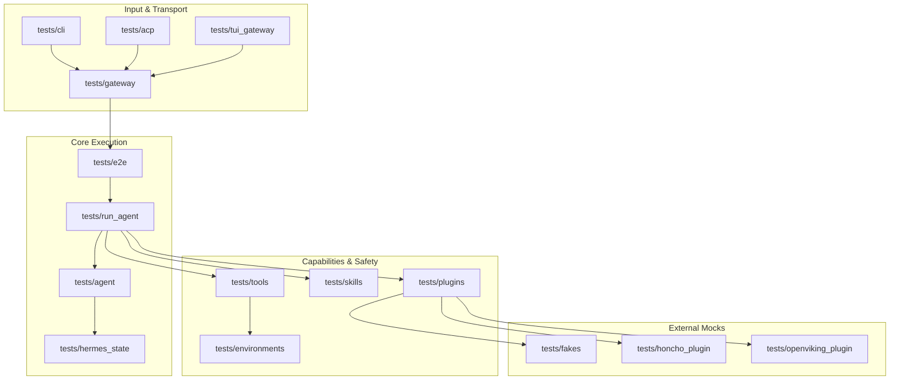

# tests

# Hermes Agent Test Suite

The `tests` module provides a hermetic, deterministic environment for validating the Hermes Agent across its entire stack. It ensures that the agent's core logic, platform integrations, and safety guardrails function identically in local development and CI by strictly isolating state and credentials.

## Testing Architecture

The suite is structured to mirror the agent's lifecycle, from raw input handling to LLM inference and tool execution.

## Core Testing Pillars

### 1. Hermetic Environment & Safety
The foundation of the suite is the `_hermetic_environment` fixture in `conftest.py`. It prevents credential leakage by unsetting sensitive environment variables and provides a deterministic execution context.
*   **[Tools](tools.md)**: Validates the `approval.py` system, ensuring dangerous filesystem and shell operations are intercepted.
*   **[Environments](environments.md)**: Focuses on security isolation, specifically testing against path traversal and archive exploitation.

### 2. Agent Execution & State
These modules test the "brain" of the system, focusing on how the agent thinks and remembers.
*   **[Agent](agent.md)**: Validates LLM provider adapters (e.g., Anthropic) and message format conversion.
*   **[Run Agent](run_agent.md)**: Tests the core execution loop, including multi-turn logic and tool-call retries.
*   **[Hermes State](hermes_state.md)**: Manages session persistence and handles "Context Compression" where conversations are split across database records.

### 3. Communication & Gateways
Hermes interacts with the world through various protocols, each with its own validation suite.
*   **[Gateway](gateway.md)**: The central hub for platform adapters (Telegram, Discord, etc.) and session management.
*   **[ACP & ACP Adapter](acp.md)**: Tests the JSON-RPC bridge used by external clients like the Zed editor, utilizing `FakeAgent` and `CaptureConn` for isolation.
*   **[CLI](cli.md) & [TUI Gateway](tui_gateway.md)**: Validates the terminal interface, slash command prefix matching, and the JSON-RPC 2.0 protocol that powers the TUI.

### 4. Integrations & Skills
The agent's extended capabilities are tested via specialized mocks and integration suites.
*   **[Skills](skills.md)**: Regression tests for Google Workspace (OAuth flows), Twilio, and productivity tools.
*   **[Plugins](plugins.md)**: Ensures image generation and memory providers (like [Honcho](honcho_plugin.md) and [OpenViking](openviking_plugin.md)) adhere to internal interfaces.
*   **[Fakes](fakes.md)**: Provides `FakeHAServer`, an in-process Home Assistant mock for testing IoT integrations without live hardware.

### 5. Specialized Suites
*   **[E2E](e2e.md)**: Exercises the full asynchronous pipeline from event injection to response dispatch.
*   **[Integration](integration.md)**: Tests requiring real network I/O or complex stateful protocols.
*   **[Stress](stress.md)**: Adversarial, high-concurrency tests and fuzzing (opt-in only).
*   **[Cron](cron.md)**: Validates background task scheduling and duration parsing.
*   **[Website](website.md)**: Ensures documentation generation remains compatible with CI linting and ASCII-art guards.