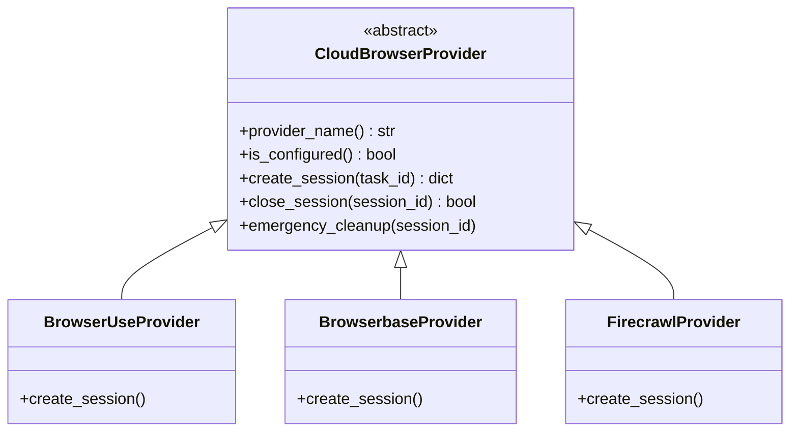

# tools — browser_providers

# Browser Providers

The `tools.browser_providers` module provides a unified abstraction layer for interacting with various cloud-hosted browser services (e.g., Browser Use, Browserbase, Firecrawl). It allows the higher-level `browser_tool` to manage remote browser sessions without needing to handle vendor-specific API differences.

## Architecture

The module follows a provider pattern using an Abstract Base Class (ABC). Each cloud vendor is implemented as a subclass of `CloudBrowserProvider`.

## Core Interface: `CloudBrowserProvider`

Defined in `base.py`, this class enforces the lifecycle methods required for any cloud browser backend:

- **`is_configured()`**: Performs a cheap check (usually environment variable presence) to determine if the provider is available for use.
- **`create_session(task_id)`**: Provisions a new remote browser. It returns a dictionary containing:
    - `cdp_url`: The WebSocket URL used to connect a Playwright/Puppeteer driver.
    - `bb_session_id`: The provider's internal session ID (used for termination).
    - `session_name`: A human-readable identifier for logging.
- **`close_session(session_id)`**: Gracefully terminates the session.
- **`emergency_cleanup(session_id)`**: A best-effort termination called during process exit or crashes.

## Supported Providers

### Browser Use (`BrowserUseProvider`)
The primary provider for managed environments. It supports two modes of operation:
1.  **Direct API**: Uses `BROWSER_USE_API_KEY`.
2.  **Managed Gateway**: Uses `tools.managed_tool_gateway` to resolve credentials and routing via the Nous infrastructure.

**Key Features:**
- **Idempotency**: Uses `X-Idempotency-Key` during session creation in managed mode to prevent duplicate billing/sessions on retries.
- **Configurable Proxies**: Defaults to `us` country codes for managed sessions.

### Browserbase (`BrowserbaseProvider`)
A robust provider requiring `BROWSERBASE_API_KEY` and `BROWSERBASE_PROJECT_ID`.

**Key Features:**
- **Feature Fallbacks**: If a session creation fails with HTTP 402 (Payment Required), the provider automatically retries by stripping advanced features like `keepAlive` or `proxies`.
- **Advanced Stealth**: Supports toggling `advancedStealth` and custom session timeouts via environment variables (`BROWSERBASE_SESSION_TIMEOUT`).

### Firecrawl (`FirecrawlProvider`)
A lightweight provider focused on web scraping and crawling contexts.

**Key Features:**
- **TTL Management**: Uses `FIRECRAWL_BROWSER_TTL` (default 300s) to ensure sessions do not persist indefinitely if the client disconnects.
- **Simple REST Interface**: Uses standard Bearer token authentication via `FIRECRAWL_API_KEY`.

## Session Lifecycle Flow

1.  **Discovery**: `browser_tool` checks `is_configured()` for the provider selected in the user's configuration.
2.  **Provisioning**: `create_session` is called. The provider performs a POST request to the vendor API and returns the `cdp_url`.
3.  **Connection**: The agent connects to the `cdp_url` to perform browser actions.
4.  **Teardown**: Upon task completion, `close_session` is called. If the process receives a termination signal, `emergency_cleanup` is triggered via `atexit` handlers in the calling module.

## Configuration

Providers are configured primarily through environment variables:

| Provider | Required Variables | Optional Variables |
| :--- | :--- | :--- |
| **Browser Use** | `BROWSER_USE_API_KEY` | `BROWSER_USE_PROXY_COUNTRY` |
| **Browserbase** | `BROWSERBASE_API_KEY`, `BROWSERBASE_PROJECT_ID` | `BROWSERBASE_PROXIES`, `BROWSERBASE_KEEP_ALIVE` |
| **Firecrawl** | `FIRECRAWL_API_KEY` | `FIRECRAWL_API_URL`, `FIRECRAWL_BROWSER_TTL` |

## Implementation Details

### Legacy Key Names
The `create_session` return dictionary uses the key `bb_session_id` to store the provider's session ID. This is a legacy naming convention (originally referring to Browserbase) maintained for backward compatibility with the `browser_tool.py` logic.

### Error Handling
Implementations are expected to catch network exceptions during `close_session` and `emergency_cleanup`, logging a warning rather than raising. This ensures that a failure to close a browser session does not crash the main agent loop.