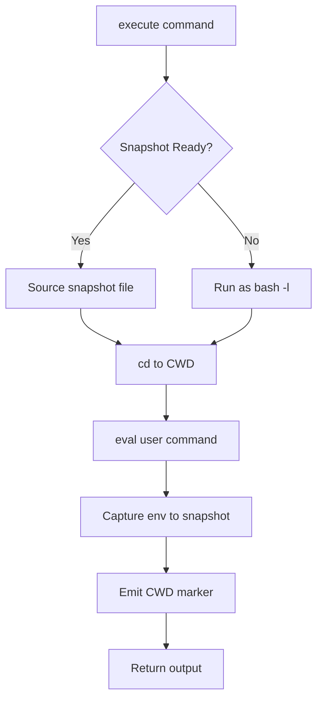

# tools — environments

# tools — environments

The `tools.environments` module provides a unified interface for executing shell commands across diverse backends. It abstracts the complexities of local processes, containers, and cloud sandboxes into a consistent API used by the Hermes terminal tool.

## Core Architecture: Spawn-per-Call

Hermes uses a **spawn-per-call** model rather than maintaining a long-lived interactive shell process. Every command execution spawns a fresh `bash -c` instance. To provide the illusion of a persistent session (where environment variables and the working directory persist), the module employs a **Session Snapshot** mechanism.

### Session Snapshots
1.  **Initialization**: When an environment is created, `init_session()` runs a bootstrap script in a login shell (`bash -l`).
2.  **Capture**: It captures the environment state (exported variables, functions, aliases) into a snapshot file (e.g., `/tmp/hermes-snap-[id].sh`).
3.  **Restoration**: Every subsequent call to `execute()` wraps the user's command. The wrapper sources the snapshot file, `cd`s to the last known directory, runs the command, and then re-dumps the environment state back into the snapshot.

## BaseEnvironment

The `BaseEnvironment` abstract base class (ABC) implements the core execution logic, including command wrapping, output draining, and interrupt handling.

### Key Methods
- `execute(command, cwd, timeout, stdin_data)`: The primary entry point. It prepares the command (handling `sudo` transformations), wraps it in the snapshot logic, and manages the process lifecycle.
- `_run_bash(...)`: Abstract method implemented by backends to spawn the actual process.
- `_wait_for_process(proc, timeout)`: A robust polling loop that:
    - Drains `stdout` non-blockingly using `select()`.
    - Monitors for interrupts via `is_interrupted()`.
    - Fires an activity callback every 10s to prevent gateway inactivity timeouts.
    - Handles "grandchild pipe leaks" by stopping the drain shortly after the main bash process exits.

### Process Abstraction
Backends return a `ProcessHandle`. While `subprocess.Popen` satisfies this natively for local/Docker execution, SDK-based backends (Modal, Daytona) use `_ThreadedProcessHandle`. This adapter wraps blocking SDK calls in a background thread to provide the `poll()`, `kill()`, and `wait()` interface required by the base class.

## File Synchronization

Remote backends (SSH, Modal, Daytona) that do not have direct access to the host filesystem use the `FileSyncManager`.

- **Tracking**: It tracks local files (credentials, skills, cache) using a combination of `mtime` and file size.
- **Transactional Sync**: Files are uploaded in batches. The internal state is only updated if the entire batch succeeds, ensuring consistency.
- **Sync-Back**: On environment cleanup, `sync_back()` can pull remote changes back to the host. It uses SHA-256 hashes to detect remote modifications and applies a "last-write-wins" strategy in case of conflicts.
- **Optimization**: Backends like `DaytonaEnvironment` implement `_daytona_bulk_upload` to batch multiple files into a single HTTP POST, significantly reducing overhead.

## Backend Implementations

### LocalEnvironment
Runs commands directly on the host.
- **Security**: Uses `_sanitize_subprocess_env` to strip Hermes-internal secrets and API keys from the environment before execution.
- **Isolation**: Redirects `HOME` to a profile-specific directory (via `get_subprocess_home`) to isolate tool configurations (git, npm, etc.).
- **Process Groups**: On POSIX, it uses `os.setsid` to run commands in their own process group, allowing `_kill_process` to reliably terminate entire process trees.

### DockerEnvironment
Provides hardened container isolation.
- **Security**: Drops all capabilities (`--cap-drop ALL`) and adds back only the minimum required (`DAC_OVERRIDE`, `CHOWN`, `FOWNER`). It enforces `no-new-privileges` and sets a `pids-limit`.
- **Persistence**: Supports optional filesystem persistence via bind mounts to `TERMINAL_SANDBOX_DIR`.
- **Resource Limits**: Configurable CPU, memory, and disk quotas (disk quotas require `overlay2` on XFS).

### Cloud Backends (Modal & Daytona)
- **ManagedModalEnvironment**: Connects to a remote tool gateway to manage sandboxes, avoiding the need for local Modal credentials.
- **ModalEnvironment**: Uses the native Modal SDK. It supports image restoration from snapshots to speed up cold starts.
- **DaytonaEnvironment**: Utilizes the Daytona SDK for persistent cloud workspaces.

## Working Directory Tracking

Because the shell exits after every command, the working directory must be tracked manually.
- **Remote**: The command wrapper emits a unique marker: `__HERMES_CWD_{session_id}__[path]__HERMES_CWD_{session_id}__`. `_extract_cwd_from_output` parses this from the stdout stream and updates `self.cwd`.
- **Local**: The wrapper writes the CWD to a temporary file, which `LocalEnvironment._update_cwd` reads directly to avoid stdout pollution.

## Interrupt Handling

The module is designed to be highly responsive to user interrupts.
- `_wait_for_process` checks `is_interrupted()` on every poll iteration (default 200ms).
- If an interrupt is detected, it calls `_kill_process`.
- For `LocalEnvironment`, this sends `SIGTERM` (and eventually `SIGKILL`) to the entire process group.
- For SDK backends, this triggers the `cancel_fn` (e.g., `sandbox.stop()` or `sandbox.terminate()`).