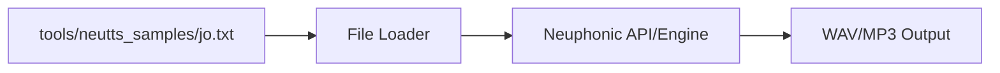

# tools — neutts_samples

# Module: tools/neutts_samples

The `tools/neutts_samples` module is a static resource directory containing sample text files used for testing, benchmarking, and demonstrating the capabilities of the Neuphonic Text-to-Speech (TTS) integration.

These samples are primarily utilized as standardized inputs for the TTS engine to evaluate voice quality, latency, and feature support (such as voice cloning and conversational agents).

## Sample Content: jo.txt

The core file currently within this module is `jo.txt`. It contains a conversational testimonial designed to test the naturalness and prosody of the synthesized output.

**Content:**
> "So I just tried Neuphonic and I’m genuinely impressed. It's super responsive, it sounds clean, supports voice cloning, and the agent feature is fun to play with too. Highly recommend it for podcasts, conversations, or even just messing around with voiceovers."

### Key Testing Characteristics
The text in `jo.txt` is structured to validate specific TTS features:
*   **Responsiveness:** The conversational tone allows developers to measure the "time to first byte" (TTFB) in interactive scenarios.
*   **Clarity and Cleanliness:** The vocabulary is chosen to test the engine's ability to produce high-fidelity audio without artifacts.
*   **Feature Mention:** The text explicitly references "voice cloning" and "agent features," making it a suitable script for marketing demos or feature-specific regression tests.

## Integration and Usage

While this module contains no executable code or logic, it serves as a data source for other components in the `tools` or `tts` namespaces. 

### Typical Workflow
Developers typically ingest these samples into a testing harness or a CLI tool to generate audio output.



### How to Use
To use these samples in a test suite, reference the file path relative to the project root:

```python
# Example pattern for utilizing the sample
with open('tools/neutts_samples/jo.txt', 'r') as f:
    sample_text = f.read()
    # Pass sample_text to the Neuphonic synthesis function
```

## Contribution Guidelines
When adding new samples to this directory:
1.  Use the `.txt` extension.
2.  Ensure the text covers specific phonetic ranges or emotional tones not present in existing samples.
3.  Keep samples concise to minimize API costs during automated testing.