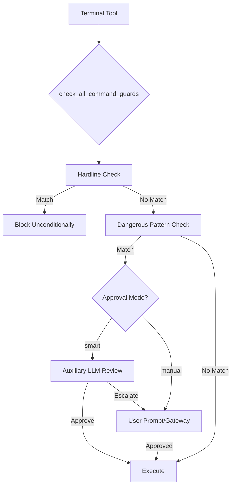

# tools — tools

# Tools Module

The `tools` module serves as the primary interface between the Hermes agent and the host environment. It encompasses command execution safety, browser automation backends, and output sanitization. The package is designed for minimal side effects during initialization to prevent circular dependencies with `hermes_cli.config`.

## Command Safety and Approval System

The `tools.approval` module is the central authority for preventing the execution of destructive commands. It implements a multi-layered defense strategy.

### 1. Hardline Blocklist
The `HARDLINE_PATTERNS` list contains catastrophic commands that are blocked unconditionally. These cannot be bypassed by `--yolo` mode or user approval.
- **Targets:** Root filesystem deletion (`rm -rf /`), disk formatting (`mkfs`), raw block device overwrites (`dd of=/dev/sda`), and system power commands (`shutdown`, `reboot`).
- **Detection:** `detect_hardline_command(command)` uses normalized regex matching to identify these patterns at the start of shell command positions.

### 2. Dangerous Command Detection
The `DANGEROUS_PATTERNS` list identifies risky but potentially valid operations (e.g., `git reset --hard`, `chmod 777`, or `kill -9`).
- **Normalization:** `_normalize_command_for_detection` strips ANSI codes, null bytes, and normalizes Unicode to prevent obfuscation bypasses.
- **Smart Approval:** If `approvals.mode` is set to `smart`, the system invokes `_smart_approve`. This uses an auxiliary LLM to assess if a flagged command is a false positive (e.g., a benign `python -c` script) before prompting the user.

### 3. Approval Orchestration
`check_all_command_guards` is the primary entry point for terminal tools. It coordinates:
- **Tirith Integration:** Incorporates security findings from `tools.tirith_security`.
- **Session State:** Tracks approvals per `session_key` using `ContextVars` to ensure thread safety during concurrent agent turns.
- **Gateway Bridging:** For headless environments, `register_gateway_notify` allows the agent to block on a `threading.Event` while waiting for a user to approve a command via the Gateway UI.

## Output Sanitization

The `tools.ansi_strip` module provides `strip_ansi(text)`. This is a high-performance utility used by `terminal_tool` and `code_execution_tool` to remove ECMA-48 escape sequences from subprocess output. 

**Purpose:** It prevents the model from seeing terminal formatting codes (colors, cursor movements). If these codes enter the model's context, the model often erroneously copies them into subsequent file writes, corrupting source code.

## Browser Infrastructure

Hermes supports multiple browser backends and a stateful supervision layer.

### CDP Supervisor
The `tools.browser_supervisor` module runs a background `CDPSupervisor` per task. It maintains a persistent WebSocket connection to a Chrome DevTools Protocol (CDP) endpoint.
- **Dialog Handling:** Intercepts JavaScript `alert`, `confirm`, and `prompt` calls. It can auto-dismiss based on policy or hold them for agent response via `browser_dialog_tool`.
- **Frame Tracking:** Maintains a real-time `frame_tree`, identifying Out-of-Process Iframes (OOPIFs) and mapping them to CDP session IDs.
- **Injection:** Uses `Page.addScriptToEvaluateOnNewDocument` to inject a bridge that routes synchronous JS dialogs through a controlled XHR interceptor.

### Browser Backends
1.  **Camofox (`tools.browser_camofox`):** A REST-based backend for the Camoufox anti-detection browser. It handles navigation, snapshots, and vision-based analysis without requiring a direct CDP connection.
2.  **CDP Passthrough (`tools.browser_cdp_tool`):** Provides the `browser_cdp` tool, allowing the agent to send raw CDP commands. It supports routing commands to specific frames via `frame_id` by multiplexing through the supervisor's session.

## File System Utilities

### Binary Detection
`tools.binary_extensions` defines `has_binary_extension(path)`. This is used by file-searching and reading tools to avoid ingesting non-text data (images, archives, executables) into the LLM context, which would waste tokens and cause hallucination.

### Requirement Checks
`tools.check_file_requirements()` validates the environment for file operations. It primarily ensures terminal backend availability via `tools.terminal_tool.check_terminal_requirements()`.

## Execution Flow: Command Approval

When an agent attempts to run a command like `rm -rf ./node_modules`:

1.  **Terminal Tool** calls `check_all_command_guards(command, env_type)`.
2.  **Normalization:** `strip_ansi` and Unicode normalization are applied.
3.  **Hardline Check:** `detect_hardline_command` returns `False`.
4.  **Dangerous Check:** `detect_dangerous_command` matches the `recursive delete` pattern.
5.  **Session Lookup:** `is_approved` checks if this pattern was already allowed for the current `HERMES_SESSION_KEY`.
6.  **Prompting:** If not approved, `prompt_dangerous_approval` (CLI) or the gateway notification callback is triggered.
7.  **Persistence:** If the user selects "Always", `save_permanent_allowlist` updates the `command_allowlist` in `config.yaml`.