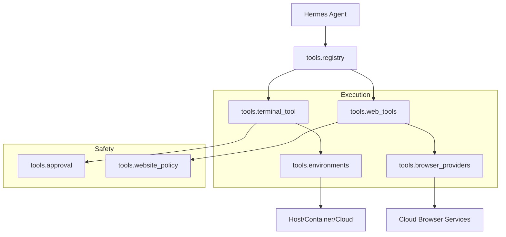

# tools

# Tools Module

The `tools` module provides the execution engine for the Hermes agent, bridging high-level reasoning with low-level system, web, and multimodal interactions. It manages the lifecycle of tool execution, from discovery and safety validation to environment-specific deployment.

## Core Architecture

The module is organized into three functional layers: **Execution**, **Safety & Policy**, and **Specialized Capabilities**.

## Functional Areas

### System Execution & Safety
The interaction with shell environments is handled by a combination of [environments](environments.md) and [terminal_tool](terminal_tool.md). 
*   **Persistence:** While [environments](environments.md) uses a "spawn-per-call" model, it maintains session state (working directories and variables) via snapshots.
*   **Gatekeeping:** Before any command reaches the environment, [approval](approval.md) enforces a hardline blocklist of destructive patterns, while `terminal_tool` manages sudo credentials and command transformation.

### Web Automation & Research
The [web_tools](web_tools.md) sub-module provides high-level functions for searching, crawling, and extracting data.
*   **Backend Abstraction:** It utilizes [browser_providers](browser_providers.md) to interface with various cloud-hosted browser services (like Browserbase or Firecrawl) through a unified API.
*   **Compliance:** Every request is filtered through [website_policy](website_policy.md) and URL safety checks to ensure the agent adheres to access rules and avoids restricted domains.

### Multimodal & Media
Hermes interacts with the physical and digital world through specialized media tools:
*   **Voice & Audio:** [voice_mode](voice_mode.md) handles real-time audio capture and playback, utilizing [neutts_samples](neutts_samples.md) for testing and benchmarking speech synthesis quality.
*   **Vision:** [vision_tools](vision_tools.md) allows the agent to process and describe visual inputs, integrated with the core interrupt system to allow for long-running analysis.

### Infrastructure & Registry
The [registry](registry.md) serves as the central source of truth for tool discovery. It manages toolset aliases and snapshots the state of available tools, allowing the agent to resolve which capabilities are active in a given environment. This registry is frequently accessed during the `rollout_and_score_eval` workflows to validate tool distributions.

## Key Sub-modules

| Module | Responsibility |
| :--- | :--- |
| [approval](approval.md) | Hardline command blocklists and safety enforcement. |
| [browser_providers](browser_providers.md) | Unified interface for cloud-hosted browser vendors. |
| [environments](environments.md) | Shell execution backends (Local, Docker, Modal). |
| [neutts_samples](neutts_samples.md) | Static resources for TTS benchmarking and testing. |
| [registry](registry.md) | Tool discovery, aliasing, and state snapshotting. |
| [web_tools](web_tools.md) | High-level web search, crawling, and content extraction. |
| [website_policy](website_policy.md) | Domain-level access control and blocklist management. |
| [voice_mode](voice_mode.md) | Audio stream management and STT/TTS integration. |