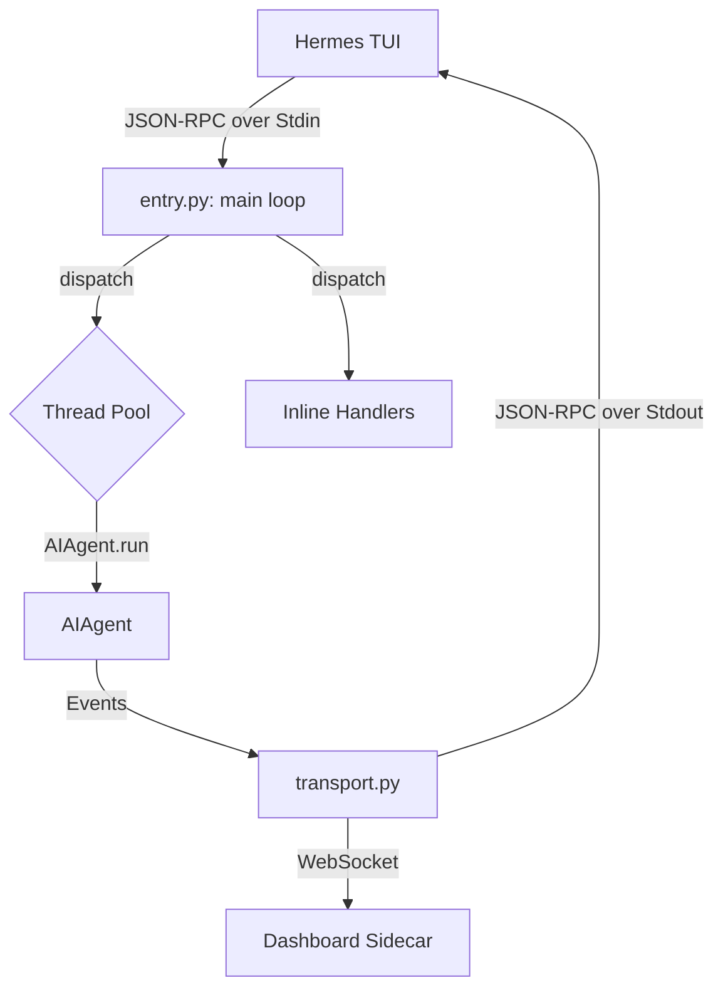

# tui_gateway

# tui_gateway

The `tui_gateway` module serves as the JSON-RPC bridge between the Hermes TUI (Terminal User Interface) and the underlying AI agent logic. It runs as a standalone subprocess, communicating with the TUI over standard I/O (stdin/stdout) to manage sessions, execute prompts, and stream events.

## Architecture Overview

The gateway is designed to be highly responsive, offloading long-running tasks to a thread pool while maintaining a synchronous command loop for state management.

## Core Components

### 1. Entry Point (`entry.py`)
The `main()` function in `entry.py` initializes the gateway environment:
- **Signal Handling**: Configures `SIGPIPE` to be ignored (preventing crashes when background threads write to a closed pipe) and `SIGTERM`/`SIGHUP` to trigger an orderly shutdown via `_log_signal`.
- **Sidecar Setup**: If `HERMES_TUI_SIDECAR_URL` is present, it wraps the standard I/O transport in a `TeeTransport` to mirror events to a WebSocket publisher.
- **Command Loop**: Reads newline-framed JSON from `sys.stdin`, parses it, and passes it to the dispatcher.

### 2. RPC Dispatcher (`server.py`)
The `dispatch()` function routes inbound requests based on their expected execution time:
- **Inline Handlers**: Fast operations (e.g., `session.list`, `terminal.resize`) run directly on the main thread.
- **Long Handlers**: Operations defined in `_LONG_HANDLERS` (e.g., `prompt.submit`, `session.resume`, `slash.exec`) are dispatched to a `ThreadPoolExecutor` (`_pool`). This prevents the stdin pipe from backing up while waiting for LLM responses or shell commands.

### 3. Session Management
Sessions are tracked in the `_sessions` dictionary. Each session encapsulates:
- An `AIAgent` instance.
- A `history_lock` for thread-safe transcript mutations.
- A `_SlashWorker` subprocess for executing `/` commands.
- Transport-specific bindings to ensure events reach the correct client.

**Lazy Agent Building**: To keep the TUI responsive, `session.create` returns a session ID immediately. The actual `AIAgent` construction (which involves tool discovery and model metadata loading) is deferred to a background thread via `_start_agent_build`.

### 4. Transport Layer (`transport.py`)
The gateway uses a pluggable transport system to emit JSON-RPC frames:
- `StdioTransport`: The default, writing to the real `sys.stdout`.
- `WsPublisherTransport`: A best-effort WebSocket client used for the dashboard sidebar.
- `TeeTransport`: Duplicates writes across multiple transports.

The `write_json()` function automatically resolves the correct transport using `contextvars` or session-specific metadata.

## JSON-RPC Methods

The module exposes several categories of methods via the `@method` decorator:

| Category | Key Methods | Description |
| :--- | :--- | :--- |
| **Session** | `session.create`, `session.resume`, `session.undo` | Manages the lifecycle and history of agent conversations. |
| **Prompt** | `prompt.submit`, `session.steer` | Sends user input to the agent and handles streaming responses. |
| **State** | `session.list`, `session.title`, `session.usage` | Interacts with `hermes_state` (SQLite) to persist and retrieve metadata. |
| **Observability** | `spawn_tree.list`, `spawn_tree.load` | Manages snapshots of sub-agent execution trees. |
| **Control** | `session.interrupt`, `subagent.interrupt` | Signals the agent or sub-agents to stop execution. |

## Error Handling and Forensics

Because the gateway's `stdout` is reserved for JSON-RPC traffic, standard Python `print()` calls and unhandled exceptions could corrupt the protocol. 

- **Stdout Redirection**: `sys.stdout` is redirected to `sys.stderr` at startup.
- **Panic Hooks**: `_panic_hook` and `_thread_panic_hook` intercept unhandled exceptions, writing full stack traces to `~/.hermes/logs/tui_gateway_crash.log` and emitting a summary to `stderr`.
- **Shutdown Grace**: On termination signals, the gateway attempts an orderly shutdown (atexit handlers) but will force an `os._exit(0)` after a configurable grace period (default 1s) to prevent deadlocks in the worker pool.

## Event Emission

The gateway emits asynchronous events to the TUI using the `method: "event"` JSON-RPC pattern. Key events include:
- `message.delta`: Incremental LLM response text.
- `tool.start` / `tool.complete`: Tool execution lifecycle.
- `status.update`: UI status bar text updates.
- `approval.request`: Requests for user permission (e.g., for shell execution).
- `reasoning.delta`: Thinking/reasoning tokens from supported models.

## Rendering Bridge (`render.py`)

The gateway provides a bridge to `agent.rich_output` via `render_message` and `render_diff`. If the `agent` package is available, it uses Python-side logic to format Markdown and diffs before sending them to the TUI; otherwise, the TUI falls back to its internal React-based rendering.