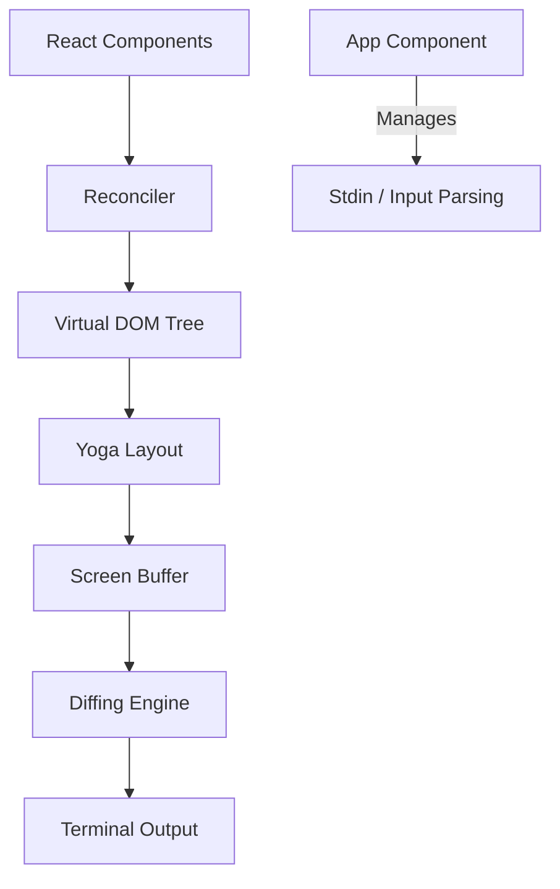

# ui-tui — packages

# @hermes/ink

`@hermes/ink` is a high-performance React reconciler specifically tuned for building complex Terminal User Interfaces (TUIs). It extends the core concepts of Ink with advanced terminal features including bidirectional text support, sophisticated mouse interaction (multi-click, drag-selection), and environment-aware color rendering.

## Architecture Overview

The module functions as a bridge between React's component model and the terminal's character-grid buffer.

## Core Components

### App
The `App` class (in `src/ink/components/App.tsx`) is the root of the Ink instance. It manages the lifecycle of the TUI session, including:
- **Raw Mode Management:** Toggles `stdin.setRawMode` and tracks a `rawModeEnabledCount` to ensure terminal settings are restored only when all components release them.
- **Input Pipeline:** Orchestrates the flow from `handleReadable` through `parseMultipleKeypresses` to `processKeysInBatch`.
- **Terminal Probing:** Uses `TerminalQuerier` to send `XTVERSION` queries to identify the host terminal (e.g., xterm.js vs. iTerm2).

### AlternateScreen
The `AlternateScreen` component switches the terminal to the DEC 1049 buffer.
- **Viewport Constraint:** Automatically constrains its height to the terminal's row count.
- **Mouse Tracking:** Enables SGR mouse tracking (wheel, click, drag) while mounted.
- **Cleanup:** Ensures the main screen is restored and the cursor is homed upon unmounting or process exit.

### Ansi
A specialized component for rendering pre-formatted ANSI strings (e.g., output from syntax highlighters).
- **Parsing:** Uses a `Parser` from `termio.js` to convert ANSI escape codes into a tree of `Text` and `Link` components.
- **Optimization:** Memoized to prevent expensive re-parsing when the parent re-renders but the content remains static.

## Input Handling & Events

The module implements a sophisticated event system that goes beyond simple keypresses.

### Keypress Parsing
Input is processed via `parseMultipleKeypresses`, which handles:
- **Bracketed Paste:** Buffers input between `EBP` (Enable Bracketed Paste) sequences to prevent rapid text entry from being interpreted as individual commands.
- **Extended Keys:** Supports Kitty keyboard protocol and xterm `modifyOtherKeys` to distinguish combinations like `Ctrl+Shift+A` from `Ctrl+A`.
- **Escape Sequence Watchdog:** Uses `incompleteEscapeTimer` to flush partial sequences (like a lone `ESC` key) after a 50ms timeout.

### Mouse & Selection
The `handleMouseEvent` function manages complex terminal interactions:
- **Multi-click Detection:** Tracks timing and distance between clicks to trigger word-select (double-click) or line-select (triple-click).
- **Drag Selection:** Implements character, word, and line-based selection modes.
- **Hyperlink Support:** Resolves OSC 8 hyperlinks at the click coordinates. Browser opening is deferred by `MULTI_CLICK_TIMEOUT_MS` to allow double-clicks to select text without triggering a URL open.

## Terminal Compatibility & Color

`@hermes/ink` includes specific logic to normalize behavior across different terminal emulators.

### Color Normalization (`colorize.ts`)
- **xterm.js Boost:** Automatically upgrades `chalk.level` to 3 (Truecolor) if `TERM_PROGRAM` is `vscode`, as many xterm.js environments support 24-bit color but fail to set `COLORTERM`.
- **tmux Clamping:** Clamps output to level 2 (256-color) when running inside `tmux` unless the user has explicitly configured truecolor passthrough, preventing background color rendering issues.
- **Apple Terminal Downgrade:** Implements a custom `richEightBitColorNumber` algorithm to provide better 256-color downgrades for legacy Apple Terminal versions.

### Bidirectional Text (`bidi.ts`)
Since many Windows terminals (conhost, older Windows Terminal versions) do not implement the Unicode Bidi Algorithm, the `reorderBidi` function:
1. Detects if the environment requires software bidi (Windows, WSL, or VS Code).
2. Identifies RTL character ranges (Hebrew, Arabic, etc.).
3. Reorders `ClusteredChar` arrays from logical to visual order before rendering.

## Performance & Memory Management

To maintain high frame rates in complex UIs, the module utilizes several module-level caches:
- **Width Cache:** Stores results of `stringWidth` calculations.
- **Wrap Cache:** Stores text wrapping results.
- **Slice Cache:** Caches ANSI-aware string slicing.

### Cache Eviction
The `evictInkCaches` function (in `src/ink/cache-eviction.ts`) allows the host application to clear these caches under memory pressure. It supports `all` or `half` eviction levels, using an LRU-style strategy to drop content-keyed entries.

## Hooks API

- `useInput(inputHandler)`: Subscribes to keyboard events.
- `useSelection()`: Accesses the current terminal text selection state.
- `useTerminalFocus()`: Returns a boolean indicating if the terminal window is currently focused (via DECSET 1004).
- `useDeclaredCursor()`: Allows a component to declare where the native terminal cursor should be parked (essential for IME support and screen readers).
- `useExternalProcess()`: Suspends the Ink renderer to allow a child process (like `vim` or `less`) to take over the terminal.