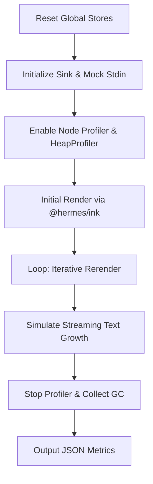

# ui-tui — scripts

# ui-tui Scripts

The `scripts` directory contains utility scripts for performance analysis and benchmarking of the TUI components. The primary tool is `profile-tui.mjs`, which provides a controlled environment to measure rendering performance, memory consumption, and output volume of the React-based terminal interface.

## profile-tui.mjs

This script benchmarks the `AppLayout` component by simulating a high-pressure environment: a large message history and a rapid stream of incoming text. It uses the Node.js `inspector` module to capture CPU profiles and heap statistics.

### Core Components

#### The `Sink` Class
To avoid the overhead and side effects of actual terminal rendering, the script implements a `Sink` class. This acts as a mock `stdout`/`stderr` that:
- Tracks the total number of bytes written.
- Tracks the total number of write operations.
- Simulates a TTY environment with configurable dimensions (`COLS`, `ROWS`).
- Discards the actual string data to keep the benchmark focused on the rendering logic rather than terminal I/O.

#### `baseProps(streamingText)`
This helper function constructs a comprehensive props object for `AppLayout`. It populates the TUI with:
- **History**: A large array of mock messages (default 500) to test virtualization.
- **Virtual History**: Pre-calculated offsets and spacers to simulate the state of the `VirtualList`.
- **Progress**: State representing active reasoning, tool usage, and streaming text.
- **Status**: Mock session data including CWD and turn timers.

### Execution Flow

The script follows a strict lifecycle to ensure clean measurements:



1.  **State Reset**: Calls `resetUiState()`, `resetTurnState()`, and `resetOverlayState()` to ensure no leakage from previous runs.
2.  **Profiler Start**: Connects to a `node:inspector` session and starts the CPU profiler.
3.  **The Iteration Loop**: The script performs a configurable number of iterations (default 40). In each iteration:
    *   A slice of a large text block is passed as the `reasoning` prop.
    *   `inst.rerender()` is called to trigger the React reconciliation and Ink rendering cycle.
    *   `setImmediate` is used to allow the event loop to process the render.
4.  **Metrics Collection**: Captures `process.memoryUsage()` before and after the loop, and again after an explicit `HeapProfiler.collectGarbage` call.

### Configuration

The script is configured via environment variables:

| Variable | Default | Description |
| :--- | :--- | :--- |
| `HISTORY` | `500` | Number of messages in the transcript history. |
| `MOUNTED` | `120` | Number of messages currently "mounted" in the virtual window. |
| `ITERS` | `40` | Number of rerender iterations to perform. |
| `LINES` | `1200` | Total lines of streaming text to simulate. |
| `COLS` | `120` | Mock terminal width. |
| `ROWS` | `42` | Mock terminal height. |

### Output

Upon completion, the script prints a JSON object to `stdout` containing:
- `elapsedMs`: Total time taken for the iteration loop.
- `stdoutBytes`: Total volume of data generated by the renderer.
- `stdoutWrites`: Number of distinct write calls made to the terminal.
- `startMem` / `endMem` / `afterGc`: Memory snapshots (rss, heapTotal, heapUsed, external).
- `profileNodes`: The number of nodes in the CPU profile (a proxy for call tree complexity).

### Usage

Run the script directly using `node`:

```bash
HISTORY=1000 ITERS=100 ./scripts/profile-tui.mjs
```

This is typically used during development to detect performance regressions in the rendering pipeline or to validate that virtualization logic in `AppLayout` is effectively limiting the work performed by `@hermes/ink`.