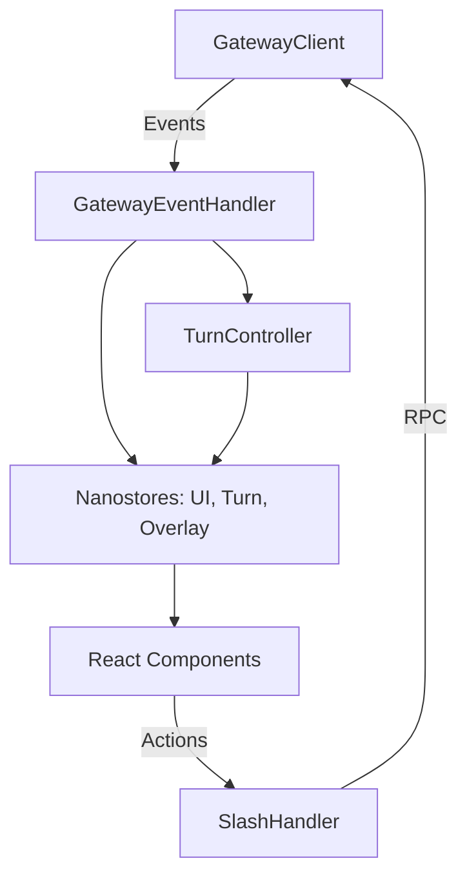

# ui-tui — src

# ui-tui — src

The `ui-tui` module serves as the core application logic for the Terminal User Interface (TUI). It manages the bridge between the React-based rendering layer (using Ink) and the backend Gateway service. It handles state synchronization, complex interaction patterns like tool-calling and subagent delegation, and the execution of slash commands.

## Architecture Overview

The module follows a reactive architecture where the Gateway emits events that are processed by a central handler, updating various `nanostores`. These stores then drive the React UI components.

## Core Components

### App Entry (`app.tsx`)
The `App` component is the root of the TUI. It initializes the application context using `useMainApp` and wraps the layout in a `GatewayProvider`. It injects the `GatewayClient` into the logic layer, enabling RPC communication.

### Turn Controller (`turnController.ts`)
The `TurnController` is a singleton class that manages the lifecycle of a single "turn" (the period from a user's input to the final assistant response). It is responsible for:
- **Streaming Management**: Buffering `message.delta` events and flushing them into segments to prevent UI flickering.
- **Reasoning/Thinking**: Handling reasoning deltas and managing the "thinking" state visibility.
- **Tool Execution**: Tracking active tools, recording progress, and handling inline diffs.
- **Interruptions**: Managing the state when a user interrupts a running agent, ensuring the transcript remains consistent.
- **Persistence**: Archiving completed spawn trees to the `spawnHistoryStore`.

### Gateway Event Handler (`createGatewayEventHandler.ts`)
This factory creates the primary listener for all events originating from the Gateway. It maps low-level protocol events to high-level application actions:
- **Session Lifecycle**: Handles `gateway.ready`, `session.info`, and session resumption.
- **Subagent Tracking**: Processes `subagent.start`, `subagent.progress`, and `subagent.complete` to maintain the delegation tree.
- **User Prompts**: Handles `clarify.request`, `approval.request`, and `secret.request` by triggering UI overlays.
- **Voice Integration**: Manages VAD (Voice Activity Detection) states and transcripts for voice-mode interaction.

### Slash Command System
Slash commands are handled by `createSlashHandler.ts`, which coordinates between local command implementations and remote gateway execution.

- **Registry**: `slash/registry.ts` aggregates commands from core, debug, ops, session, and setup categories.
- **Resolution**: It first checks the local registry for matches or aliases. If not found locally, it dispatches the command to the Gateway via `slash.exec` or `command.dispatch`.
- **Context**: Commands receive a `SlashRunCtx` providing access to the transcript, gateway RPCs, and UI state.

## State Management

The module uses `nanostores` for lightweight, reactive state management outside of the React tree:

| Store | Purpose |
| :--- | :--- |
| `$uiState` | Global UI configuration (theme, busy status, compact mode, mouse tracking). |
| `$turnStore` | Transient state for the active turn (current tools, streaming text, activity logs). |
| `$overlayState` | Controls visibility and data for modal-like prompts (approvals, model picker, pager). |
| `$delegationState` | Tracks subagent caps, concurrency limits, and pause status. |
| `$spawnHistory` | Stores snapshots of completed subagent trees for the `/replay` command. |

## Key Execution Flows

### Message Streaming
1. `message.delta` arrives via the Gateway.
2. `turnController.recordMessageDelta` updates the internal buffer.
3. A batching timer (defined by `STREAM_BATCH_MS`) triggers `flushStreamingSegment`.
4. The `turnStore` is updated, causing the React `AppLayout` to re-render the streaming text.

### Tool Completion with Inline Diffs
1. `tool.complete` arrives with an `inline_diff` payload.
2. `turnController.recordInlineDiffToolComplete` is called.
3. It flushes any preceding text segments and pushes a specialized `diff` segment into the message history.
4. This ensures the diff is anchored at the correct temporal point in the conversation.

### Session Resumption
1. On `gateway.ready`, the handler checks for `STARTUP_RESUME_ID`.
2. If `tui_auto_resume_recent` is enabled in config, it calls the `session.most_recent` RPC.
3. It triggers `resumeById`, which fetches the historical transcript and populates the UI.

## External Process Handoff
The `setupHandoff.ts` utility manages transitions where the TUI must suspend itself to run an external CLI process (e.g., `hermes setup`). It uses `@hermes/ink`'s `withInkSuspended` to release terminal control and resumes the TUI session once the external process exits.