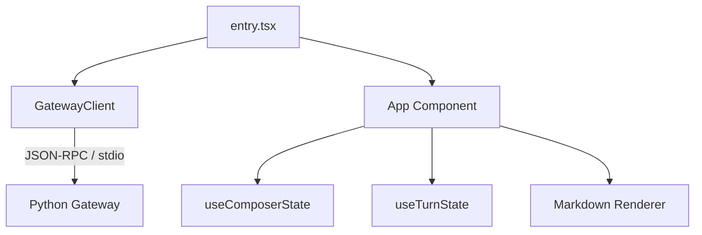

# ui-tui — ui-tui

# Hermes TUI (ui-tui)

The `ui-tui` module provides a React-based terminal user interface for Hermes, powered by [Ink](https://github.com/vadimdemedes/ink). It follows a client-server architecture where the TypeScript frontend manages the screen and user input, while a Python-based gateway handles session state, tool execution, and model interactions.

## Architecture

The TUI operates as a Node.js process that spawns a Python subprocess (`tui_gateway.entry`) as its backend. Communication occurs via newline-delimited JSON-RPC over `stdin` and `stdout`.



### Gateway Communication
- **`GatewayClient`**: Manages the lifecycle of the Python gateway process. It handles interpreter resolution, process spawning, and the JSON-RPC bridge.
- **Transport**: `stdout` is reserved for JSON-RPC responses and events. `stderr` is captured into an in-memory log ring and surfaced via `gateway.stderr` events to prevent UI corruption.
- **Event Handling**: `createGatewayEventHandler.ts` maps incoming gateway events (like `message.delta` or `tool.start`) to React state updates.

## Core State Management

The application state is centralized in `src/app.tsx` and managed through specialized hooks and stores:

- **`useComposerState`**: Manages the input buffer, multiline editing, and the message queue. It handles the logic for "drafting" messages while the agent is busy.
- **`useTurnState`**: Tracks the lifecycle of an agent "turn," including streaming status, tool progress, and reasoning blocks.
- **`uiStore` & `overlayStore`**: Nanostores used for global UI flags (e.g., status bar visibility) and managing modal-like overlays (e.g., session pickers).
- **`gatewayContext`**: Provides the `GatewayClient` instance to the component tree via React Context.

## Input & Interaction Model

The TUI implements a custom input handler in `components/textInput.tsx` and `useInputHandlers.ts` to support advanced terminal interactions.

### Input Modes
1.  **Chat Input**: The default mode for sending messages and slash commands.
2.  **Multiline Mode**: Triggered by `Shift+Enter` or `Alt+Enter`, allowing for complex prompt engineering within the TUI.
3.  **Prompt Overlays**: Blocking states triggered by the gateway (e.g., `approval.request`, `sudo.request`). These suspend the main chat input until resolved.
4.  **External Editor**: `Cmd/Ctrl+G` suspends the TUI and opens the current buffer in the user's `$EDITOR`.

### Command Dispatch
Input starting with `/` is processed by `createSlashHandler.ts`.
- **Local Commands**: Commands like `/clear`, `/copy`, and `/exit` are handled directly by the TUI.
- **Remote Commands**: Unknown slash commands are forwarded to the gateway via `slash.exec` or `command.dispatch`, allowing Python-based plugins to extend the TUI.

## Rendering Engine

The TUI uses a hybrid rendering approach to balance performance and rich formatting:

- **Transcript**: Uses Ink's `Static` component to render historical messages. This ensures that as the conversation grows, the TUI remains performant by not re-rendering the entire history.
- **Markdown**: `components/markdown.tsx` transforms a subset of Markdown into Ink components. It supports fenced code blocks (with syntax highlighting), tables, and diffs.
- **ANSI Support**: If the gateway sends pre-rendered ANSI strings, `messageLine.tsx` renders them directly to preserve formatting from external tools.
- **Activity Lane**: `thinking.tsx` provides a live view of tool execution, reasoning tokens, and spinners without cluttering the main transcript.

## Prompt Flows

The gateway can pause execution to request structured input. These are handled as stateful branches in `App.tsx`:

| Request Type | Component | Purpose |
| :--- | :--- | :--- |
| `approval.request` | `Prompts` | Security confirmation for tool execution (Once/Always/Deny). |
| `clarify.request` | `Prompts` | Disambiguation questions with multiple-choice or free-text. |
| `sudo.request` | `MaskedPrompt` | Secure password entry for elevated permissions. |
| `session.list` | `SessionPicker` | Interactive list for resuming previous sessions. |

## Development

### Setup
The TUI requires `node_modules` to be populated. If running from the repository root:
```bash
cd ui-tui
npm install
npm run build
```

### Key Files
- `src/entry.tsx`: The TTY gate and React entry point.
- `src/app.tsx`: The root component composing the layout and logic.
- `src/theme.ts`: Merges the default palette with "skin" data provided by the gateway.
- `packages/hermes-ink`: A local fork of Ink used to provide specific terminal behaviors required by Hermes.