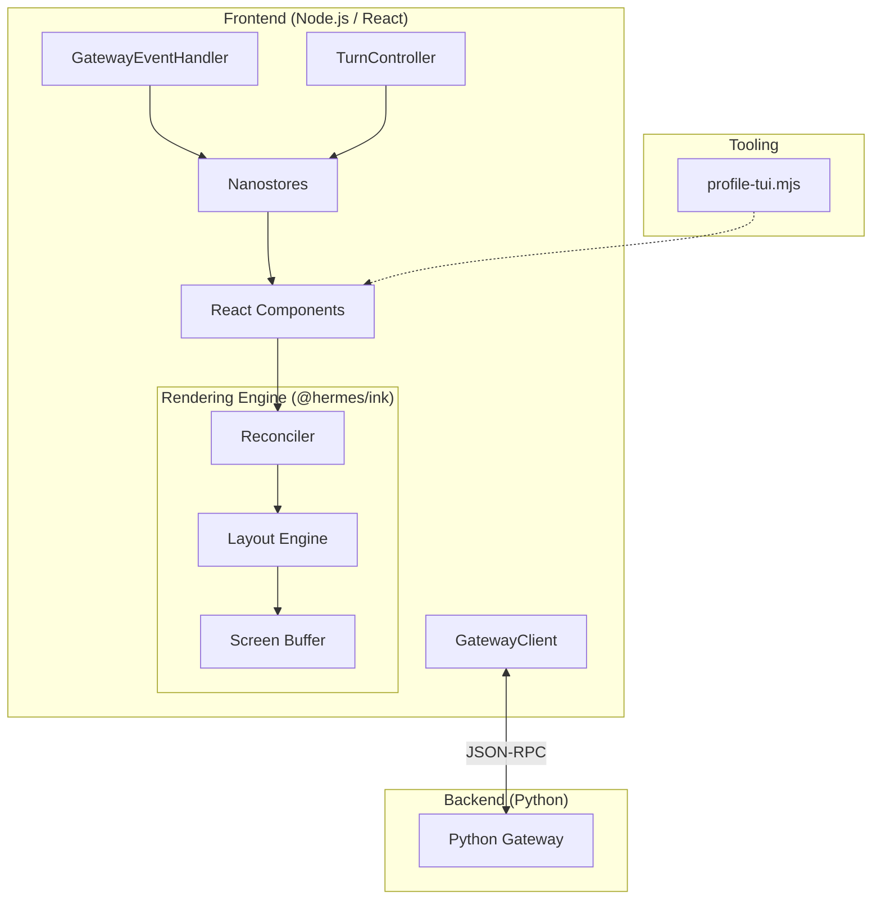

# ui-tui

# Hermes TUI (ui-tui)

The `ui-tui` module implements a high-performance Terminal User Interface for Hermes. It utilizes a client-server architecture where a Node.js frontend, built with React and a custom terminal reconciler, communicates with a Python-based gateway to manage model interactions and tool execution.

## Architecture Overview

The TUI is structured into three primary layers: the application logic, the rendering engine, and the performance utility suite.

## Sub-modules

### [Core Application (src)](src.md)
The `src` directory contains the central business logic. It manages the lifecycle of a "turn" (a single interaction with the model) via the `TurnController`. 
- **State Management:** Uses `nanostores` to synchronize state between the backend and the UI.
- **Gateway Communication:** The `GatewayClient` handles the bidirectional JSON-RPC stream over `stdio` to the Python backend.
- **Event Handling:** Processes incoming events (streaming text, tool calls, reasoning phases) and updates the UI state reactively.

### [Rendering Engine (@hermes/ink)](packages.md)
Located in `packages/ink`, this is a specialized React reconciler optimized for terminal environments. It extends the standard Ink library to support:
- **Advanced Interactions:** Multi-click mouse support and drag-selection.
- **Layout & Buffer:** Uses the Yoga layout engine to map React components to a character-grid buffer.
- **Performance:** Implements a diffing engine that minimizes terminal write operations by only updating changed cells.

### [Utility & Benchmarking (scripts)](scripts.md)
The `scripts` directory provides tools for maintaining TUI performance.
- **Profiling:** `profile-tui.mjs` benchmarks the `AppLayout` under high-pressure scenarios (e.g., rapid text streaming).
- **Mocking:** Includes a `Sink` class that simulates terminal output, allowing for CPU and memory profiling without the overhead of actual TTY rendering.

## Key Workflows

1.  **The Interaction Loop:** When the Python Gateway emits a message delta, the `GatewayClient` parses the JSON-RPC notification. The `GatewayEventHandler` then triggers the `TurnController` to update the `turnStore`. React components, observing these stores, re-render via the `@hermes/ink` reconciler.
2.  **Tool Execution:** When a tool call is detected, the `TurnController` manages the transition from message streaming to tool execution state, updating the UI to show progress indicators or subagent delegation status.
3.  **Performance Validation:** Developers use the `scripts` suite to ensure that complex UI updates—such as markdown rendering or inline diffs—do not exceed memory or CPU budgets during long-running sessions.