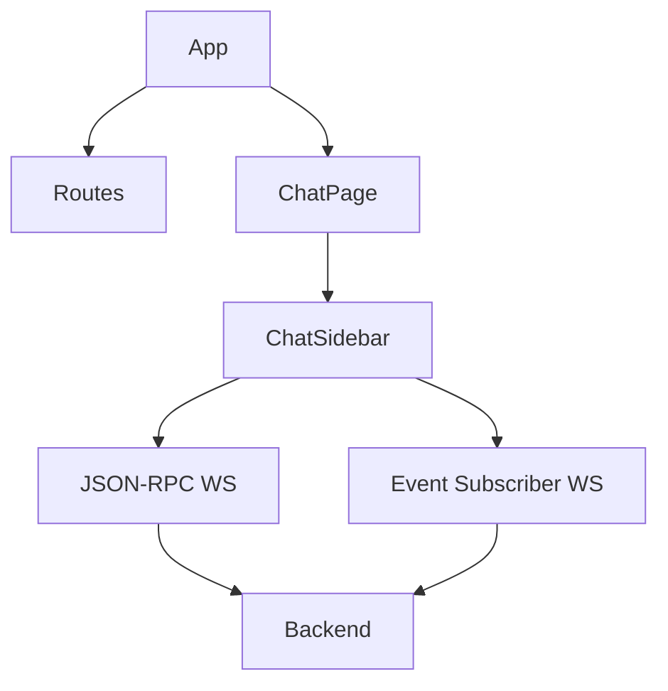

# web — src

# Hermes Dashboard (web/src)

The `web/src` module is the React-based frontend for the Hermes Agent. It provides a comprehensive management dashboard for sessions, analytics, model configuration, and a persistent terminal-based chat interface.

## Core Architecture

### Routing and Persistence
The application uses `react-router-dom` for navigation, but employs a hybrid rendering strategy to maintain state for the terminal-based chat.

*   **Standard Routes:** Pages like Analytics, Logs, and Config are rendered within a standard `<Routes>` switch.
*   **Persistent Chat:** When `isDashboardEmbeddedChatEnabled()` is true, the `ChatPage` is rendered outside the main `<Routes>` block. This ensures that the PTY child, WebSocket connections, and xterm.js instances survive when a user navigates to other tabs. A `display: none` toggle is used to hide the terminal without unmounting it.
*   **ChatRouteSink:** A placeholder component used in the router to claim the `/chat` path, preventing the `*` redirect while the persistent host handles the actual rendering.

### Plugin Integration
The dashboard is highly extensible via a manifest-driven plugin system.
*   **Navigation Injection:** `partitionSidebarNav` merges built-in routes with plugin-defined tabs, supporting positioning hints like `before:path` or `after:path`.
*   **UI Slots:** The `PluginSlot` component provides named injection points (e.g., `backdrop`, `header-banner`, `pre-main`) where plugins can render custom components.
*   **Route Overrides:** Plugins can override built-in routes (like `/chat`) by specifying an `override` path in their manifest.

## Communication Layer

The dashboard communicates with the Hermes backend through two primary channels:

1.  **REST API (`lib/api.ts`):** Used for stateless operations such as fetching logs, updating configuration, managing cron jobs, and retrieving model information.
2.  **Gateway Client (`lib/gatewayClient.ts`):** A JSON-RPC over WebSocket client used for stateful, real-time interactions.

### Chat Synchronization
The `ChatSidebar` component demonstrates a dual-socket pattern:
*   **JSON-RPC Sidecar:** Uses `GatewayClient` to drive the dashboard's in-process gateway (e.g., switching models via `slash.exec`).
*   **Event Subscriber:** Connects to `/api/events?channel=...` to passively receive tool execution updates (`tool.start`, `tool.progress`, `tool.complete`) fanned out from the PTY child.

## Key Components

### Model Selection (`ModelPickerDialog.tsx`)
A two-stage modal for selecting providers and models. It operates in two modes:
*   **Chat Mode:** Emits a slash command (e.g., `/model gpt-4o`) to the active session via JSON-RPC.
*   **Standalone Mode:** Used in configuration pages to update global settings via REST API.

### Dynamic Forms (`AutoField.tsx`)
Generates UI inputs dynamically based on a schema. It supports:
*   **Booleans:** Rendered as `Switch`.
*   **Selects:** Rendered as `Select` with predefined options.
*   **Lists:** Handles comma-separated string inputs.
*   **Objects:** Recursively renders nested fields for complex configurations.

### Markdown Rendering (`Markdown.tsx`)
A lightweight, performance-optimized Markdown renderer tailored for LLM outputs.
*   **Streaming Support:** Includes a `streaming` prop that renders a blinking caret at the end of the last block.
*   **Pattern Matching:** Specifically handles fenced code blocks, headers, and inline formatting (bold, italic, links) without the overhead of a full CommonMark parser.

### OAuth Management (`OAuthProvidersCard.tsx`)
Handles authentication flows for external platforms.
*   **PKCE Flow:** Opens a browser window for authorization and accepts a manual code entry.
*   **Device Code Flow:** Displays a user code and polls the backend until the user approves the login on the external site.

## Theming and Visuals

### Backdrop System (`Backdrop.tsx`)
Implements a complex visual stack to match the Hermes design language:
1.  **Base Layer:** `background-base` with `difference` blend mode.
2.  **Filler Layer:** Inverted JPEG textures at low opacity.
3.  **Warm Glow:** A radial vignette anchored to the top-left.
4.  **Noise Grain:** An SVG-based fractal noise layer, gated by `useGpuTier` to disable animations on low-power hardware or for users with `prefers-reduced-motion`.

### Theme Switcher (`ThemeSwitcher.tsx`)
Allows users to toggle between built-in and user-defined themes. It provides a 3-stop swatch preview (Background, Midground, Warm Glow) for each theme. Themes are applied by updating CSS custom properties on the root element, allowing for instant repainting without a page reload.

## Execution Flows

### System Actions
The `SidebarSystemActions` component triggers high-level gateway operations:
1.  User clicks "Restart Gateway".
2.  `useSystemActions` hook invokes the backend action.
3.  The UI enters a "Busy" state, showing a spinner in the sidebar.
4.  The app navigates to `/sessions` to monitor the gateway's recovery.

### Slash Command Autocomplete
The `SlashPopover` provides real-time suggestions in the chat composer:
1.  Input starts with `/`.
2.  `complete.slash` request is debounced and sent via `GatewayClient`.
3.  Results are rendered in a popover above the input.
4.  Keyboard events (Arrow keys, Tab) are intercepted by the popover via `useImperativeHandle`.