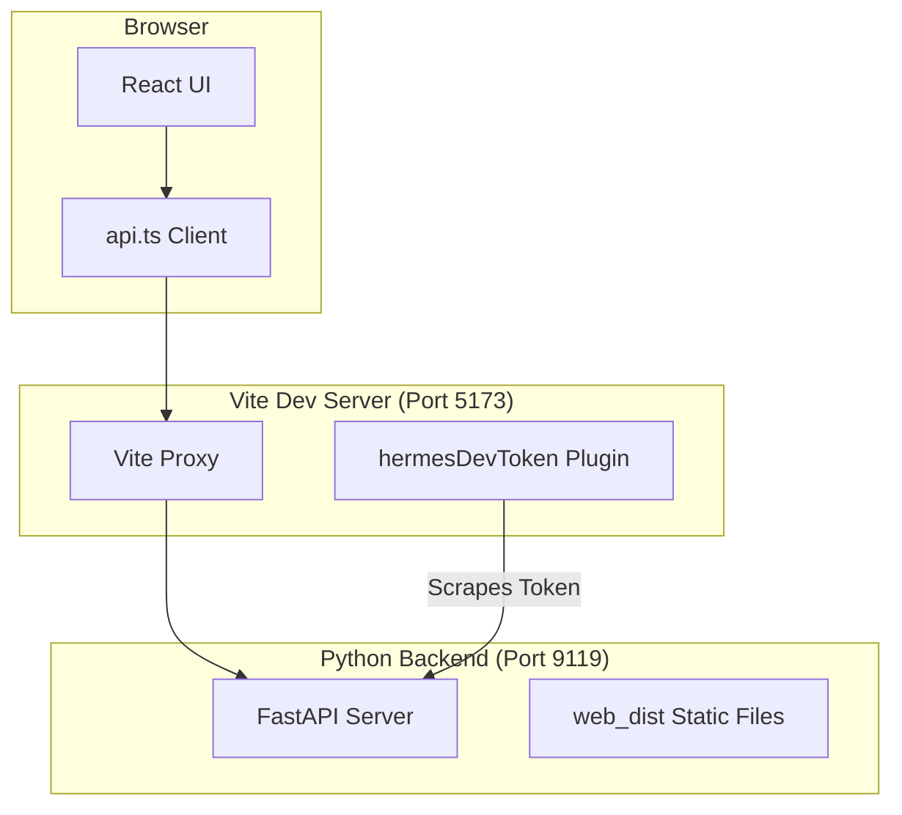

# web — web

# Hermes Agent Web UI

The `web` module is a React-based dashboard providing a graphical interface for managing Hermes Agent configurations, API keys, and monitoring active sessions. It is built as a Single Page Application (SPA) that integrates tightly with the Hermes Python backend.

## Tech Stack

- **Framework**: React 19 with TypeScript
- **Build Tool**: Vite
- **Styling**: Tailwind CSS v4
- **UI Components**: Custom primitives inspired by shadcn/ui and `@nous-research/ui`
- **State & Routing**: `react-router-dom`

## Architecture & Integration

The dashboard operates in two modes: **Development** (with HMR) and **Production** (served as static assets by FastAPI).



### API Communication
All backend interactions are centralized in `src/lib/api.ts`. This module provides typed fetch wrappers for the FastAPI endpoints. In development, Vite proxies requests starting with `/api` to the backend server (defaulting to `http://127.0.0.1:9119`).

### Session Authentication
The Hermes backend uses a one-shot session token for security. 
- **Production**: The Python server injects `window.__HERMES_SESSION_TOKEN__` directly into the `index.html` before serving it.
- **Development**: The `hermesDevToken` plugin in `vite.config.ts` fetches the backend's `index.html`, extracts the token via regex (`TOKEN_RE`), and injects it into the Vite-served HTML. This ensures that developers can make authenticated API calls during local development without manual token management.

## Directory Structure

- `src/components/ui/`: Reusable UI primitives (Buttons, Cards, Inputs).
- `src/lib/api.ts`: The core API client.
- `src/lib/utils.ts`: Contains the `cn()` helper for merging Tailwind classes using `clsx` and `tailwind-merge`.
- `src/pages/`:
    - `StatusPage`: Displays agent health and active/recent session telemetry.
    - `ConfigPage`: A dynamic configuration editor that renders forms based on the JSON schema provided by the backend.
    - `EnvPage`: Interface for managing environment variables and API keys.

## Development Workflow

### Setup
Before starting the UI, the backend must be running to provide the API and the session token:

```bash
# Terminal 1: Backend
python -m hermes_cli.main web --no-open

# Terminal 2: Frontend
cd web/
npm install
npm run dev
```

### Asset Syncing
The project relies on external design system assets. The `sync-assets` script (triggered via `predev` and `prebuild`) copies fonts and assets from `@nous-research/ui` into the `public/` directory.

### Dependency Deduplication
The `vite.config.ts` includes a `dedupe` configuration for packages like `react`, `three`, and `gsap`. This is critical when using symlinked libraries (like a local design language repo) to prevent multiple instances of React or WebGL contexts, which would otherwise cause hook errors or rendering conflicts.

## Build and Deployment

Running `npm run build` executes the following:
1. `tsc -b`: Type-checks the project.
2. `vite build`: Bundles assets into `../hermes_cli/web_dist/`.

The Python package is configured to include the `web_dist` directory as package data. When a user runs `hermes dashboard`, the FastAPI server mounts this directory to serve the SPA.