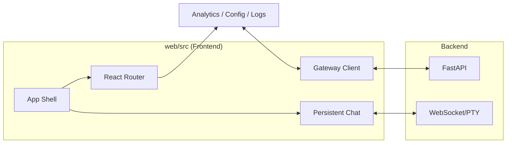

# web

# Web Module

The `web` module provides the graphical interface for the Hermes Agent ecosystem. It is a React-based Single Page Application (SPA) designed to manage agent configurations, monitor real-time sessions, and provide a persistent terminal-based chat interface.

## Architecture Overview

The module is structured to balance standard web navigation with the high-availability requirements of LLM interactions and terminal emulators.

*   **[web](web.md)**: Defines the build system (Vite), styling framework (Tailwind CSS v4), and the integration strategy with the FastAPI backend. It manages the transition between development (HMR) and production (static asset serving).
*   **[src](src.md)**: Contains the application logic, including a hybrid rendering engine that separates transient UI (Analytics, Logs) from persistent stateful components (Chat, WebSockets).

### Component Interaction

The dashboard utilizes a centralized gateway client to synchronize state between the browser and the Python backend.

## Key Workflows

### Persistent Communication
Unlike standard SPA routes that unmount on navigation, the `web` module employs a hybrid strategy for the **ChatPage**. When embedded chat is enabled, the terminal instance and its associated WebSocket connections are rendered outside the main routing switch. This ensures that active agent sessions and xterm.js instances remain alive while the user navigates between **Analytics**, **Models**, and **Skills** pages.

### Plugin & Theme Integration
 functionality is extended through a dynamic plugin registry. The `usePlugins` hook resolves components at runtime, allowing the dashboard to incorporate new tools and views without core logic changes. This is complemented by a `ThemeProvider` that injects CSS variables and font stylesheets to maintain visual consistency across custom and core components.

### Session & Model Management
The interface provides specialized views for managing the agent's lifecycle:
*   **Sessions & Logs**: Real-time monitoring of agent thoughts and tool calls via `SessionsPage`.
*   **Configuration**: Centralized management of LLM providers, API keys, and model parameters through `ModelsPage` and `ProfilesPage`.
*   **Skill Orchestration**: A dedicated `SkillsPage` for toggling agent capabilities and viewing tool categories.