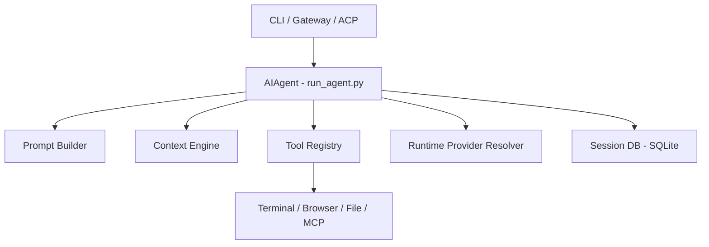

# website — docs

# Hermes Agent Developer Documentation

This module contains the technical specifications, internal architecture, and extensibility guides for the Hermes Agent ecosystem. It serves as the primary reference for developers contributing to the core engine, building platform adapters, or implementing new tools and skills.

## System Architecture

Hermes is designed as a platform-agnostic orchestration engine. The core logic resides in the `AIAgent` class, which is wrapped by various entry points (CLI, Gateway, ACP).

### High-Level Component Map



### Core Subsystems
*   **Agent Loop (`run_agent.py`)**: The central orchestration engine handling conversation state, tool dispatch, and provider failover.
*   **Tool Registry (`tools/registry.py`)**: A discovery-based system where tools self-register. It manages schemas and execution for 60+ built-in tools.
*   **Gateway (`gateway/run.py`)**: A multi-platform messaging server supporting 20+ adapters (Telegram, Discord, Slack, etc.).
*   **ACP Adapter (`acp_adapter/`)**: An implementation of the Agent Control Protocol, allowing IDEs (VS Code, Zed) to communicate with Hermes via JSON-RPC over stdio.

---

## Agent Loop Internals

The `AIAgent` class in `run_agent.py` manages the lifecycle of a conversation turn.

### Execution Flow: `run_conversation()`
1.  **Prompt Assembly**: `prompt_builder.py` constructs the system prompt from personality (`SOUL.md`), memory, and active skills.
2.  **Context Check**: If the conversation exceeds the compression threshold (default 50%), `ContextCompressor` triggers a summarization pass.
3.  **API Mode Selection**: The agent resolves the provider to one of three modes:
    *   `chat_completions`: Standard OpenAI-compatible flow.
    *   `codex_responses`: OpenAI Codex/Responses format.
    *   `anthropic_messages`: Native Anthropic Messages API via `anthropic_adapter.py`.
4.  **Interruptible Call**: The LLM request is wrapped in `_interruptible_api_call` to allow user cancellation mid-stream.
5.  **Tool Dispatch**: If the model returns `tool_calls`, `model_tools.handle_function_call()` routes them to the registry or intercepts agent-level tools (`todo`, `memory`, `delegate_task`).

### API Role Alternation
The loop enforces strict OpenAI-style role sequences: `User -> Assistant -> Tool -> Assistant`. It prevents consecutive messages of the same role to ensure compatibility across strict providers.

---

## Extensibility

### 1. Adding Tools
Tools are Python functions registered with the `registry`.
*   **Location**: `tools/your_tool.py`
*   **Requirement**: Must return a JSON string.
*   **Registration**:
    ```python
    registry.register(
        name="my_tool",
        schema=MY_SCHEMA,
        handler=my_handler_func,
        check_fn=check_requirements
    )
    ```
*   **Integration**: Add the tool name to `_HERMES_CORE_TOOLS` in `toolsets.py`.

### 2. Creating Skills
Skills are instruction-based capabilities defined in `SKILL.md` files.
*   **Format**: Markdown with YAML frontmatter.
*   **Features**: Supports platform gating (`platforms: [macos]`), tool dependencies (`requires_tools`), and environment variable passthrough.
*   **Dynamic Context**: Supports template variables like `${HERMES_SKILL_DIR}` and inline shell snippets `` !`cmd` ``.

### 3. Platform Adapters
Adapters connect Hermes to messaging services.
*   **Base Class**: `BasePlatformAdapter` in `gateway/platforms/base.py`.
*   **Methods**: Must implement `connect()`, `disconnect()`, and `send()`.
*   **Plugin Path**: New platforms can be added without core changes by placing an `adapter.py` and `PLUGIN.yaml` in `~/.hermes/plugins/`.

---

## Context Management

Hermes uses a dual-layer approach to manage large context windows.

### Context Compression
Triggered when prompt tokens reach a threshold (default 50%).
1.  **Pruning**: Old, verbose tool results are cleared.
2.  **Summarization**: Middle conversation turns are sent to an auxiliary LLM to generate a structured summary (Goal, Progress, Decisions, Next Steps).
3.  **Tail Protection**: The most recent `N` messages (default 20) are preserved intact.

### Prompt Caching
For Anthropic providers, `prompt_caching.py` implements a "system_and_3" strategy, placing `cache_control` breakpoints at the system prompt and the last three messages to minimize latency and cost in multi-turn sessions.

---

## ACP (Agent Control Protocol)

The ACP adapter (`acp_adapter/server.py`) transforms the synchronous `AIAgent` into an asynchronous JSON-RPC server.
*   **Transport**: Stdio (Stdout for RPC, Stderr for logs).
*   **Session Management**: `SessionManager` tracks live sessions, supporting `fork`, `resume`, and `cancel` operations.
*   **Event Bridge**: `events.py` uses `asyncio.run_coroutine_threadsafe` to pipe sync agent callbacks (thinking, tool progress) into async ACP notifications.

---

## Browser Supervision

The `CDPSupervisor` (`tools/browser_supervisor.py`) manages persistent Chrome DevTools Protocol connections.
*   **Dialog Handling**: Intercepts `alert`, `confirm`, and `prompt` calls. It can pause execution until the agent calls `browser_dialog`.
*   **Iframe Interaction**: Tracks the frame tree and enables `Runtime.evaluate` calls inside cross-origin (OOPIF) iframes by routing through specific CDP session IDs.
*   **Backend Support**: Optimized for Local Chrome and Browserbase; provides a bridge for environments where native CDP is restricted.

---

## Development Standards

### Environment Setup
*   **Python**: 3.11+ managed via `uv`.
*   **Home Directory**: All state is stored in `~/.hermes/` (or a profile-specific subdirectory).
*   **Testing**: Pytest suite located in `tests/`. Use `-n0` for tests involving shared resources like the Session DB.

### Security
*   **Dangerous Commands**: `tools/approval.py` contains regex patterns for destructive shell commands that trigger mandatory user approval.
*   **Sandboxing**: `execute_code` and `terminal` tools support backends like Docker, Modal, and SSH to isolate execution from the host.